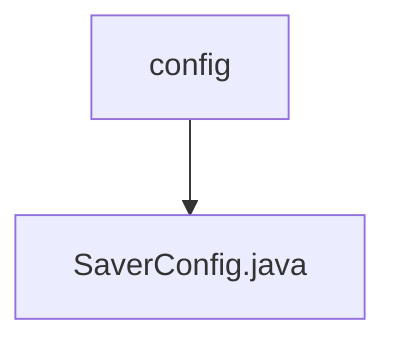

# 基础信息

|      |      |
|------|------|
| 名称 | config |
| 编码语言 | .java |
| 代码路径 | spring-ai-alibaba/spring-ai-alibaba-graph/spring-ai-alibaba-graph-core/src/main/java/com/alibaba/cloud/ai/graph/checkpoint/config |
| 包名 | spring-ai-alibaba.spring-ai-alibaba-graph.spring-ai-alibaba-graph-core.src.main.java.com.alibaba.cloud.ai.graph.checkpoint.config |
| 概述说明 | SaverConfig类管理BaseCheckpointSaver实例，支持注册、获取和配置构建。 |

# 说明

SaverConfig类的主要功能是管理BaseCheckpointSaver实例，提供注册、获取和构建配置的支持。该类通过注册机制，允许用户添加新的BaseCheckpointSaver实例，并能够在需要时获取已注册的实例。此外，SaverConfig类还负责构建和配置这些实例，确保它们能够按照预定的设置运行。通过这种方式，SaverConfig类为BaseCheckpointSaver实例的管理提供了集中化的解决方案，简化了配置和维护过程。

### 包内部结构视图

这段流程图展示了路径的层级关系，`config`文件夹包含了一个名为`SaverConfig.java`的文件。该图简洁地表示了文件与文件夹之间的从属关系，帮助开发者快速理解项目结构。

# 文件列表 File List

| 名称   | 类型  | 说明 |
|-------|------|-------------|
| [SaverConfig.java](SaverConfig.md) | file | SaverConfig类管理BaseCheckpointSaver实例，支持注册、获取和配置构建。 |

