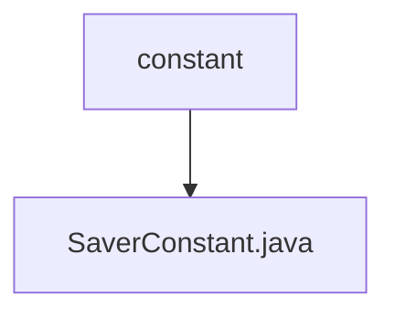

# 基础信息

|      |      |
|------|------|
| 名称 | constant |
| 编码语言 | .java |
| 代码路径 | spring-ai-alibaba/spring-ai-alibaba-graph/spring-ai-alibaba-graph-core/src/main/java/com/alibaba/cloud/ai/graph/checkpoint/constant |
| 包名 | spring-ai-alibaba.spring-ai-alibaba-graph.spring-ai-alibaba-graph-core.src.main.java.com.alibaba.cloud.ai.graph.checkpoint.constant |
| 概述说明 | 信息为空，无法生成概要描述。 |

# 说明

内容为空，无法进行总结描述。请提供具体内容以便生成相应的总结。

### 包内部结构视图

该流程图展示了路径的层级关系，`constant` 文件夹包含一个文件 `SaverConstant.java`。图中仅显示路径的最后一级元素，清晰简洁地表示了文件与文件夹之间的关系。

# 文件列表 File List

| 名称   | 类型  | 说明 |
|-------|------|-------------|
| [SaverConstant.java](SaverConstant.md) | file | 信息为空，无法生成概要描述。 |

