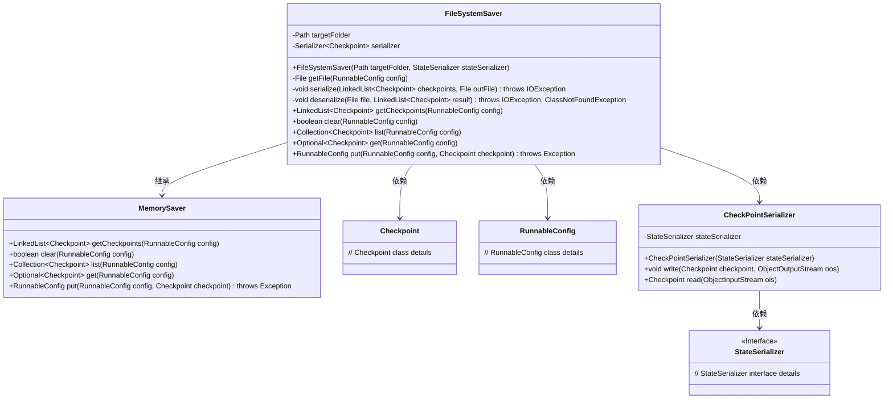

# 基础信息

|      |      |
|------|------|
| 名称 | FileSystemSaver |
| 编码语言 | .java |
| 代码路径 | spring-ai-alibaba/spring-ai-alibaba-graph/spring-ai-alibaba-graph-core/src/main/java/com/alibaba/cloud/ai/graph/checkpoint/savers/FileSystemSaver.java |
| 包名 | com.alibaba.cloud.ai.graph.checkpoint.savers |
| 依赖项 | ['java.io.File', 'java.io.IOException', 'java.io.ObjectInputStream', 'java.io.ObjectOutputStream', 'java.nio.file.Files', 'java.nio.file.Path', 'java.nio.file.Paths', 'java.util.Collection', 'java.util.LinkedList', 'java.util.Optional', 'com.alibaba.cloud.ai.graph.RunnableConfig', 'com.alibaba.cloud.ai.graph.checkpoint.Checkpoint', 'com.alibaba.cloud.ai.graph.serializer.Serializer', 'com.alibaba.cloud.ai.graph.serializer.StateSerializer', 'com.alibaba.cloud.ai.graph.serializer.check_point.CheckPointSerializer', 'lombok.NonNull', 'lombok.extern.slf4j.Slf4j', 'java.lang.String.format'] |
| 概述说明 | FileSystemSaver继承MemorySaver，实现检查点序列化与反序列化，支持文件系统存储。 |

# 说明

FileSystemSaver类继承自MemorySaver，主要用于实现检查点的序列化与反序列化功能，并支持将数据存储到文件系统中。

# 类列表 Class Summary

| 名称   | 类型  | 说明 |
|-------|------|-------------|
| FileSystemSaver | class | FileSystemSaver类继承MemorySaver，负责检查点的序列化与反序列化，支持文件系统存储。 |

## 类 FileSystemSaver

|      |      |
|------|------|
| 访问范围 | @Slf4j;public |
| 类型 | class |
| 名称 | FileSystemSaver |
| 说明 | FileSystemSaver类继承MemorySaver，负责检查点的序列化与反序列化，支持文件系统存储。 |

### UML类图

**描述：**  
`FileSystemSaver` 类继承自 `MemorySaver`，用于将检查点（`Checkpoint`）数据序列化并保存到文件系统中。它依赖于 `RunnableConfig` 来获取文件路径，并通过 `CheckPointSerializer` 进行序列化和反序列化操作。`CheckPointSerializer` 实现了 `StateSerializer` 接口，负责具体的序列化逻辑。`FileSystemSaver` 提供了获取、清除、列出和添加检查点的方法，并将数据持久化到指定文件夹中。

### 内部方法调用关系图

```mermaid
graph TD
    A["类FileSystemSaver"]
    B["属性: Path targetFolder"]
    C["属性: Serializer<Checkpoint> serializer"]
    D["构造方法: FileSystemSaver(Path targetFolder, StateSerializer stateSerializer)"]
    E["方法: File getFile(RunnableConfig config)"]
    F["方法: void serialize(LinkedList<Checkpoint> checkpoints, File outFile)"]
    G["方法: void deserialize(File file, LinkedList<Checkpoint> result)"]
    H["重写方法: LinkedList<Checkpoint> getCheckpoints(RunnableConfig config)"]
    I["重写方法: boolean clear(RunnableConfig config)"]
    J["重写方法: Collection<Checkpoint> list(RunnableConfig config)"]
    K["重写方法: Optional<Checkpoint> get(RunnableConfig config)"]
    L["重写方法: RunnableConfig put(RunnableConfig config, Checkpoint checkpoint)"]

    A --> B
    A --> C
    A --> D
    A --> E
    A --> F
    A --> G
    A --> H
    A --> I
    A --> J
    A --> K
    A --> L
```

这段代码定义了一个名为 `FileSystemSaver` 的类，继承自 `MemorySaver`，用于将检查点数据序列化并保存到文件系统中。类中包含多个方法，用于处理文件的创建、序列化、反序列化以及检查点的获取、清除、列出和存储。构造方法确保目标文件夹存在且有效，其他方法则负责具体的文件操作和数据处理。流程图展示了类的属性和方法之间的调用关系。

### 字段列表 Field List

| 名称  | 类型  | 说明 |
|-------|-------|------|
| targetFolder | Path | 目标文件夹路径为私有不可变变量。 |
| serializer | Serializer<Checkpoint> | 私有不可变的Checkpoint序列化器实例。 |

### 方法列表 Method List

| 名称  | 类型  | 说明 |
|-------|-------|------|
| clear | boolean | 该方法根据配置获取文件并检查存在后删除。 |
| list | Collection<Checkpoint> | 重写方法，返回父类配置的检查点集合。 |
| serialize | void | 将检查点列表序列化并写入指定文件。 |
| put | RunnableConfig | 重写方法，保存配置并序列化检查点到文件。 |
| getFile | File | 根据线程ID生成文件路径，无ID则使用默认路径。 |
| getCheckpoints | LinkedList<Checkpoint> | 方法获取检查点列表，若文件存在且列表为空，则反序列化文件内容。 |
| deserialize | void | 从文件反序列化检查点数据到链表。 |
| get | Optional<Checkpoint> | 重写get方法，调用父类方法返回Optional<Checkpoint>。 |

