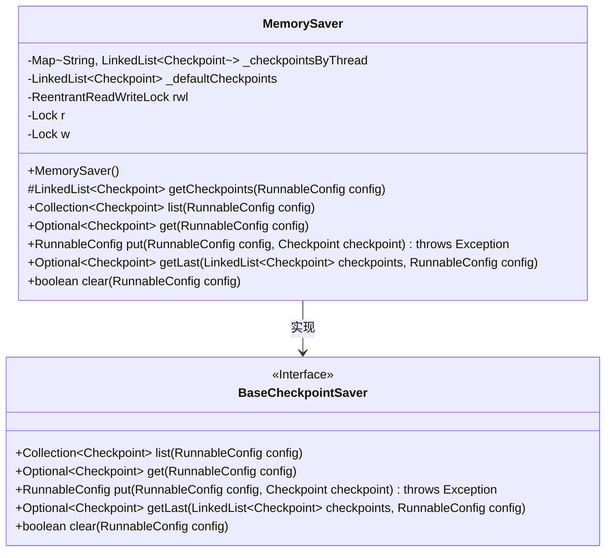
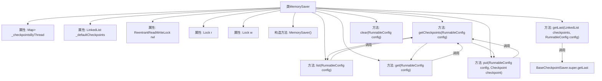

# 基础信息

|      |      |
|------|------|
| 名称 | MemorySaver |
| 编码语言 | .java |
| 代码路径 | spring-ai-alibaba/spring-ai-alibaba-graph/spring-ai-alibaba-graph-core/src/main/java/com/alibaba/cloud/ai/graph/checkpoint/savers/MemorySaver.java |
| 包名 | com.alibaba.cloud.ai.graph.checkpoint.savers |
| 依赖项 | ['java.util.Collection', 'java.util.HashMap', 'java.util.LinkedList', 'java.util.Map', 'java.util.NoSuchElementException', 'java.util.Optional', 'java.util.concurrent.locks.Lock', 'java.util.concurrent.locks.ReentrantReadWriteLock', 'java.util.stream.IntStream', 'com.alibaba.cloud.ai.graph.RunnableConfig', 'com.alibaba.cloud.ai.graph.checkpoint.BaseCheckpointSaver', 'com.alibaba.cloud.ai.graph.checkpoint.Checkpoint', 'java.lang.String.format', 'java.util.Collections.unmodifiableCollection'] |
| 概述说明 | MemorySaver类实现BaseCheckpointSaver，管理线程检查点，支持增删查，确保线程安全。 |

# 说明

MemorySaver类实现了BaseCheckpointSaver接口，主要用于管理线程检查点。该类支持对检查点进行增加、删除和查询操作，确保了操作的灵活性和功能性。为了保证在多线程环境下的数据安全性，MemorySaver类使用了读写锁机制，有效避免了并发访问时可能出现的冲突问题，从而确保了线程安全。

# 类列表 Class Summary

| 名称   | 类型  | 说明 |
|-------|------|-------------|
| MemorySaver | class | MemorySaver类实现BaseCheckpointSaver接口，管理线程检查点，支持增删查操作，使用读写锁保证线程安全。 |

## 类 MemorySaver

|      |      |
|------|------|
| 访问范围 | public |
| 类型 | class |
| 名称 | MemorySaver |
| 说明 | MemorySaver类实现BaseCheckpointSaver接口，管理线程检查点，支持增删查操作，使用读写锁保证线程安全。 |

### UML类图

**描述：**
`MemorySaver` 类实现了 `BaseCheckpointSaver` 接口，用于管理和保存检查点（Checkpoint）。它通过线程ID将检查点存储在 `_checkpointsByThread` 映射中，并为没有指定线程ID的检查点提供了默认的存储列表 `_defaultCheckpoints`。类中使用 `ReentrantReadWriteLock` 来确保线程安全，提供了列出、获取、添加和清除检查点的方法。`MemorySaver` 的设计允许在多线程环境下高效地管理检查点数据。

### 内部方法调用关系图

这段代码定义了一个名为`MemorySaver`的类，它实现了`BaseCheckpointSaver`接口。该类主要用于管理不同线程的检查点（Checkpoint），提供了列出、获取、添加和清除检查点的方法。代码通过使用`ReentrantReadWriteLock`来确保线程安全，并且在获取检查点时使用了`computeIfAbsent`方法来避免重复创建链表。流程图展示了类的属性和方法之间的调用关系，清晰地反映了各个方法如何通过`getCheckpoints`方法来获取检查点链表。

### 字段列表 Field List

| 名称  | 类型  | 说明 |
|-------|-------|------|
| w = rwl.writeLock() | Lock | 使用写锁保护共享资源的线程安全访问。 |
| _defaultCheckpoints = new LinkedList<>() | LinkedList<Checkpoint> | 私有链表_defaultCheckpoints存储默认检查点。 |
| r = rwl.readLock() | Lock | 私有锁对象r使用读写锁的读锁初始化。 |
| rwl = new ReentrantReadWriteLock() | ReentrantReadWriteLock | 使用ReentrantReadWriteLock实现线程安全的读写锁。 |
| _checkpointsByThread = new HashMap<>() | Map<String, LinkedList<Checkpoint>> | 私有线程检查点映射，键为字符串，值为链表。 |

### 方法列表 Method List

| 名称  | 类型  | 说明 |
|-------|-------|------|
| clear | boolean | 该方法重写父类的clear方法，返回false。 |
| getLast | Optional<Checkpoint> | 重写方法，调用父类获取最新检查点。 |
| list | Collection<Checkpoint> | 方法list获取不可修改的检查点集合，使用锁确保线程安全。 |
| put | RunnableConfig | 方法put更新或添加检查点，若存在则替换，否则新增，最后返回配置。 |
| get | Optional<Checkpoint> | 方法获取检查点，锁定资源后根据配置ID筛选或返回最后一个检查点，最后释放锁。 |
| getCheckpoints | LinkedList<Checkpoint> | 获取检查点列表，根据线程ID从映射中查找或创建新列表，若无则返回默认列表。 |

