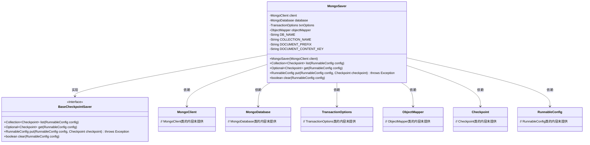
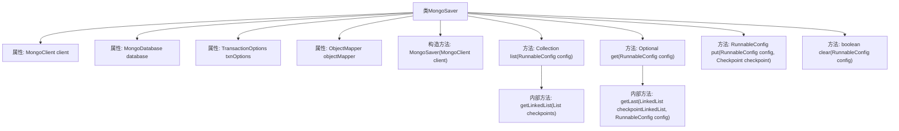

# 基础信息

|      |      |
|------|------|
| 名称 | MongoSaver |
| 编码语言 | .java |
| 代码路径 | spring-ai-alibaba/spring-ai-alibaba-graph/spring-ai-alibaba-graph-core/src/main/java/com/alibaba/cloud/ai/graph/checkpoint/savers/MongoSaver.java |
| 包名 | com.alibaba.cloud.ai.graph.checkpoint.savers |
| 依赖项 | ['java.util.Collection', 'java.util.Collections', 'java.util.LinkedList', 'java.util.List', 'java.util.NoSuchElementException', 'java.util.Objects', 'java.util.Optional', 'java.util.stream.IntStream', 'com.alibaba.cloud.ai.graph.RunnableConfig', 'com.alibaba.cloud.ai.graph.checkpoint.BaseCheckpointSaver', 'com.alibaba.cloud.ai.graph.checkpoint.Checkpoint', 'com.fasterxml.jackson.core.type.TypeReference', 'com.fasterxml.jackson.databind.ObjectMapper', 'com.mongodb.BasicDBObject', 'com.mongodb.ClientSessionOptions', 'com.mongodb.TransactionOptions', 'com.mongodb.WriteConcern', 'com.mongodb.client.ClientSession', 'com.mongodb.client.MongoClient', 'com.mongodb.client.MongoCollection', 'com.mongodb.client.MongoDatabase', 'com.mongodb.client.model.Filters', 'com.mongodb.client.model.ReplaceOptions', 'com.mongodb.client.result.InsertOneResult', 'lombok.extern.slf4j.Slf4j', 'org.bson.Document', 'java.lang.String.format'] |
| 概述说明 | MongoSaver类实现BaseCheckpointSaver接口，管理MongoDB检查点数据，支持增删改查。 |

# 说明

MongoSaver类实现了BaseCheckpointSaver接口，专门用于通过MongoDB管理检查点数据。该类提供了对检查点数据的增删改查操作，确保数据的有效管理和维护。通过集成MongoDB，MongoSaver能够高效地处理检查点数据的存储和检索，为系统提供了可靠的数据持久化解决方案。

# 类列表 Class Summary

| 名称   | 类型  | 说明 |
|-------|------|-------------|
| MongoSaver | class | MongoSaver类实现BaseCheckpointSaver接口，通过MongoDB管理检查点数据，支持增删改查操作。 |

## 类 MongoSaver

|      |      |
|------|------|
| 访问范围 | @Slf4j;public |
| 类型 | class |
| 名称 | MongoSaver |
| 说明 | MongoSaver类实现BaseCheckpointSaver接口，通过MongoDB管理检查点数据，支持增删改查操作。 |

### UML类图

### 描述
`MongoSaver` 类实现了 `BaseCheckpointSaver` 接口，用于在 MongoDB 中保存和检索检查点数据。它依赖于 `MongoClient`、`MongoDatabase`、`TransactionOptions` 和 `ObjectMapper` 等类来完成其功能。`MongoSaver` 提供了 `list`、`get`、`put` 和 `clear` 方法，分别用于列出、获取、添加和清除检查点数据。这些方法在事务中执行，确保数据的一致性和可靠性。

### 内部方法调用关系图

**描述：**  
MongoSaver类是一个用于管理MongoDB中检查点数据的工具类。它通过MongoClient与MongoDB进行交互，提供了列出、获取、添加和清除检查点的功能。类中包含了多个方法，如`list`、`get`、`put`和`clear`，这些方法都依赖于MongoDB的事务机制来确保数据的一致性。此外，类内部还定义了一些辅助方法，如`getLinkedList`和`getLast`，用于处理检查点数据的链表操作。整体设计注重事务管理和异常处理，确保数据操作的原子性和可靠性。

### 字段列表 Field List

| 名称  | 类型  | 说明 |
|-------|-------|------|
| database | MongoDatabase | 私有MongoDatabase数据库实例。 |
| COLLECTION_NAME = "checkpoint_collection" | String | 定义私有静态常量COLLECTION_NAME，值为"checkpoint_collection"。 |
| DOCUMENT_CONTENT_KEY = "checkpoint_content" | String | 定义一个私有静态常量字符串，键名为"checkpoint_content"。 |
| client | MongoClient | 声明了一个私有的MongoClient类型变量client。 |
| txnOptions | TransactionOptions | 私有事务选项变量声明。 |
| objectMapper | ObjectMapper | 私有且不可变的ObjectMapper对象。 |
| DOCUMENT_PREFIX = "mongo:checkpoint:document:" | String | MongoDB文档检查点前缀为"mongo:checkpoint:document:"。 |
| DB_NAME = "check_point_db" | String | 定义了一个私有静态常量字符串变量，名称为DB_NAME，值为"check_point_db"。 |

### 方法列表 Method List

| 名称  | 类型  | 说明 |
|-------|-------|------|
| clear | boolean | 根据配置删除MongoDB文档，成功返回true，失败抛出异常。 |
| get | Optional<Checkpoint> | 根据线程ID获取检查点，处理MongoDB事务，返回匹配检查点或最后一个检查点。 |
| list | Collection<Checkpoint> | 根据配置线程ID查询MongoDB集合，返回检查点列表，处理事务并捕获异常。 |
| put | RunnableConfig | 该方法通过MongoDB事务处理配置检查点，支持添加或替换检查点，确保线程ID不为空。 |

