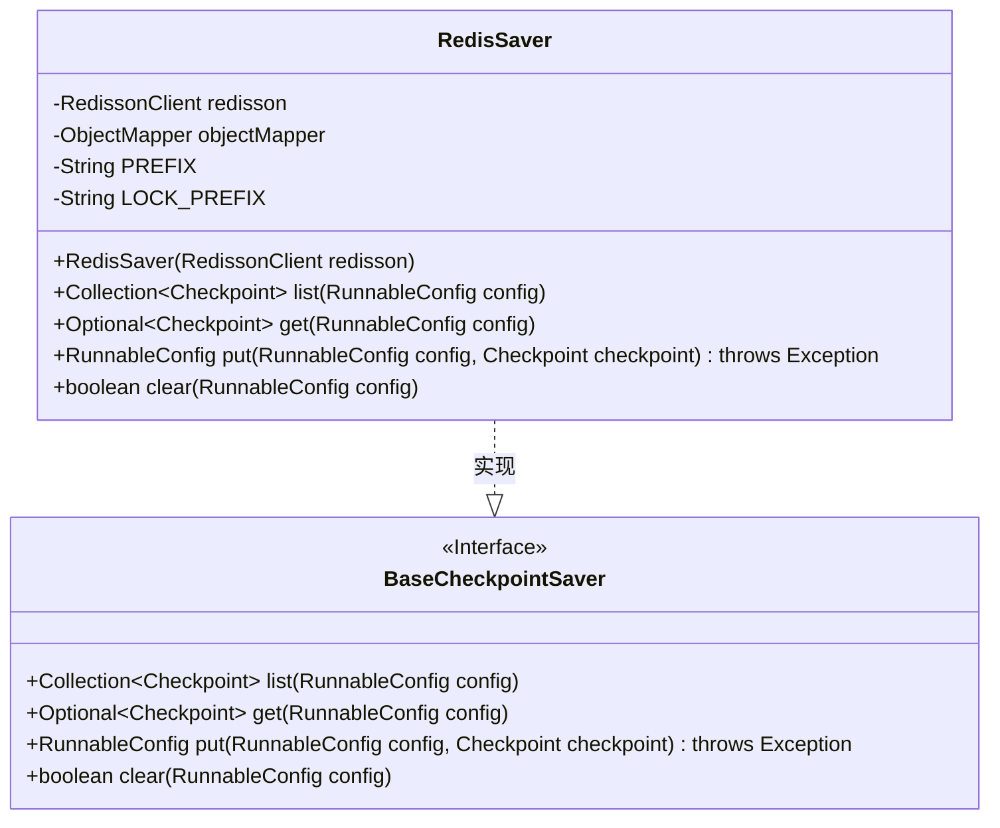
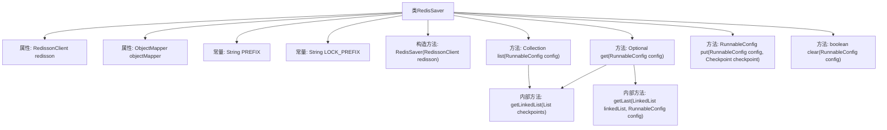

# 基础信息

|      |      |
|------|------|
| 名称 | RedisSaver |
| 编码语言 | .java |
| 代码路径 | spring-ai-alibaba/spring-ai-alibaba-graph/spring-ai-alibaba-graph-core/src/main/java/com/alibaba/cloud/ai/graph/checkpoint/savers/RedisSaver.java |
| 包名 | com.alibaba.cloud.ai.graph.checkpoint.savers |
| 依赖项 | ['java.util.Collection', 'java.util.LinkedList', 'java.util.List', 'java.util.NoSuchElementException', 'java.util.Optional', 'java.util.concurrent.TimeUnit', 'java.util.stream.IntStream', 'com.alibaba.cloud.ai.graph.RunnableConfig', 'com.alibaba.cloud.ai.graph.checkpoint.BaseCheckpointSaver', 'com.alibaba.cloud.ai.graph.checkpoint.Checkpoint', 'com.fasterxml.jackson.core.JsonProcessingException', 'com.fasterxml.jackson.core.type.TypeReference', 'com.fasterxml.jackson.databind.JsonMappingException', 'com.fasterxml.jackson.databind.ObjectMapper', 'org.redisson.api.RBucket', 'org.redisson.api.RLock', 'org.redisson.api.RedissonClient', 'java.lang.String.format'] |
| 概述说明 | RedisSaver类通过RedissonClient操作Redis，支持检查点的增删查操作。 |

# 说明

RedisSaver类实现了BaseCheckpointSaver接口，利用RedissonClient与Redis进行交互，提供了检查点的列出、获取、添加和清除功能。该类通过RedissonClient实现对Redis的操作，确保检查点的管理高效且可靠。

# 类列表 Class Summary

| 名称   | 类型  | 说明 |
|-------|------|-------------|
| RedisSaver | class | RedisSaver类实现BaseCheckpointSaver接口，通过RedissonClient操作Redis，支持检查点的列出、获取、添加和清除操作。 |

## 类 RedisSaver

|      |      |
|------|------|
| 访问范围 | public |
| 类型 | class |
| 名称 | RedisSaver |
| 说明 | RedisSaver类实现BaseCheckpointSaver接口，通过RedissonClient操作Redis，支持检查点的列出、获取、添加和清除操作。 |

### UML类图

**描述：**
`RedisSaver` 类实现了 `BaseCheckpointSaver` 接口，用于在 Redis 中保存和检索检查点数据。该类通过 `RedissonClient` 与 Redis 进行交互，并使用 `ObjectMapper` 进行 JSON 序列化和反序列化。`RedisSaver` 提供了列出、获取、添加和清除检查点的方法，所有操作都通过 Redis 分布式锁确保线程安全。

### 内部方法调用关系图

这段代码定义了一个名为 `RedisSaver` 的类，该类实现了 `BaseCheckpointSaver` 接口，用于管理与 Redis 相关的检查点操作。类中包含四个主要方法：`list`、`get`、`put` 和 `clear`，分别用于列出、获取、添加和清除检查点。每个方法在执行时都会尝试获取 Redis 锁，以确保操作的原子性。此外，代码中还包含两个内部方法 `getLinkedList` 和 `getLast`，用于处理检查点列表的转换和获取最后一个检查点。整个流程涉及 Redis 锁的获取与释放，以及 JSON 数据的序列化与反序列化。

### 字段列表 Field List

| 名称  | 类型  | 说明 |
|-------|-------|------|
| redisson | RedissonClient | 私有Redisson客户端实例。 |
| objectMapper | ObjectMapper | 私有对象映射器实例。 |
| PREFIX = "graph:checkpoint:content:" | String | 私有静态常量PREFIX定义为"graph:checkpoint:content:"。 |
| LOCK_PREFIX = "graph:checkpoint:lock:" | String | 私有静态常量LOCK_PREFIX定义为"graph:checkpoint:lock:"。 |

### 方法列表 Method List

| 名称  | 类型  | 说明 |
|-------|-------|------|
| get | Optional<Checkpoint> | 获取检查点，锁定线程ID，解析JSON，返回结果或异常。 |
| put | RunnableConfig | 方法通过线程ID获取锁，更新或添加检查点，并释放锁。 |
| clear | boolean | 根据配置清除数据，获取锁后更新存储内容，确保线程ID不为空。 |
| list | Collection<Checkpoint> | 方法根据配置获取线程ID，尝试加锁并读取数据，解析后返回，失败则抛出异常。 |

