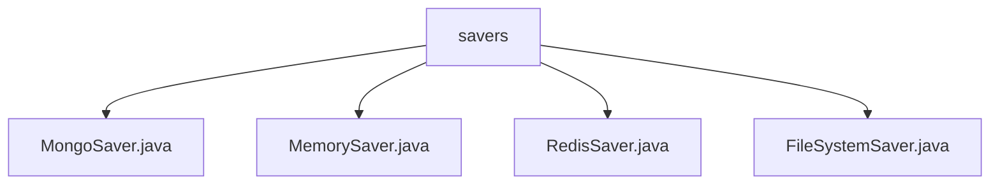

# 基础信息

|      |      |
|------|------|
| 名称 | savers |
| 编码语言 | .java |
| 代码路径 | spring-ai-alibaba/spring-ai-alibaba-graph/spring-ai-alibaba-graph-core/src/main/java/com/alibaba/cloud/ai/graph/checkpoint/savers |
| 包名 | spring-ai-alibaba.spring-ai-alibaba-graph.spring-ai-alibaba-graph-core.src.main.java.com.alibaba.cloud.ai.graph.checkpoint.savers |
| 概述说明 | MongoSaver通过MongoDB管理检查点，MemorySaver确保线程安全，RedisSaver利用Redis管理检查点，FileSystemSaver支持文件存储。 |

# 说明

## 概述

该代码模块主要实现了检查点数据的管理功能，提供了多种存储方式的实现，包括MongoDB、内存、Redis和文件系统。所有类均实现了`BaseCheckpointSaver`接口，确保了一致的操作接口和功能。通过这些实现，模块能够灵活地支持不同场景下的检查点数据存储和检索需求，同时保证了数据的安全性和高效性。

## 主要业务场景

1. **MongoDB存储**：`MongoSaver`类通过MongoDB管理检查点数据，适用于需要持久化存储且数据量较大的场景。它提供了增删改查操作，确保数据的有效管理和维护，适合需要高可靠性和数据持久化的应用。

2. **内存存储**：`MemorySaver`类主要用于管理线程检查点，适用于对性能要求较高且数据量较小的场景。它通过读写锁机制确保了多线程环境下的数据安全性，适合需要快速访问和操作的场景。

3. **Redis存储**：`RedisSaver`类利用RedissonClient与Redis进行交互，适用于需要高并发访问和分布式存储的场景。它提供了检查点的列出、获取、添加和清除功能，适合需要高效且可靠的检查点管理的应用。

4. **文件系统存储**：`FileSystemSaver`类继承自`MemorySaver`，支持将检查点数据序列化并存储到文件系统中，适用于需要长期保存和备份的场景。它提供了数据的持久化存储，适合需要数据恢复和离线访问的应用。

通过这些不同的存储实现，该模块能够满足多样化的业务需求，确保检查点数据在不同场景下的高效管理和安全存储。

### 包内部结构视图

该流程图展示了`spring-ai-alibaba-graph-core`项目中`checkpoint/savers`目录下的四个保存器类文件。这些文件包括`MongoSaver.java`、`MemorySaver.java`、`RedisSaver.java`和`FileSystemSaver.java`，它们都位于`savers`目录下，用于不同的数据保存方式。

# 文件列表 File List

| 名称   | 类型  | 说明 |
|-------|------|-------------|
| [FileSystemSaver.java](FileSystemSaver.md) | file | FileSystemSaver继承MemorySaver，实现检查点序列化与反序列化，支持文件系统存储。 |
| [MongoSaver.java](MongoSaver.md) | file | MongoSaver类实现BaseCheckpointSaver接口，管理MongoDB检查点数据，支持增删改查。 |
| [RedisSaver.java](RedisSaver.md) | file | RedisSaver类通过RedissonClient操作Redis，支持检查点的增删查操作。 |
| [MemorySaver.java](MemorySaver.md) | file | MemorySaver类实现BaseCheckpointSaver，管理线程检查点，支持增删查，确保线程安全。 |

