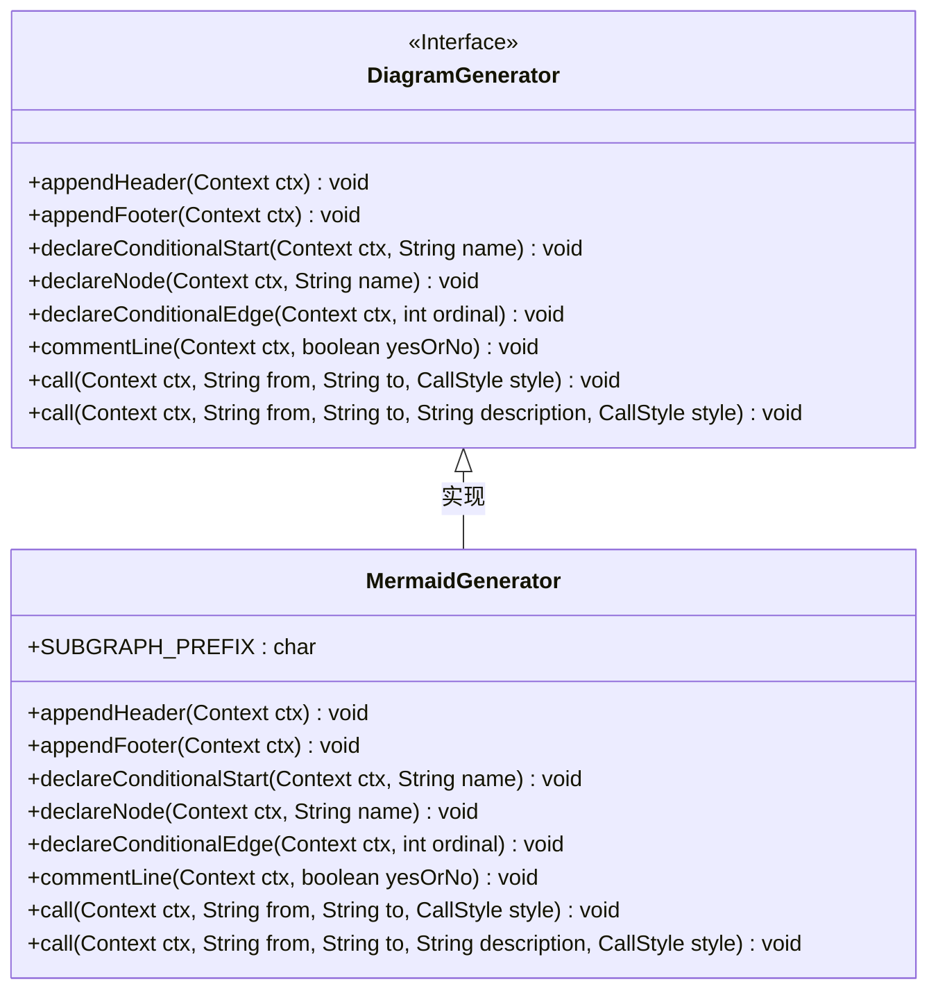
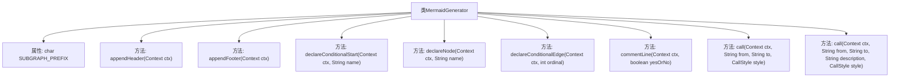

# 基础信息

|      |      |
|------|------|
| 名称 | MermaidGenerator |
| 编码语言 | .java |
| 代码路径 | spring-ai-alibaba/spring-ai-alibaba-graph/spring-ai-alibaba-graph-core/src/main/java/com/alibaba/cloud/ai/graph/diagram/MermaidGenerator.java |
| 包名 | com.alibaba.cloud.ai.graph.diagram |
| 依赖项 | ['com.alibaba.cloud.ai.graph.DiagramGenerator', 'java.lang.String.format', 'com.alibaba.cloud.ai.graph.StateGraph.END', 'com.alibaba.cloud.ai.graph.StateGraph.START'] |
| 概述说明 | MermaidGenerator继承DiagramGenerator，生成流程图，支持条件节点和边描述。 |

# 说明

MermaidGenerator类继承自DiagramGenerator，专门用于生成子图和主图的流程图。该类支持条件节点和边描述功能，能够灵活地创建复杂的流程图结构，满足不同场景下的需求。通过继承DiagramGenerator，MermaidGenerator继承了其基础功能，并在此基础上扩展了针对流程图生成的特性和方法。

# 类列表 Class Summary

| 名称   | 类型  | 说明 |
|-------|------|-------------|
| MermaidGenerator | class | MermaidGenerator类继承DiagramGenerator，用于生成子图和主图的流程图，支持条件节点和边描述。 |

## 类 MermaidGenerator

|      |      |
|------|------|
| 访问范围 | public |
| 类型 | class |
| 名称 | MermaidGenerator |
| 说明 | MermaidGenerator类继承DiagramGenerator，用于生成子图和主图的流程图，支持条件节点和边描述。 |

### UML类图

### 描述
`MermaidGenerator` 类继承自 `DiagramGenerator` 接口，用于生成 Mermaid 格式的流程图。它通过重写 `DiagramGenerator` 中的方法，实现了对流程图的头部、尾部、条件节点、普通节点、条件边、注释行以及节点之间调用的格式化输出。该类特别处理了子图（subgraph）的情况，使用了 `SUBGRAPH_PREFIX` 来标识子图中的节点。

### 内部方法调用关系图

这段代码定义了一个名为 `MermaidGenerator` 的类，该类继承自 `DiagramGenerator`，用于生成Mermaid格式的流程图。类中包含多个方法，用于处理流程图的头部、尾部、条件节点、普通节点、条件边、注释行以及节点之间的调用关系。每个方法都根据上下文 (`Context`) 和传入的参数生成相应的Mermaid代码，支持子图和主图的生成，并处理不同的调用风格。

### 字段列表 Field List

| 名称  | 类型  | 说明 |
|-------|-------|------|
| SUBGRAPH_PREFIX = '_' | char | 静态常量字符SUBGRAPH_PREFIX定义为下划线。 |

### 方法列表 Method List

| 名称  | 类型  | 说明 |
|-------|-------|------|
| call | void | 根据上下文和样式生成图节点连接描述。 |
| commentLine | void | 重写方法，根据条件在上下文中添加注释行。 |
| appendFooter | void | 根据上下文是否为子图，追加不同格式的页脚内容。 |
| declareNode | void | 在上下文声明节点时，添加前缀并格式化名称。 |
| declareConditionalEdge | void | 重写方法声明条件边，根据上下文添加子图前缀并格式化条件状态。 |
| call | void | 根据上下文和调用样式，生成子图或普通图的连接关系。 |
| appendHeader | void | 根据上下文判断是否为子图，分别生成包含标题、开始和结束节点的流程图代码。 |
| declareConditionalStart | void | 该方法在子图条件下添加前缀并格式化输出状态检查。 |

