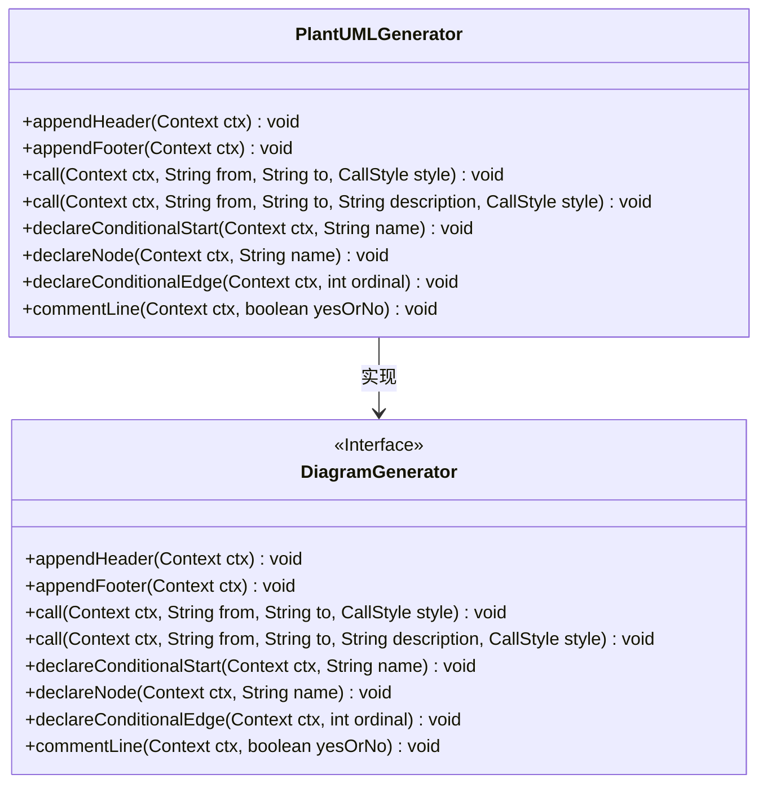

# 基础信息

|      |      |
|------|------|
| 名称 | PlantUMLGenerator |
| 编码语言 | .java |
| 代码路径 | spring-ai-alibaba/spring-ai-alibaba-graph/spring-ai-alibaba-graph-core/src/main/java/com/alibaba/cloud/ai/graph/diagram/PlantUMLGenerator.java |
| 包名 | com.alibaba.cloud.ai.graph.diagram |
| 依赖项 | ['com.alibaba.cloud.ai.graph.DiagramGenerator', 'java.lang.String.format', 'com.alibaba.cloud.ai.graph.StateGraph.END', 'com.alibaba.cloud.ai.graph.StateGraph.START'] |
| 概述说明 | PlantUMLGenerator继承DiagramGenerator，实现子图、主图及节点声明功能。 |

# 说明

PlantUMLGenerator类继承自DiagramGenerator，扩展了其功能，实现了子图和主图的头部、尾部声明，以及调用和条件节点的声明。该类通过继承和扩展，增强了DiagramGenerator的原有功能，使其能够处理更复杂的图形结构，包括子图和主图的各个部分，并支持调用和条件节点的声明，从而提升了生成图形描述的灵活性和全面性。

# 类列表 Class Summary

| 名称   | 类型  | 说明 |
|-------|------|-------------|
| PlantUMLGenerator | class | PlantUMLGenerator类扩展DiagramGenerator，实现子图和主图的头部、尾部、调用、条件节点声明等功能。 |

## 类 PlantUMLGenerator

|      |      |
|------|------|
| 访问范围 | public |
| 类型 | class |
| 名称 | PlantUMLGenerator |
| 说明 | PlantUMLGenerator类扩展DiagramGenerator，实现子图和主图的头部、尾部、调用、条件节点声明等功能。 |

### UML类图

**描述：**  
`PlantUMLGenerator` 类继承自 `DiagramGenerator` 接口，实现了生成 PlantUML 图的功能。它重写了多个方法，包括 `appendHeader`、`appendFooter`、`call`、`declareConditionalStart`、`declareNode`、`declareConditionalEdge` 和 `commentLine`，用于处理图的不同部分和样式。通过这些方法，`PlantUMLGenerator` 能够根据上下文生成符合 PlantUML 语法的图代码，支持条件判断、节点声明、边声明等功能。

### 内部方法调用关系图

```mermaid
graph TD
    A["类PlantUMLGenerator"]
    B["继承: DiagramGenerator"]
    C["重写方法: appendHeader(Context ctx)"]
    D["条件判断: ctx.isSubGraph()"]
    E["追加格式: rectangle %s [ {{\ntitle '%s'\n"]
    F["追加格式: circle ' ' as %s\n"]
    G["追加格式: circle exit as %s\n"]
    H["追加格式: @startuml %s\n"]
    I["追加格式: skinparam usecaseFontSize 14\n"]
    J["追加格式: skinparam usecaseStereotypeFontSize 12\n"]
    K["追加格式: skinparam hexagonFontSize 14\n"]
    L["追加格式: skinparam hexagonStereotypeFontSize 12\n"]
    M["追加格式: title '%s'\n"]
    N["追加格式: footer\n\n"]
    O["追加格式: powered by spring-ai-alibaba\n"]
    P["追加格式: end footer\n"]
    Q["追加格式: circle start<<input>> as %s\n"]
    R["追加格式: circle stop as %s\n"]
    S["重写方法: appendFooter(Context ctx)"]
    T["条件判断: ctx.isSubGraph()"]
    U["追加格式: \n}} ]\n"]
    V["追加格式: @enduml\n"]
    W["重写方法: call(Context ctx, String from, String to, CallStyle style)"]
    X["条件判断: style == CONDITIONAL"]
    Y["追加格式: '%s' .down.> '%s'\n"]
    Z["追加格式: '%s' -down-> '%s'\n"]
    AA["重写方法: call(Context ctx, String from, String to, String description, CallStyle style)"]
    AB["条件判断: style == CONDITIONAL"]
    AC["追加格式: '%s' .down.> '%s': '%s'\n"]
    AD["追加格式: '%s' -down-> '%s': '%s'\n"]
    AE["重写方法: declareConditionalStart(Context ctx, String name)"]
    AF["追加格式: hexagon 'check state' as %s<<Condition>>\n"]
    AG["重写方法: declareNode(Context ctx, String name)"]
    AH["追加格式: usecase '%s'<<Node>>\n"]
    AI["重写方法: declareConditionalEdge(Context ctx, int ordinal)"]
    AJ["追加格式: hexagon 'check state' as condition%d<<Condition>>\n"]
    AK["重写方法: commentLine(Context ctx, boolean yesOrNo)"]
    AL["条件判断: yesOrNo"]
    AM["追加格式: '\n"]

    A --> B
    A --> C
    C --> D
    D --> E
    D --> F
    D --> G
    D --> H
    H --> I
    I --> J
    J --> K
    K --> L
    L --> M
    M --> N
    N --> O
    O --> P
    P --> Q
    Q --> R
    A --> S
    S --> T
    T --> U
    T --> V
    A --> W
    W --> X
    X --> Y
    X --> Z
    A --> AA
    AA --> AB
    AB --> AC
    AB --> AD
    A --> AE
    AE --> AF
    A --> AG
    AG --> AH
    A --> AI
    AI --> AJ
    A --> AK
    AK --> AL
    AL --> AM
```

这段代码定义了一个名为 `PlantUMLGenerator` 的类，继承自 `DiagramGenerator`，并重写了多个方法以生成 PlantUML 图的头部、尾部、节点、条件判断等内容。代码通过条件判断和格式追加的方式，根据上下文的不同生成不同的 PlantUML 语法。流程图展示了类中各个方法的调用关系和条件判断逻辑，帮助理解代码的执行流程。

### 字段列表 Field List

| 名称  | 类型  | 说明 |
|-------|-------|------|

### 方法列表 Method List

| 名称  | 类型  | 说明 |
|-------|-------|------|
| declareNode | void | 重写方法，声明节点并格式化输出。 |
| appendHeader | void | 根据上下文动态生成UML图头部信息，包含标题、起始和结束节点。 |
| appendFooter | void | 根据上下文动态添加UML图脚注。 |
| declareConditionalStart | void | 重写方法，在上下文中追加格式化字符串以声明条件开始。 |
| declareConditionalEdge | void | 重写方法声明条件边，格式化为六边形条件状态。 |
| call | void | 重写call方法，根据style选择不同格式输出from、to和description。 |
| call | void | 重写call方法，根据style格式化字符串并追加到ctx的sb中。 |
| commentLine | void | 重写方法`commentLine`，根据`yesOrNo`参数决定是否在`ctx.sb()`中添加单引号。 |

