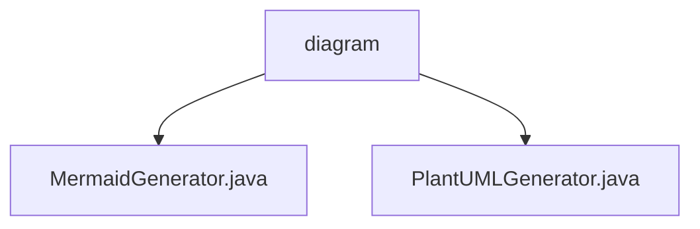

# 基础信息

|      |      |
|------|------|
| 名称 | diagram |
| 编码语言 | .java |
| 代码路径 | spring-ai-alibaba/spring-ai-alibaba-graph/spring-ai-alibaba-graph-core/src/main/java/com/alibaba/cloud/ai/graph/diagram |
| 包名 | spring-ai-alibaba.spring-ai-alibaba-graph.spring-ai-alibaba-graph-core.src.main.java.com.alibaba.cloud.ai.graph.diagram |
| 概述说明 | MermaidGenerator和PlantUMLGenerator均继承自DiagramGenerator，分别扩展了流程图和复杂图形结构的生成功能。 |

# 说明

## 概述
该代码模块是一个用于生成流程图的工具集，主要包含两个核心类：`MermaidGenerator` 和 `PlantUMLGenerator`。这两个类均继承自 `DiagramGenerator`，并通过扩展其功能，分别支持生成 Mermaid 和 PlantUML 格式的流程图。该模块的主要目标是提供灵活且强大的流程图生成能力，能够处理复杂的图形结构，包括子图、主图、条件节点和边描述等。

## 主要业务场景
1. **Mermaid 流程图生成**：`MermaidGenerator` 类专门用于生成 Mermaid 格式的流程图。它支持条件节点和边描述功能，能够灵活地创建复杂的流程图结构，适用于需要生成 Mermaid 格式流程图的场景。
2. **PlantUML 流程图生成**：`PlantUMLGenerator` 类扩展了 `DiagramGenerator` 的功能，实现了子图和主图的头部、尾部声明，以及调用和条件节点的声明。它能够处理更复杂的图形结构，适用于需要生成 PlantUML 格式流程图的场景。
3. **流程图生成工具集**：该模块通过继承和扩展 `DiagramGenerator`，提供了一个统一的流程图生成框架，支持多种格式的流程图生成，适用于需要灵活生成复杂流程图的业务场景。

### 包内部结构视图

该流程图展示了`spring-ai-alibaba-graph-core`项目中`diagram`目录下的文件结构。`diagram`作为根节点，包含两个子节点：`MermaidGenerator.java`和`PlantUMLGenerator.java`，分别表示两个不同的生成器类文件。

# 文件列表 File List

| 名称   | 类型  | 说明 |
|-------|------|-------------|
| [MermaidGenerator.java](MermaidGenerator.md) | file | MermaidGenerator继承DiagramGenerator，生成流程图，支持条件节点和边描述。 |
| [PlantUMLGenerator.java](PlantUMLGenerator.md) | file | PlantUMLGenerator继承DiagramGenerator，实现子图、主图及节点声明功能。 |

