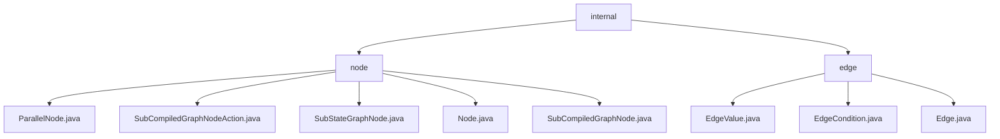

# 基础信息

|      |      |
|------|------|
| 名称 | internal |
| 编码语言 | .java |
| 代码路径 | spring-ai-alibaba/spring-ai-alibaba-graph/spring-ai-alibaba-graph-core/src/main/java/com/alibaba/cloud/ai/graph/internal |
| 包名 | spring-ai-alibaba.spring-ai-alibaba-graph.spring-ai-alibaba-graph-core.src.main.java.com.alibaba.cloud.ai.graph.internal |
| 概述说明 | 该模块提供图结构中节点和边的管理功能，支持并行任务、子图操作及边值处理。 |

# 说明

## 概述

该代码模块是 `spring-ai-alibaba` 项目的一部分，具体位于 `spring-ai-alibaba-graph` 子模块中的 `spring-ai-alibaba-graph-core` 包下。模块的核心功能围绕图数据结构中的节点和边管理展开，提供了多种节点类型的实现以及边的操作和条件处理。模块的核心目标是为图结构中的节点和边提供高效的管理和操作能力，特别是在并行任务处理、子图管理以及边的条件处理方面表现出色。

## 主要业务场景

1. **并行任务处理**：通过 `ParallelNode` 类，模块支持多个任务的同时执行，利用异步机制提高执行效率，并能够动态更新任务状态，确保并行操作的全面管理。
2. **子图管理**：`SubStateGraphNode` 和 `SubCompiledGraphNode` 类专注于子图的管理和操作。这些类继承自 `Node` 类，并扩展了对子图的支持，使得在复杂的图结构中能够有效地处理子图的操作和管理。
3. **基础节点管理**：`Node` 类作为基础节点，提供了节点的唯一标识、操作管理以及相等性检查等功能，为其他节点类提供了基础支持，确保节点在哈希表中的高效存储和检索。
4. **边的值处理**：通过 `EdgeValue.java` 类，处理图中边的值，可能包括存储、获取和更新边的权重或其他相关属性。
5. **边的条件处理**：通过 `EdgeCondition.java` 类，定义和处理边的条件，可能用于过滤或匹配特定条件下的边。
6. **边的基本操作**：通过 `Edge.java` 类，定义边的基本结构和操作，可能包括边的创建、删除、连接节点等操作。

该模块的设计适用于需要高效处理图结构、并行任务以及子图管理的场景，特别是在需要动态更新任务状态和复杂图操作的应用中表现出色。

### 包内部结构视图

该流程图展示了`spring-ai-alibaba-graph-core`项目中`internal`目录下的层级结构。`internal`包含两个主要子目录：`node`和`edge`。`node`目录下包含多个与节点相关的Java文件，如`ParallelNode.java`和`Node.java`，而`edge`目录下则包含与边相关的文件，如`EdgeValue.java`和`Edge.java`。该图清晰地展示了项目的内部结构及其文件之间的关系。

# 文件列表 File List

| 名称   | 类型  | 说明 |
|-------|------|-------------|
| [edge](edge/_module.md) | package | 内容为空，无法总结。请提供具体信息。 |
| [node](node/_module.md) | package | ParallelNode类支持异步操作和状态更新，SubStateGraphNode类管理子图，Node类提供ID和哈希功能，SubCompiledGraphNode类扩展子图处理能力。 |

