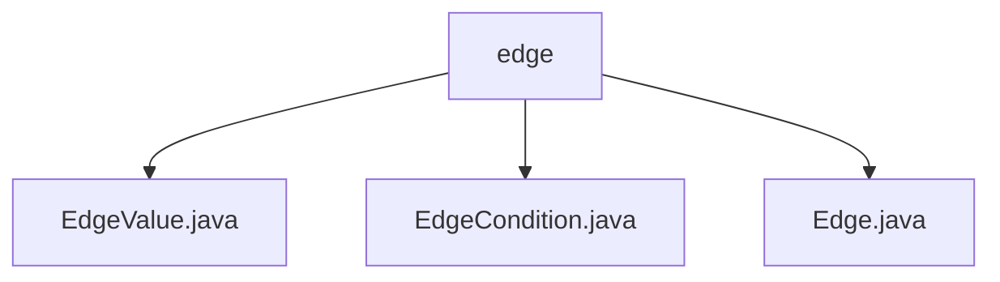

# 基础信息

|      |      |
|------|------|
| 名称 | edge |
| 编码语言 | .java |
| 代码路径 | spring-ai-alibaba/spring-ai-alibaba-graph/spring-ai-alibaba-graph-core/src/main/java/com/alibaba/cloud/ai/graph/internal/edge |
| 包名 | spring-ai-alibaba.spring-ai-alibaba-graph.spring-ai-alibaba-graph-core.src.main.java.com.alibaba.cloud.ai.graph.internal.edge |
| 概述说明 | 内容为空，无法总结。请提供具体信息。 |

# 说明

## 概述

该代码模块属于 `spring-ai-alibaba` 项目的一部分，具体位于 `spring-ai-alibaba-graph` 子模块中的 `spring-ai-alibaba-graph-core` 包下。该模块的核心功能与图（Graph）数据结构相关，特别是与图的边（Edge）相关的操作和条件处理。模块中包含的类如 `EdgeValue.java`、`EdgeCondition.java` 和 `Edge.java` 分别用于处理边的值、边的条件以及边的基本定义和操作。

## 主要业务场景

该模块的主要业务场景围绕图数据结构中的边展开，具体包括：

1. **边的值处理**：通过 `EdgeValue.java` 类，处理图中边的值，可能包括存储、获取和更新边的权重或其他相关属性。
2. **边的条件处理**：通过 `EdgeCondition.java` 类，定义和处理边的条件，可能用于过滤或匹配特定条件下的边。
3. **边的基本操作**：通过 `Edge.java` 类，定义边的基本结构和操作，可能包括边的创建、删除、连接节点等操作。

这些类共同构成了图数据结构中边操作的核心功能，适用于需要处理复杂图结构的业务场景，如社交网络分析、推荐系统、路径规划等。

### 包内部结构视图

该流程图展示了路径 `spring-ai-alibaba/spring-ai-alibaba-graph/spring-ai-alibaba-graph-core/src/main/java/com/alibaba/cloud/ai/graph/internal/edge` 下的文件层级关系。`edge` 是父节点，包含三个子节点：`EdgeValue.java`、`EdgeCondition.java` 和 `Edge.java`。这些文件均位于 `edge` 目录下，表示它们属于同一层级且具有相同的父目录。

# 文件列表 File List

| 名称   | 类型  | 说明 |
|-------|------|-------------|
| [Edge.java](Edge.md) | file | 信息为空，无法生成概要描述。 |
| [EdgeValue.java](EdgeValue.md) | file | 输入内容为空，请提供具体信息以便生成概要描述。 |
| [EdgeCondition.java](EdgeCondition.md) | file | 输入信息为空，无法生成概要描述。 |

