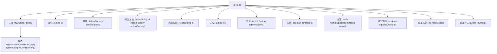

# 基础信息

|      |      |
|------|------|
| 名称 | Node |
| 编码语言 | .java |
| 代码路径 | spring-ai-alibaba/spring-ai-alibaba-graph/spring-ai-alibaba-graph-core/src/main/java/com/alibaba/cloud/ai/graph/internal/node/Node.java |
| 包名 | com.alibaba.cloud.ai.graph.internal.node |
| 依赖项 | ['java.util.Objects', 'java.util.function.Function', 'com.alibaba.cloud.ai.graph', 'com.alibaba.cloud.ai.graph.action.AsyncNodeActionWithConfig', 'com.alibaba.cloud.ai.graph.state.AgentState', 'java.lang.String.format'] |
| 概述说明 | Node类具备ID和ActionFactory，支持更新ID、相等性检查和哈希码生成。 |

# 说明

Node类是一个包含ID和ActionFactory属性的数据结构，支持ID的更新操作。该类提供了相等性检查功能，能够比较两个Node对象是否相同。此外，Node类还实现了哈希码生成方法，确保对象在哈希表中的高效存储和检索。这些功能使得Node类在处理需要唯一标识和操作管理的场景中非常实用。

# 类列表 Class Summary

| 名称   | 类型  | 说明 |
|-------|------|-------------|
| Node | class | Node类包含ID和ActionFactory，支持ID更新、相等性检查和哈希码生成。 |


## 类 Node

|      |      |
|------|------|
| 访问范围 | public |
| 类型 | class |
| 名称 | Node |
| 说明 | Node类包含ID和ActionFactory，支持ID更新、相等性检查和哈希码生成。 |


### UML类图

```mermaid
classDiagram
    class Node {
        -String id
        -ActionFactory actionFactory
        +Node(String id, ActionFactory actionFactory)
        +Node(String id)
        +String id()
        +ActionFactory actionFactory()
        +boolean isParallel()
        +Node withIdUpdated(Function~String, String~ newId)
        +boolean equals(Object o)
        +int hashCode()
        +String toString()
        <<Interface>> ActionFactory {
            +AsyncNodeActionWithConfig apply(CompileConfig config) throws GraphStateException
        }
    }
```

这段代码定义了一个 `Node` 类，该类包含一个内部接口 `ActionFactory`，用于生成 `AsyncNodeActionWithConfig` 实例。`Node` 类具有一个唯一的标识符 `id` 和一个可选的 `actionFactory`。类中提供了多个方法，包括获取 `id` 和 `actionFactory`、检查节点是否为并行节点、更新节点 `id`、以及重写 `equals`、`hashCode` 和 `toString` 方法。`ActionFactory` 接口定义了一个 `apply` 方法，接受 `CompileConfig` 参数并返回 `AsyncNodeActionWithConfig` 实例。


### 内部方法调用关系图



这段代码定义了一个名为`Node`的类，其中包含一个内部接口`ActionFactory`，该接口有一个方法`apply`。`Node`类有两个属性：`id`和`actionFactory`，并提供了多个构造方法、getter方法、以及一些工具方法如`isParallel`和`withIdUpdated`。此外，`Node`类还重写了`equals`、`hashCode`和`toString`方法，用于对象的比较、哈希值计算和字符串表示。

### 字段列表 Field List

| 名称  | 类型  | 说明 |
|-------|-------|------|
| id | String | 定义了一个私有且不可变的字符串类型变量id。 |
| actionFactory | ActionFactory | 私有不可变的ActionFactory实例。 |

### 方法列表 Method List

| 名称  | 类型  | 说明 |
|-------|-------|------|
| actionFactory | ActionFactory | 该方法返回一个ActionFactory实例。 |
| id | String | 该方法返回对象的id属性值。 |
| isParallel | boolean | 方法isParallel始终返回false，未实现并行判断逻辑。 |
| withIdUpdated | Node | 该方法更新节点ID并返回新节点实例。 |
| toString | String | 重写toString方法，返回节点信息及动作工厂状态。 |
| equals | boolean | 重写equals方法，判断对象是否相等，包括null和类型检查。 |
| hashCode | int | 重写hashCode方法，使用id生成哈希值。 |


