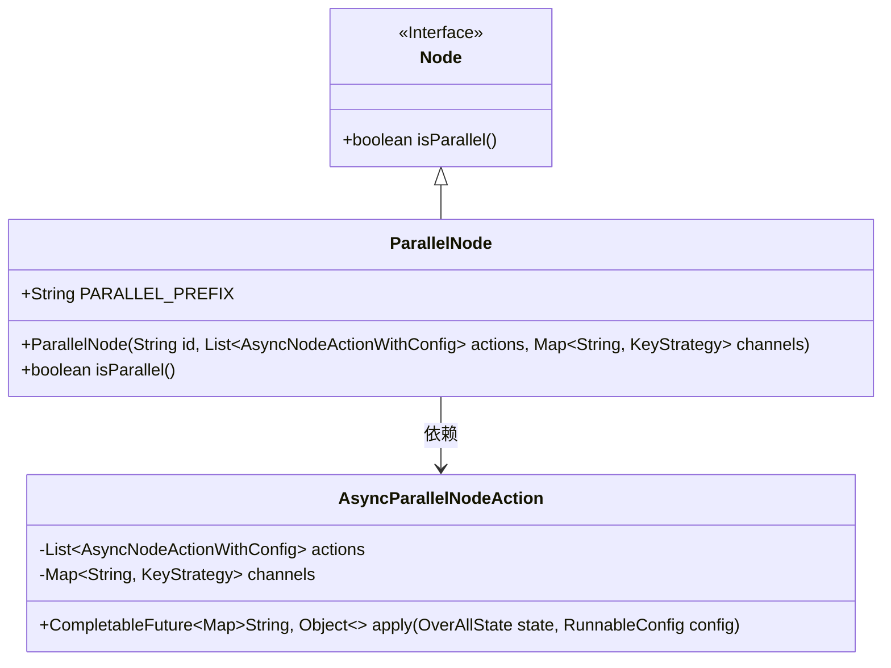
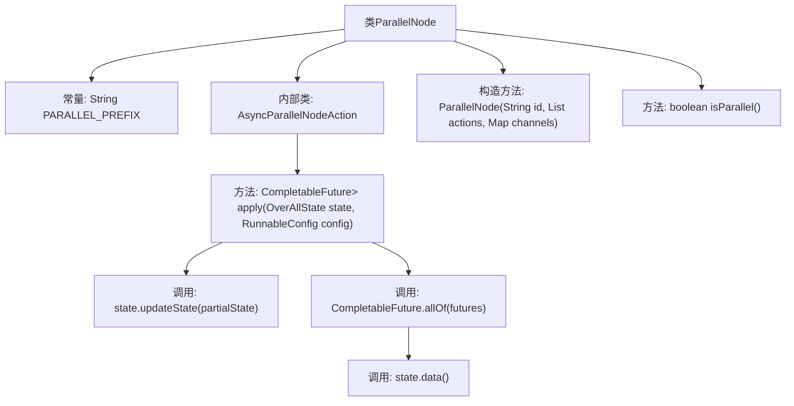

# 基础信息

|      |      |
|------|------|
| 名称 | ParallelNode |
| 编码语言 | .java |
| 代码路径 | spring-ai-alibaba/spring-ai-alibaba-graph/spring-ai-alibaba-graph-core/src/main/java/com/alibaba/cloud/ai/graph/internal/node/ParallelNode.java |
| 包名 | com.alibaba.cloud.ai.graph.internal.node |
| 依赖项 | ['java.util.HashMap', 'java.util.List', 'java.util.Map', 'java.util.concurrent.CompletableFuture', 'com.alibaba.cloud.ai.graph.KeyStrategy', 'com.alibaba.cloud.ai.graph.OverAllState', 'com.alibaba.cloud.ai.graph.RunnableConfig', 'com.alibaba.cloud.ai.graph.action.AsyncNodeActionWithConfig', 'com.alibaba.cloud.ai.graph.state.AgentState', 'com.alibaba.cloud.ai.graph.state.Channel', 'java.lang.String.format'] |
| 概述说明 | ParallelNode类实现并行节点功能，支持异步操作和状态更新。 |

# 说明

ParallelNode类实现了并行节点功能，主要支持异步操作并能够更新状态。该类的设计旨在处理多个任务同时执行的情况，通过异步机制提高效率，并确保在执行过程中能够动态更新任务状态，从而实现对并行操作的全面管理。

# 类列表 Class Summary

| 名称   | 类型  | 说明 |
|-------|------|-------------|
| ParallelNode | class | ParallelNode类实现并行节点功能，支持异步操作并更新状态。 |

## 类 ParallelNode

|      |      |
|------|------|
| 访问范围 | public |
| 类型 | class |
| 名称 | ParallelNode |
| 说明 | ParallelNode类实现并行节点功能，支持异步操作并更新状态。 |

### UML类图

这段代码定义了一个 `ParallelNode` 类，它继承自 `Node` 接口，并实现了 `isParallel` 方法。`ParallelNode` 类包含一个内部记录类 `AsyncParallelNodeAction`，该类实现了 `AsyncNodeActionWithConfig` 接口，并负责处理异步并行操作。`ParallelNode` 的构造函数接受一个 ID、一组异步操作和一个通道映射，并将其传递给 `AsyncParallelNodeAction` 进行处理。`AsyncParallelNodeAction` 的 `apply` 方法通过异步操作更新状态，并返回一个包含最终状态的 `CompletableFuture`。

### 内部方法调用关系图

该流程图描述了`ParallelNode`类的结构及其内部类`AsyncParallelNodeAction`的行为。`ParallelNode`类包含一个常量`PARALLEL_PREFIX`、一个构造方法和一个重写方法`isParallel`。内部类`AsyncParallelNodeAction`实现了`apply`方法，该方法通过异步操作更新状态并返回最终结果。流程图中详细展示了各个方法之间的调用关系，特别是`apply`方法中如何更新状态并处理异步任务。

### 字段列表 Field List

| 名称  | 类型  | 说明 |
|-------|-------|------|
| PARALLEL_PREFIX = "__PARALLEL__" | String | 定义了一个用于标识并行处理的前缀常量。 |

### 方法列表 Method List

| 名称  | 类型  | 说明 |
|-------|-------|------|
| isParallel | boolean | 该方法返回true，表示操作是并行的。 |

