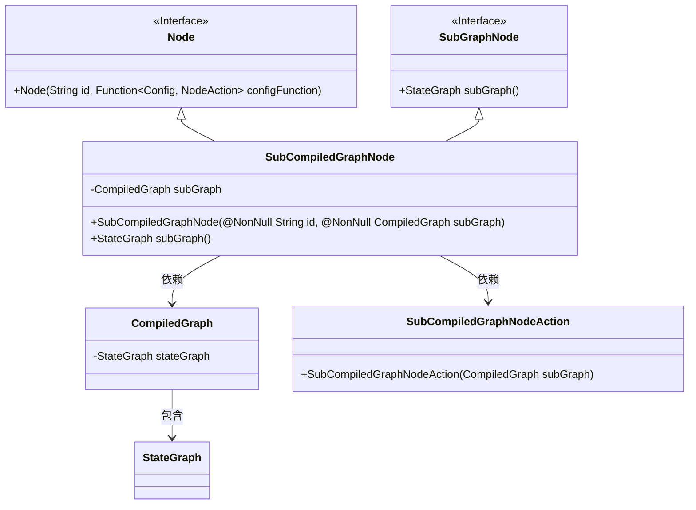
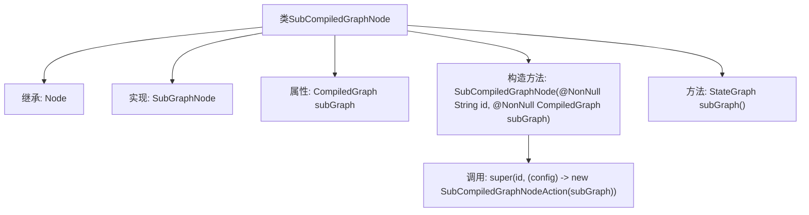

# 基础信息

|      |      |
|------|------|
| 名称 | SubCompiledGraphNode |
| 编码语言 | .java |
| 代码路径 | spring-ai-alibaba/spring-ai-alibaba-graph/spring-ai-alibaba-graph-core/src/main/java/com/alibaba/cloud/ai/graph/internal/node/SubCompiledGraphNode.java |
| 包名 | com.alibaba.cloud.ai.graph.internal.node |
| 依赖项 | ['lombok.NonNull', 'com.alibaba.cloud.ai.graph.CompiledGraph', 'com.alibaba.cloud.ai.graph.StateGraph', 'com.alibaba.cloud.ai.graph.SubGraphNode', 'com.alibaba.cloud.ai.graph.state.AgentState'] |
| 概述说明 | SubCompiledGraphNode继承Node，包含子图并提供访问方法。 |

# 说明

SubCompiledGraphNode类继承自Node类，主要功能是管理和访问子图。该类包含一个名为subGraph的属性，用于存储子图数据。此外，SubCompiledGraphNode类提供了专门的方法，以便用户可以方便地访问和操作子图。通过继承Node类，SubCompiledGraphNode具备了Node的所有基础功能，同时扩展了子图处理的能力。

# 类列表 Class Summary

| 名称   | 类型  | 说明 |
|-------|------|-------------|
| SubCompiledGraphNode | class | SubCompiledGraphNode类继承Node，包含子图subGraph，提供子图访问方法。 |

## 类 SubCompiledGraphNode

|      |      |
|------|------|
| 访问范围 | public |
| 类型 | class |
| 名称 | SubCompiledGraphNode |
| 说明 | SubCompiledGraphNode类继承Node，包含子图subGraph，提供子图访问方法。 |

### UML类图

**描述：**  
`SubCompiledGraphNode` 是一个继承自 `Node` 并实现 `SubGraphNode` 接口的类，用于表示一个子编译图节点。它包含一个 `CompiledGraph` 类型的私有成员 `subGraph`，并通过构造函数进行初始化。`SubCompiledGraphNode` 提供了 `subGraph()` 方法，返回 `CompiledGraph` 中的 `stateGraph`。`CompiledGraph` 类包含一个 `StateGraph` 类型的成员，表示状态图。`SubCompiledGraphNodeAction` 是 `SubCompiledGraphNode` 的依赖类，用于处理节点的行为。

### 内部方法调用关系图

这段代码定义了一个名为`SubCompiledGraphNode`的类，该类继承自`Node`并实现了`SubGraphNode`接口。类中包含一个`CompiledGraph`类型的私有属性`subGraph`，并通过构造函数进行初始化。构造函数在调用父类构造函数时，传入了一个`SubCompiledGraphNodeAction`实例。此外，类中还定义了一个`subGraph()`方法，用于返回`subGraph`的`stateGraph`属性。这段代码主要用于管理子图的节点及其状态图。

### 字段列表 Field List

| 名称  | 类型  | 说明 |
|-------|-------|------|
| subGraph | CompiledGraph | 子图使用私有编译图对象。 |

### 方法列表 Method List

| 名称  | 类型  | 说明 |
|-------|-------|------|
| subGraph | StateGraph | 该方法返回子图的状态图。 |

