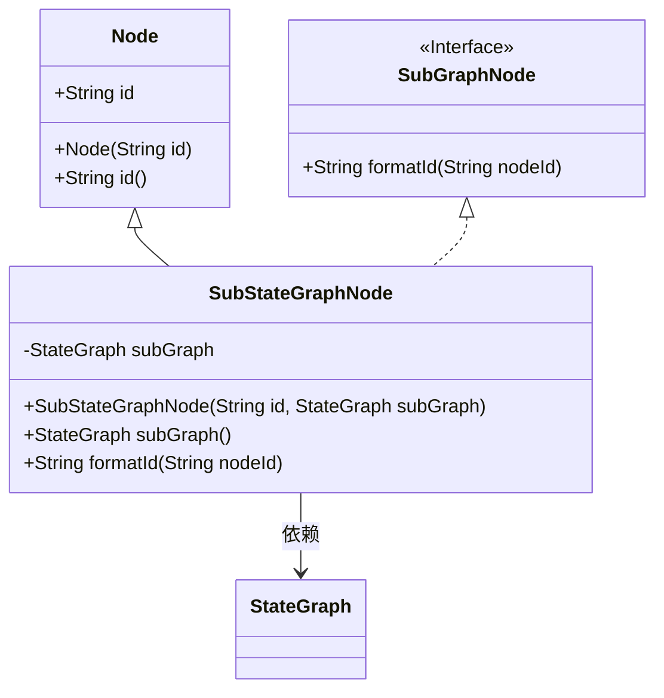
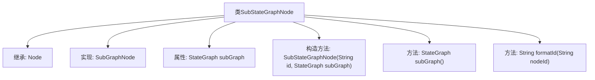

# 基础信息

|      |      |
|------|------|
| 名称 | SubStateGraphNode |
| 编码语言 | .java |
| 代码路径 | spring-ai-alibaba/spring-ai-alibaba-graph/spring-ai-alibaba-graph-core/src/main/java/com/alibaba/cloud/ai/graph/internal/node/SubStateGraphNode.java |
| 包名 | com.alibaba.cloud.ai.graph.internal.node |
| 依赖项 | ['lombok.NonNull', 'com.alibaba.cloud.ai.graph.StateGraph', 'com.alibaba.cloud.ai.graph.SubGraphNode', 'com.alibaba.cloud.ai.graph.state.AgentState'] |
| 概述说明 | SubStateGraphNode继承Node并实现SubGraphNode，包含子图StateGraph和方法。 |

# 说明

SubStateGraphNode类继承自Node类，并实现了SubGraphNode接口。该类主要用于管理和操作子图StateGraph，提供了与子图相关的各种方法。通过继承和实现，SubStateGraphNode类具备了Node类的基本功能，同时扩展了对子图的支持，使其能够在复杂的图结构中有效地处理子图的操作和管理。

# 类列表 Class Summary

| 名称   | 类型  | 说明 |
|-------|------|-------------|
| SubStateGraphNode | class | SubStateGraphNode类继承Node并实现SubGraphNode，包含子图StateGraph和相关方法。 |

## 类 SubStateGraphNode

|      |      |
|------|------|
| 访问范围 | public |
| 类型 | class |
| 名称 | SubStateGraphNode |
| 说明 | SubStateGraphNode类继承Node并实现SubGraphNode，包含子图StateGraph和相关方法。 |

### UML类图

这段代码描述了一个继承自 `Node` 类并实现 `SubGraphNode` 接口的 `SubStateGraphNode` 类。`SubStateGraphNode` 类包含一个私有的 `StateGraph` 对象，并通过构造函数初始化。该类提供了获取 `subGraph` 的方法以及格式化节点 ID 的方法。`SubGraphNode` 接口定义了 `formatId` 方法，`SubStateGraphNode` 类实现了该方法。类图清晰地展示了类之间的继承和实现关系，以及 `SubStateGraphNode` 对 `StateGraph` 的依赖。

### 内部方法调用关系图

这段代码定义了一个名为 `SubStateGraphNode` 的类，该类继承自 `Node` 并实现了 `SubGraphNode` 接口。类中包含一个 `StateGraph` 类型的私有属性 `subGraph`，并通过构造方法进行初始化。类中还提供了两个方法：`subGraph()` 用于返回 `subGraph` 属性，`formatId()` 用于格式化节点ID。流程图清晰地展示了类的继承关系、属性、构造方法以及方法之间的调用关系。

### 字段列表 Field List

| 名称  | 类型  | 说明 |
|-------|-------|------|
| subGraph | StateGraph | 子图状态变量声明为私有且不可变。 |

### 方法列表 Method List

| 名称  | 类型  | 说明 |
|-------|-------|------|
| subGraph | StateGraph | 方法返回子图对象。 |
| formatId | String | 方法formatId调用SubGraphNode.formatId处理id和nodeId。 |

