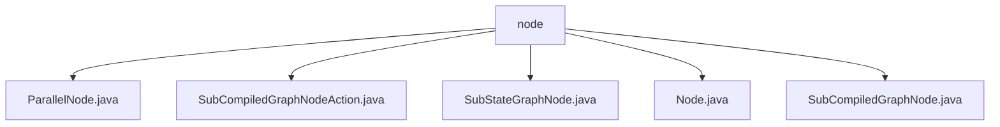

# 基础信息

|      |      |
|------|------|
| 名称 | node |
| 编码语言 | .java |
| 代码路径 | spring-ai-alibaba/spring-ai-alibaba-graph/spring-ai-alibaba-graph-core/src/main/java/com/alibaba/cloud/ai/graph/internal/node |
| 包名 | spring-ai-alibaba.spring-ai-alibaba-graph.spring-ai-alibaba-graph-core.src.main.java.com.alibaba.cloud.ai.graph.internal.node |
| 概述说明 | ParallelNode类支持异步操作和状态更新，SubStateGraphNode类管理子图，Node类提供ID和哈希功能，SubCompiledGraphNode类扩展子图处理能力。 |

# 说明

## 概述
该代码模块主要围绕图结构中的节点管理展开，提供了多种节点类型的实现，包括基础节点、并行节点、子图节点等。这些节点类通过继承和接口实现，扩展了基础功能，支持复杂的图操作和管理。模块的核心目标是为图结构中的节点提供高效的管理和操作能力，特别是在并行任务处理和子图管理方面表现出色。

## 主要业务场景
1. **并行任务处理**：通过`ParallelNode`类，模块支持多个任务的同时执行，利用异步机制提高执行效率，并能够动态更新任务状态，确保并行操作的全面管理。
2. **子图管理**：`SubStateGraphNode`和`SubCompiledGraphNode`类专注于子图的管理和操作。这些类继承自`Node`类，并扩展了对子图的支持，使得在复杂的图结构中能够有效地处理子图的操作和管理。
3. **基础节点管理**：`Node`类作为基础节点，提供了节点的唯一标识、操作管理以及相等性检查等功能，为其他节点类提供了基础支持，确保节点在哈希表中的高效存储和检索。

该模块的设计适用于需要高效处理图结构、并行任务以及子图管理的场景，特别是在需要动态更新任务状态和复杂图操作的应用中表现出色。

### 包内部结构视图

该流程图展示了 `node` 目录下的文件层级关系。`node` 作为根目录，包含了五个文件：`ParallelNode.java`、`SubCompiledGraphNodeAction.java`、`SubStateGraphNode.java`、`Node.java` 和 `SubCompiledGraphNode.java`。这些文件直接位于 `node` 目录下，没有进一步的子目录嵌套。

# 文件列表 File List

| 名称   | 类型  | 说明 |
|-------|------|-------------|
| [Node.java](Node.md) | file | Node类具备ID和ActionFactory，支持更新ID、相等性检查和哈希码生成。 |
| [SubCompiledGraphNodeAction.java](SubCompiledGraphNodeAction.md) | file | 输入内容为空，无法生成概要描述。 |
| [SubCompiledGraphNode.java](SubCompiledGraphNode.md) | file | SubCompiledGraphNode继承Node，包含子图并提供访问方法。 |
| [SubStateGraphNode.java](SubStateGraphNode.md) | file | SubStateGraphNode继承Node并实现SubGraphNode，包含子图StateGraph和方法。 |
| [ParallelNode.java](ParallelNode.md) | file | ParallelNode类实现并行节点功能，支持异步操作和状态更新。 |

