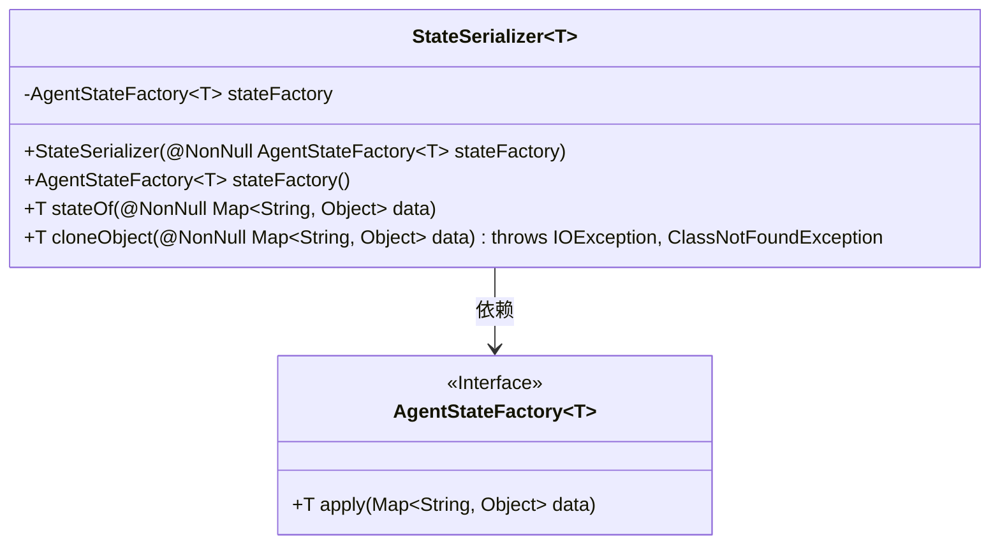
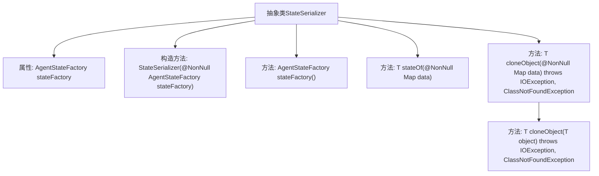

# 基础信息

|      |      |
|------|------|
| 名称 | StateSerializer |
| 编码语言 | .java |
| 代码路径 | spring-ai-alibaba/spring-ai-alibaba-graph/spring-ai-alibaba-graph-core/src/main/java/com/alibaba/cloud/ai/graph/serializer/StateSerializer.java |
| 包名 | com.alibaba.cloud.ai.graph.serializer |
| 依赖项 | ['java.io.IOException', 'java.util.Map', 'com.alibaba.cloud.ai.graph.OverAllState', 'lombok.NonNull', 'com.alibaba.cloud.ai.graph.state.AgentState', 'com.alibaba.cloud.ai.graph.state.AgentStateFactory'] |
| 概述说明 | 抽象类StateSerializer实现Serializer接口，含状态工厂和对象克隆方法。 |

# 说明

抽象类StateSerializer实现了Serializer接口，主要用于序列化操作。该类包含状态工厂和对象克隆方法，状态工厂用于创建和管理对象的状态，而对象克隆方法则用于复制对象实例，确保在序列化和反序列化过程中对象的完整性和一致性。通过实现Serializer接口，StateSerializer提供了统一的序列化机制，适用于需要保存和恢复对象状态的场景。

# 类列表 Class Summary

| 名称   | 类型  | 说明 |
|-------|------|-------------|
| StateSerializer | class | 抽象类StateSerializer实现Serializer接口，包含状态工厂和对象克隆方法。 |

## 类 StateSerializer

|      |      |
|------|------|
| 访问范围 | public abstract |
| 类型 | class |
| 名称 | StateSerializer |
| 说明 | 抽象类StateSerializer实现Serializer接口，包含状态工厂和对象克隆方法。 |

### UML类图

这段代码定义了一个抽象类 `StateSerializer<T>`，它实现了 `Serializer<T>` 接口，并依赖于 `AgentStateFactory<T>` 接口。`StateSerializer` 类通过 `stateFactory` 对象将 `Map<String, Object>` 数据转换为 `T` 类型的对象，并提供了克隆对象的功能。`AgentStateFactory` 是一个泛型接口，负责将 `Map` 数据转换为 `T` 类型的对象。

### 内部方法调用关系图

这段代码定义了一个抽象类 `StateSerializer<T>`，它实现了 `Serializer<T>` 接口。类中包含一个 `AgentStateFactory<T>` 类型的属性 `stateFactory`，并通过构造方法进行初始化。类提供了三个方法：`stateFactory()` 用于返回 `stateFactory` 属性，`stateOf()` 方法通过 `stateFactory` 将 `Map<String, Object>` 转换为 `T` 类型对象，`cloneObject()` 方法则通过 `stateFactory` 和 `cloneObject(T object)` 方法实现对对象的克隆操作。整个类的设计主要用于状态序列化和对象克隆。

### 字段列表 Field List

| 名称  | 类型  | 说明 |
|-------|-------|------|
| stateFactory | AgentStateFactory<T> | 私有常量stateFactory为AgentStateFactory类型。 |

### 方法列表 Method List

| 名称  | 类型  | 说明 |
|-------|-------|------|
| cloneObject | T | 克隆对象方法，接收非空数据映射，返回克隆对象。 |
| stateFactory | AgentStateFactory<T> | 该方法返回一个不可变的AgentStateFactory实例。 |
| stateOf | T | 该方法通过传入的Map数据调用stateFactory生成并返回状态对象。 |

