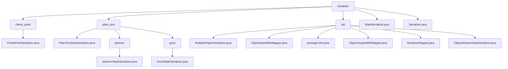

# 基础信息

|      |      |
|------|------|
| 名称 | serializer |
| 编码语言 | .java |
| 代码路径 | spring-ai-alibaba/spring-ai-alibaba-graph/spring-ai-alibaba-graph-core/src/main/java/com/alibaba/cloud/ai/graph/serializer |
| 包名 | spring-ai-alibaba.spring-ai-alibaba-graph.spring-ai-alibaba-graph-core.src.main.java.com.alibaba.cloud.ai.graph.serializer |
| 概述说明 | CheckPointSerializer继承NullableObjectSerializer，处理Checkpoint对象的序列化和反序列化，确保数据完整性。 |

# 说明

## 概述

该代码模块主要围绕序列化与反序列化功能展开，提供了多种工具类和实现类来支持复杂数据结构的序列化与反序列化操作。模块中包含了多个序列化器类，分别基于不同的技术栈（如Jackson、Gson）实现，以确保数据在存储和传输过程中的完整性与一致性。所有序列化器类均继承自`PlainTextStateSerializer`或实现`Serializer`接口，并针对不同的数据格式（如JSON）进行了专门的优化和扩展。模块还提供了序列化器的注册、注销和获取功能，确保序列化器的有效管理。

## 主要业务场景

1. **Checkpoint对象的序列化与反序列化**：`CheckPointSerializer`继承自`NullableObjectSerializer`，专门用于处理`Checkpoint`对象的序列化与反序列化操作。它利用`StateSerializer`来管理和转换对象的状态信息，确保数据的完整性和一致性。

2. **OverAllState的序列化与反序列化**：`PlainTextStateSerializer`类专门用于处理`OverAllState`对象的序列化与反序列化，确保该对象在存储和传输过程中能够保持数据的完整性和一致性。

3. **JSON格式的序列化与反序列化**：
   - `JacksonStateSerializer`利用`ObjectMapper`实现JSON格式的序列化与反序列化，适用于需要与JSON数据交互的场景。
   - `GsonStateSerializer`基于`Gson`库实现JSON格式的序列化与反序列化，支持`application/json` MIME类型，确保数据格式的兼容性和正确性。

4. **多格式支持**：通过继承`PlainTextStateSerializer`，模块能够灵活支持多种文本格式的序列化与反序列化，满足不同业务场景的需求，特别是在AI图计算等场景中，确保数据的高效处理和传输。

5. **序列化器管理**：`SerializerMapper`类提供了序列化器的注册、注销和获取功能，确保序列化器的有效管理。该功能适用于需要动态管理序列化器的场景，方便在需要时进行注册和注销操作，并能快速获取所需的序列化器。

6. **默认序列化器支持**：`SerializerMapper`类还提供了默认序列化器支持，确保在没有特定序列化器时仍能正常运作。该功能为系统提供了基础支持，适用于需要处理多种数据类型但无法预先确定所有序列化器的场景。

7. **对象状态管理**：`StateSerializer`抽象类实现了`Serializer`接口，主要用于序列化操作。该类包含状态工厂和对象克隆方法，状态工厂用于创建和管理对象的状态，而对象克隆方法则用于复制对象实例，确保在序列化和反序列化过程中对象的完整性和一致性。通过实现`Serializer`接口，`StateSerializer`提供了统一的序列化机制，适用于需要保存和恢复对象状态的场景。

### 包内部结构视图

该流程图展示了`serializer`目录下的层级结构，包括`check_point`、`plain_text`和`std`三个子目录，以及多个具体的序列化器文件。每个子目录下进一步细分了不同的序列化器实现，如`jackson`和`gson`，展示了复杂的文件组织和依赖关系。

# 文件列表 File List

| 名称   | 类型  | 说明 |
|-------|------|-------------|
| [Serializer.java](Serializer.md) | file | 无内容可总结。 |
| [StateSerializer.java](StateSerializer.md) | file | 抽象类StateSerializer实现Serializer接口，含状态工厂和对象克隆方法。 |
| [std](std/_module.md) | package | 多个类实现序列化接口，管理序列化器，支持数据流读写与映射功能。 |
| [plain_text](plain_text/_module.md) | package | PlainTextStateSerializer处理OverAllState序列化，Jackson和Gson子类分别实现JSON格式转换。 |
| [check_point](check_point/_module.md) | package | CheckPointSerializer继承NullableObjectSerializer，负责Checkpoint对象的序列化与反序列化，使用StateSerializer处理状态。 |

