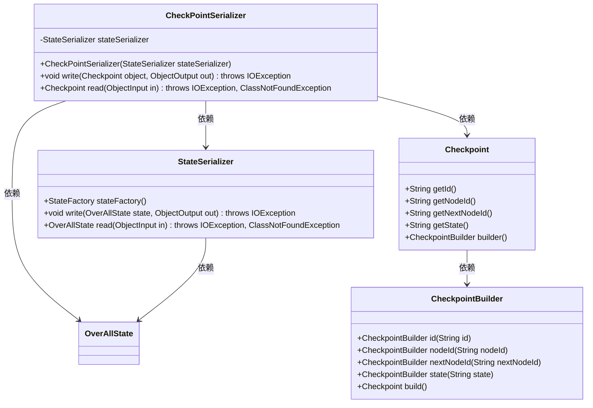
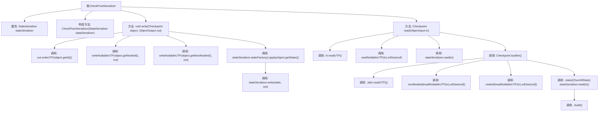

# 基础信息

|      |      |
|------|------|
| 名称 | CheckPointSerializer |
| 编码语言 | .java |
| 代码路径 | spring-ai-alibaba/spring-ai-alibaba-graph/spring-ai-alibaba-graph-core/src/main/java/com/alibaba/cloud/ai/graph/serializer/check_point/CheckPointSerializer.java |
| 包名 | com.alibaba.cloud.ai.graph.serializer.check_point |
| 依赖项 | ['java.io.IOException', 'java.io.ObjectInput', 'java.io.ObjectOutput', 'com.alibaba.cloud.ai.graph.OverAllState', 'com.alibaba.cloud.ai.graph.checkpoint.Checkpoint', 'com.alibaba.cloud.ai.graph.serializer.StateSerializer', 'com.alibaba.cloud.ai.graph.serializer.std.NullableObjectSerializer', 'com.alibaba.cloud.ai.graph.state.AgentState'] |
| 概述说明 | CheckPointSerializer继承NullableObjectSerializer，负责Checkpoint对象的序列化与反序列化，使用StateSerializer处理状态。 |

# 说明

CheckPointSerializer继承自NullableObjectSerializer，专门用于处理Checkpoint对象的序列化和反序列化操作。它利用StateSerializer来管理和转换对象的状态信息，确保数据的完整性和一致性。

# 类列表 Class Summary

| 名称   | 类型  | 说明 |
|-------|------|-------------|
| CheckPointSerializer | class | CheckPointSerializer实现NullableObjectSerializer，负责Checkpoint对象的序列化和反序列化，使用StateSerializer处理状态。 |

## 类 CheckPointSerializer

|      |      |
|------|------|
| 访问范围 | public |
| 类型 | class |
| 名称 | CheckPointSerializer |
| 说明 | CheckPointSerializer实现NullableObjectSerializer，负责Checkpoint对象的序列化和反序列化，使用StateSerializer处理状态。 |

### UML类图

这段代码描述了一个 `CheckPointSerializer` 类，它实现了 `NullableObjectSerializer<Checkpoint>` 接口，用于序列化和反序列化 `Checkpoint` 对象。`CheckPointSerializer` 依赖于 `StateSerializer` 来处理 `OverAllState` 的序列化。`Checkpoint` 类通过 `CheckpointBuilder` 构建对象。整个流程涉及多个类的协作，确保 `Checkpoint` 对象的状态能够正确地进行序列化和反序列化。

### 内部方法调用关系图

这段代码定义了一个`CheckPointSerializer`类，用于序列化和反序列化`Checkpoint`对象。它包含一个`StateSerializer`属性，用于处理`OverAllState`的序列化。`write`方法将`Checkpoint`对象的各个字段写入输出流，而`read`方法从输入流中读取数据并构建一个新的`Checkpoint`对象。代码通过调用多个辅助方法来完成这些操作，确保了数据的完整性和正确性。

### 字段列表 Field List

| 名称  | 类型  | 说明 |
|-------|-------|------|
| stateSerializer | StateSerializer | 定义了最终状态序列化器实例stateSerializer。 |

### 方法列表 Method List

| 名称  | 类型  | 说明 |
|-------|-------|------|
| read | Checkpoint | 重写read方法，从输入流读取并构建Checkpoint对象。 |
| write | void | 方法write将Checkpoint对象的ID、节点ID、下一节点ID及状态序列化并写入输出流。 |

