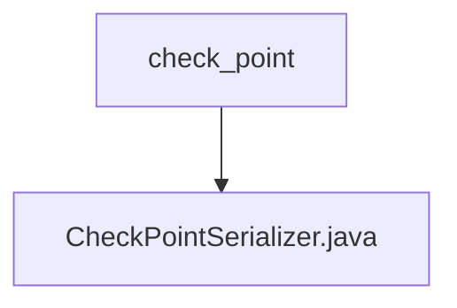

# 基础信息

|      |      |
|------|------|
| 名称 | check_point |
| 编码语言 | .java |
| 代码路径 | spring-ai-alibaba/spring-ai-alibaba-graph/spring-ai-alibaba-graph-core/src/main/java/com/alibaba/cloud/ai/graph/serializer/check_point |
| 包名 | spring-ai-alibaba.spring-ai-alibaba-graph.spring-ai-alibaba-graph-core.src.main.java.com.alibaba.cloud.ai.graph.serializer.check_point |
| 概述说明 | CheckPointSerializer继承NullableObjectSerializer，负责Checkpoint对象的序列化与反序列化，使用StateSerializer处理状态。 |

# 说明

CheckPointSerializer继承自NullableObjectSerializer，专门用于处理Checkpoint对象的序列化和反序列化操作。它利用StateSerializer来管理和转换对象的状态信息，确保数据的完整性和一致性。

### 包内部结构视图

该流程图展示了路径的层级关系，`check_point`文件夹中包含一个文件`CheckPointSerializer.java`。通过简洁的图形表示，清晰地反映了文件与文件夹之间的从属关系，便于理解项目结构。

# 文件列表 File List

| 名称   | 类型  | 说明 |
|-------|------|-------------|
| [CheckPointSerializer.java](CheckPointSerializer.md) | file | CheckPointSerializer继承NullableObjectSerializer，负责Checkpoint对象的序列化与反序列化，使用StateSerializer处理状态。 |

