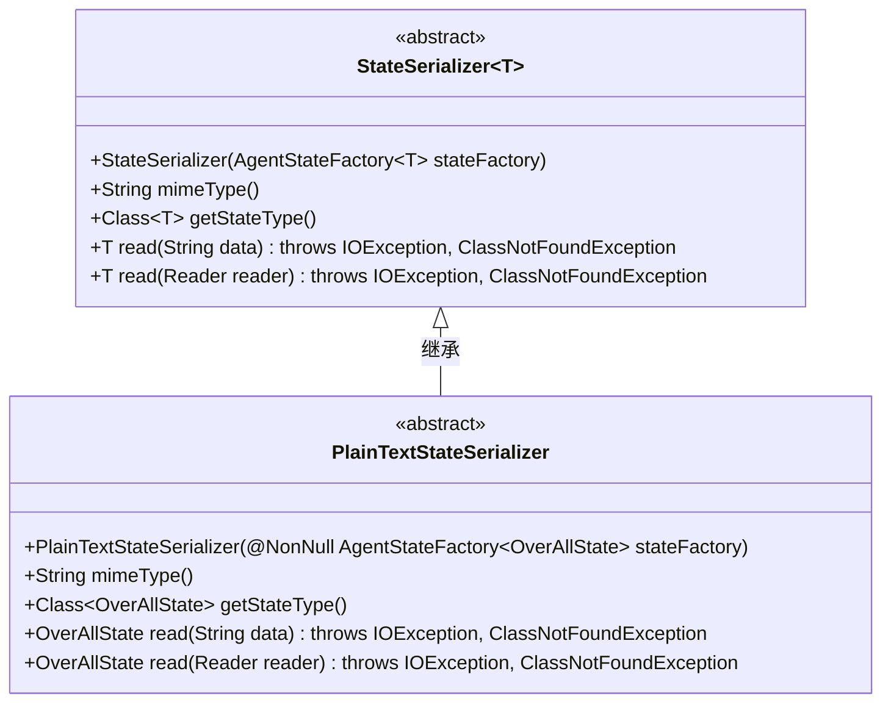
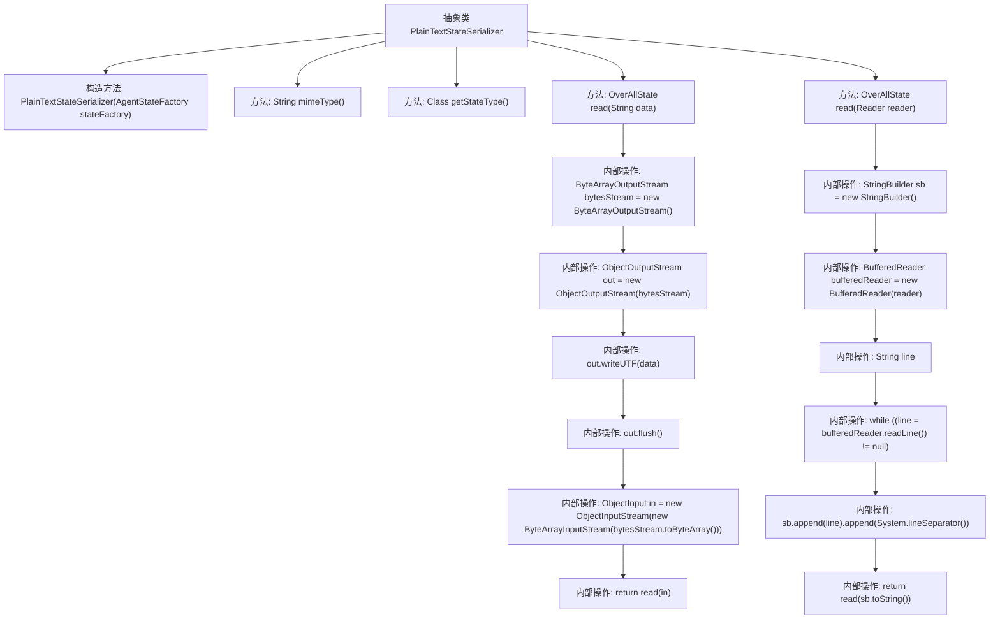

# 基础信息

|      |      |
|------|------|
| 名称 | PlainTextStateSerializer |
| 编码语言 | .java |
| 代码路径 | spring-ai-alibaba/spring-ai-alibaba-graph/spring-ai-alibaba-graph-core/src/main/java/com/alibaba/cloud/ai/graph/serializer/plain_text/PlainTextStateSerializer.java |
| 包名 | com.alibaba.cloud.ai.graph.serializer.plain_text |
| 依赖项 | ['java.io.BufferedReader', 'java.io.ByteArrayInputStream', 'java.io.ByteArrayOutputStream', 'java.io.IOException', 'java.io.ObjectInput', 'java.io.ObjectInputStream', 'java.io.ObjectOutputStream', 'java.io.Reader', 'java.lang.reflect.ParameterizedType', 'java.lang.reflect.Type', 'com.alibaba.cloud.ai.graph.OverAllState', 'lombok.NonNull', 'com.alibaba.cloud.ai.graph.serializer.StateSerializer', 'com.alibaba.cloud.ai.graph.state.AgentState', 'com.alibaba.cloud.ai.graph.state.AgentStateFactory'] |
| 概述说明 | PlainTextStateSerializer继承StateSerializer，处理OverAllState的序列化与反序列化。 |

# 说明

PlainTextStateSerializer类继承自StateSerializer，专门用于处理OverAllState的序列化与反序列化操作。该类通过继承StateSerializer，实现了将OverAllState对象转换为文本格式以及从文本格式还原为OverAllState对象的功能，确保了数据在存储和传输过程中的完整性与一致性。

# 类列表 Class Summary

| 名称   | 类型  | 说明 |
|-------|------|-------------|
| PlainTextStateSerializer | class | PlainTextStateSerializer类继承StateSerializer，支持OverAllState的序列化与反序列化。 |

## 类 PlainTextStateSerializer

|      |      |
|------|------|
| 访问范围 | public abstract |
| 类型 | class |
| 名称 | PlainTextStateSerializer |
| 说明 | PlainTextStateSerializer类继承StateSerializer，支持OverAllState的序列化与反序列化。 |

### UML类图

类图描述：
`PlainTextStateSerializer` 是一个抽象类，继承自泛型类 `StateSerializer<OverAllState>`。它提供了对 `OverAllState` 类型对象的序列化和反序列化功能，支持从字符串和 `Reader` 对象中读取数据。`PlainTextStateSerializer` 实现了 `mimeType` 方法，返回 "plain/text" 作为 MIME 类型，并通过 `getStateType` 方法返回 `OverAllState` 类的类型。`read` 方法通过 `ObjectOutputStream` 和 `ObjectInputStream` 处理数据流，实现数据的读取和转换。

### 内部方法调用关系图

这段代码定义了一个抽象类 `PlainTextStateSerializer`，它继承自 `StateSerializer<OverAllState>`。该类包含一个构造方法、两个重写方法和两个自定义方法。`read(String data)` 方法将字符串数据写入字节流并通过反序列化读取对象，而 `read(Reader reader)` 方法从读取器中读取数据并调用 `read(String data)` 方法进行处理。流程图展示了类中方法的调用关系以及内部操作的执行顺序。

### 字段列表 Field List

| 名称  | 类型  | 说明 |
|-------|-------|------|

### 方法列表 Method List

| 名称  | 类型  | 说明 |
|-------|-------|------|
| read | OverAllState | 读取Reader内容并返回OverAllState对象。 |
| getStateType | Class<OverAllState> | 该方法返回OverAllState类的类型。 |
| mimeType | String | 重写mimeType方法，返回值为"plain/text"。 |
| read | OverAllState | 方法读取字符串数据并返回OverAllState对象，处理IO和类未找到异常。 |

