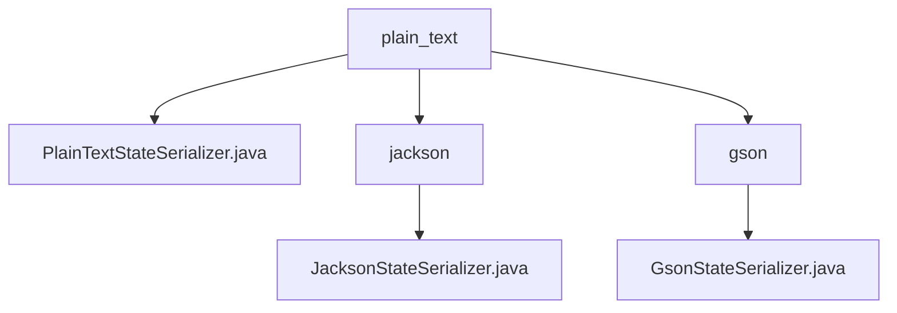

# 基础信息

|      |      |
|------|------|
| 名称 | plain_text |
| 编码语言 | .java |
| 代码路径 | spring-ai-alibaba/spring-ai-alibaba-graph/spring-ai-alibaba-graph-core/src/main/java/com/alibaba/cloud/ai/graph/serializer/plain_text |
| 包名 | spring-ai-alibaba.spring-ai-alibaba-graph.spring-ai-alibaba-graph-core.src.main.java.com.alibaba.cloud.ai.graph.serializer.plain_text |
| 概述说明 | PlainTextStateSerializer处理OverAllState序列化，Jackson和Gson子类分别实现JSON格式转换。 |

# 说明

## 概述

该代码模块主要涉及序列化与反序列化功能的实现，专注于将对象转换为文本格式以及从文本格式还原为对象。模块中包含了多个序列化器类，分别基于不同的技术栈（如Jackson、Gson）实现，以确保数据在存储和传输过程中的完整性与一致性。所有序列化器类均继承自`PlainTextStateSerializer`，并针对不同的数据格式（如JSON）进行了专门的优化和扩展。

## 主要业务场景

1. **OverAllState的序列化与反序列化**：`PlainTextStateSerializer`类专门用于处理`OverAllState`对象的序列化与反序列化，确保该对象在存储和传输过程中能够保持数据的完整性和一致性。

2. **JSON格式的序列化与反序列化**：
   - `JacksonStateSerializer`利用`ObjectMapper`实现JSON格式的序列化与反序列化，适用于需要与JSON数据交互的场景。
   - `GsonStateSerializer`基于`Gson`库实现JSON格式的序列化与反序列化，支持`application/json` MIME类型，确保数据格式的兼容性和正确性。

3. **多格式支持**：通过继承`PlainTextStateSerializer`，模块能够灵活支持多种文本格式的序列化与反序列化，满足不同业务场景的需求，特别是在AI图计算等场景中，确保数据的高效处理和传输。

### 包内部结构视图

该流程图展示了`plain_text`文件夹与其子文件夹`jackson`和`gson`的层级关系，以及这些文件夹中的具体文件。`plain_text`文件夹包含一个直接文件`PlainTextStateSerializer.java`，并且它还有两个子文件夹`jackson`和`gson`，分别包含`JacksonStateSerializer.java`和`GsonStateSerializer.java`文件。

# 文件列表 File List

| 名称   | 类型  | 说明 |
|-------|------|-------------|
| [PlainTextStateSerializer.java](PlainTextStateSerializer.md) | file | PlainTextStateSerializer继承StateSerializer，处理OverAllState的序列化与反序列化。 |
| [gson](gson/_module.md) | package | GsonStateSerializer继承PlainTextStateSerializer，用Gson处理JSON序列化，支持application/json。 |
| [jackson](jackson/_module.md) | package | JacksonStateSerializer继承PlainTextStateSerializer，利用ObjectMapper处理JSON序列化与反序列化。 |

