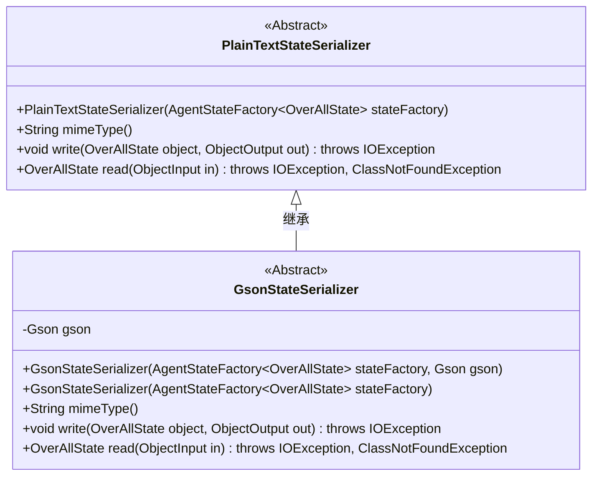
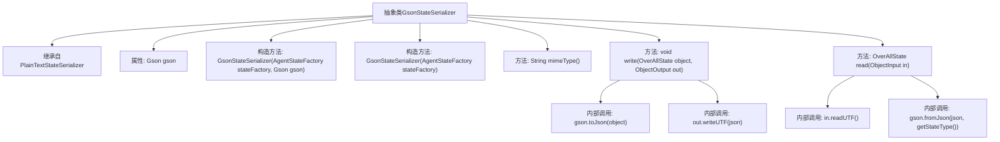

# 基础信息

|      |      |
|------|------|
| 名称 | GsonStateSerializer |
| 编码语言 | .java |
| 代码路径 | spring-ai-alibaba/spring-ai-alibaba-graph/spring-ai-alibaba-graph-core/src/main/java/com/alibaba/cloud/ai/graph/serializer/plain_text/gson/GsonStateSerializer.java |
| 包名 | com.alibaba.cloud.ai.graph.serializer.plain_text.gson |
| 依赖项 | ['java.io.IOException', 'java.io.ObjectInput', 'java.io.ObjectOutput', 'com.alibaba.cloud.ai.graph.OverAllState', 'com.google.gson.Gson', 'com.google.gson.GsonBuilder', 'lombok.NonNull', 'com.alibaba.cloud.ai.graph.serializer.plain_text.PlainTextStateSerializer', 'com.alibaba.cloud.ai.graph.state.AgentState', 'com.alibaba.cloud.ai.graph.state.AgentStateFactory'] |
| 概述说明 | GsonStateSerializer继承PlainTextStateSerializer，用Gson处理JSON序列化，支持application/json。 |

# 说明

GsonStateSerializer是PlainTextStateSerializer的子类，专门用于处理JSON数据的序列化和反序列化。它利用Gson库来实现这些功能，并支持application/json MIME类型，确保数据格式的兼容性和正确性。

# 类列表 Class Summary

| 名称   | 类型  | 说明 |
|-------|------|-------------|
| GsonStateSerializer | class | GsonStateSerializer继承PlainTextStateSerializer，使用Gson处理JSON序列化和反序列化，支持application/json MIME类型。 |

## 类 GsonStateSerializer

|      |      |
|------|------|
| 访问范围 | public abstract |
| 类型 | class |
| 名称 | GsonStateSerializer |
| 说明 | GsonStateSerializer继承PlainTextStateSerializer，使用Gson处理JSON序列化和反序列化，支持application/json MIME类型。 |

### UML类图

**描述：**  
`GsonStateSerializer` 是一个抽象类，继承自 `PlainTextStateSerializer`，用于将 `OverAllState` 对象序列化为 JSON 格式的字符串。它使用 `Gson` 库进行序列化和反序列化操作。`GsonStateSerializer` 提供了两种构造函数，一种接受 `AgentStateFactory` 和 `Gson` 对象，另一种仅接受 `AgentStateFactory` 并默认创建一个 `Gson` 实例。该类重写了 `mimeType`、`write` 和 `read` 方法，分别用于返回 MIME 类型、将对象写入输出流以及从输入流中读取对象。

### 内部方法调用关系图

这段代码定义了一个抽象类 `GsonStateSerializer`，它继承自 `PlainTextStateSerializer`。该类包含一个 `Gson` 对象作为属性，并提供了两个构造方法，分别用于初始化 `Gson` 对象。类中重写了 `mimeType()` 方法，返回 `"application/json"`。此外，还实现了 `write()` 和 `read()` 方法，分别用于将 `OverAllState` 对象序列化为 JSON 字符串并写入输出流，以及从输入流中读取 JSON 字符串并反序列化为 `OverAllState` 对象。

### 字段列表 Field List

| 名称  | 类型  | 说明 |
|-------|-------|------|
| gson | Gson | 保护类型的Gson对象。 |

### 方法列表 Method List

| 名称  | 类型  | 说明 |
|-------|-------|------|
| mimeType | String | 该方法返回MIME类型为application/json。 |
| write | void | 将对象序列化为JSON并写入输出流。 |
| read | OverAllState | 重写read方法，从输入流读取JSON并转换为指定类型。 |

