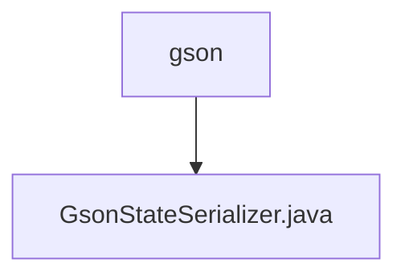

# 基础信息

|      |      |
|------|------|
| 名称 | gson |
| 编码语言 | .java |
| 代码路径 | spring-ai-alibaba/spring-ai-alibaba-graph/spring-ai-alibaba-graph-core/src/main/java/com/alibaba/cloud/ai/graph/serializer/plain_text/gson |
| 包名 | spring-ai-alibaba.spring-ai-alibaba-graph.spring-ai-alibaba-graph-core.src.main.java.com.alibaba.cloud.ai.graph.serializer.plain_text.gson |
| 概述说明 | GsonStateSerializer继承PlainTextStateSerializer，用Gson处理JSON序列化，支持application/json。 |

# 说明

GsonStateSerializer是PlainTextStateSerializer的子类，专门用于处理JSON数据的序列化和反序列化。它利用Gson库来实现这些功能，并支持application/json MIME类型，确保数据格式的兼容性和正确性。

### 包内部结构视图

该流程图展示了`gson`文件夹与`GsonStateSerializer.java`文件之间的层级关系。`gson`是`GsonStateSerializer.java`文件的父目录，表明该文件位于`gson`文件夹内。这种结构常用于组织代码，特别是当多个文件属于同一功能模块时。

# 文件列表 File List

| 名称   | 类型  | 说明 |
|-------|------|-------------|
| [GsonStateSerializer.java](GsonStateSerializer.md) | file | GsonStateSerializer继承PlainTextStateSerializer，用Gson处理JSON序列化，支持application/json。 |

