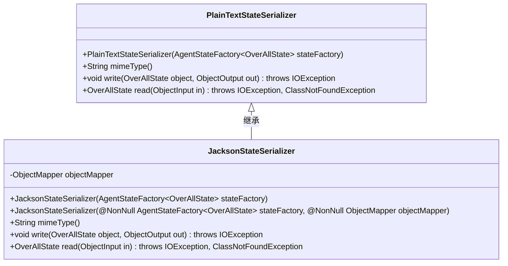
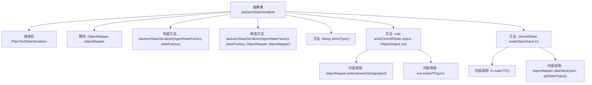

# 基础信息

|      |      |
|------|------|
| 名称 | JacksonStateSerializer |
| 编码语言 | .java |
| 代码路径 | spring-ai-alibaba/spring-ai-alibaba-graph/spring-ai-alibaba-graph-core/src/main/java/com/alibaba/cloud/ai/graph/serializer/plain_text/jackson/JacksonStateSerializer.java |
| 包名 | com.alibaba.cloud.ai.graph.serializer.plain_text.jackson |
| 依赖项 | ['java.io.IOException', 'java.io.ObjectInput', 'java.io.ObjectOutput', 'com.alibaba.cloud.ai.graph.OverAllState', 'com.fasterxml.jackson.annotation.JsonAutoDetect', 'com.fasterxml.jackson.annotation.PropertyAccessor', 'com.fasterxml.jackson.databind.ObjectMapper', 'lombok.NonNull', 'com.alibaba.cloud.ai.graph.serializer.plain_text.PlainTextStateSerializer', 'com.alibaba.cloud.ai.graph.state.AgentState', 'com.alibaba.cloud.ai.graph.state.AgentStateFactory'] |
| 概述说明 | JacksonStateSerializer继承PlainTextStateSerializer，利用ObjectMapper处理JSON序列化与反序列化。 |

# 说明

JacksonStateSerializer继承自PlainTextStateSerializer，并利用ObjectMapper进行JSON格式的序列化和反序列化操作。

# 类列表 Class Summary

| 名称   | 类型  | 说明 |
|-------|------|-------------|
| JacksonStateSerializer | class | JacksonStateSerializer继承PlainTextStateSerializer，使用ObjectMapper进行JSON序列化和反序列化。 |

## 类 JacksonStateSerializer

|      |      |
|------|------|
| 访问范围 | public abstract |
| 类型 | class |
| 名称 | JacksonStateSerializer |
| 说明 | JacksonStateSerializer继承PlainTextStateSerializer，使用ObjectMapper进行JSON序列化和反序列化。 |

### UML类图

这段代码定义了一个抽象类 `JacksonStateSerializer`，它继承自 `PlainTextStateSerializer`。`JacksonStateSerializer` 使用 `ObjectMapper` 将 `OverAllState` 对象序列化为 JSON 格式，并支持从 JSON 反序列化为 `OverAllState` 对象。类中提供了两个构造函数，分别用于初始化 `ObjectMapper` 和 `AgentStateFactory`。`mimeType` 方法返回 JSON 的 MIME 类型，`write` 和 `read` 方法分别用于序列化和反序列化操作。

### 内部方法调用关系图

这段代码定义了一个抽象类 `JacksonStateSerializer`，它继承自 `PlainTextStateSerializer`。该类主要用于序列化和反序列化 `OverAllState` 对象，使用 `ObjectMapper` 将对象转换为 JSON 格式。代码中包含两个构造方法，分别用于初始化 `ObjectMapper` 和设置字段的可见性。`write` 方法将对象序列化为 JSON 字符串并写入输出流，而 `read` 方法从输入流中读取 JSON 字符串并反序列化为 `OverAllState` 对象。

### 字段列表 Field List

| 名称  | 类型  | 说明 |
|-------|-------|------|
| objectMapper | ObjectMapper | 保护型ObjectMapper对象实例。 |

### 方法列表 Method List

| 名称  | 类型  | 说明 |
|-------|-------|------|
| mimeType | String | 方法mimeType返回MIME类型为application/json。 |
| write | void | 重写write方法，将对象序列化为JSON字符串并写入输出流。 |
| read | OverAllState | 重写方法从输入流读取JSON并反序列化为指定类型对象。 |

