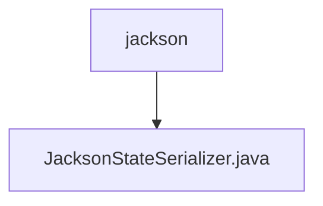

# 基础信息

|      |      |
|------|------|
| 名称 | jackson |
| 编码语言 | .java |
| 代码路径 | spring-ai-alibaba/spring-ai-alibaba-graph/spring-ai-alibaba-graph-core/src/main/java/com/alibaba/cloud/ai/graph/serializer/plain_text/jackson |
| 包名 | spring-ai-alibaba.spring-ai-alibaba-graph.spring-ai-alibaba-graph-core.src.main.java.com.alibaba.cloud.ai.graph.serializer.plain_text.jackson |
| 概述说明 | JacksonStateSerializer继承PlainTextStateSerializer，利用ObjectMapper处理JSON序列化与反序列化。 |

# 说明

JacksonStateSerializer继承自PlainTextStateSerializer，并利用ObjectMapper进行JSON格式的序列化和反序列化操作。

### 包内部结构视图

该流程图展示了`jackson`文件夹与其内部文件`JacksonStateSerializer.java`之间的层级关系。`jackson`作为父节点，包含了一个子节点`JacksonStateSerializer.java`，表示该文件位于`jackson`文件夹内。这种结构清晰地反映了文件在项目中的组织方式。

# 文件列表 File List

| 名称   | 类型  | 说明 |
|-------|------|-------------|
| [JacksonStateSerializer.java](JacksonStateSerializer.md) | file | JacksonStateSerializer继承PlainTextStateSerializer，利用ObjectMapper处理JSON序列化与反序列化。 |

