# 基础信息

|      |      |
|------|------|
| 名称 | ObjectInputWithMapper |
| 编码语言 | .java |
| 代码路径 | spring-ai-alibaba/spring-ai-alibaba-graph/spring-ai-alibaba-graph-core/src/main/java/com/alibaba/cloud/ai/graph/serializer/std/ObjectInputWithMapper.java |
| 包名 | com.alibaba.cloud.ai.graph.serializer.std |
| 依赖项 | ['java.io.IOException', 'java.io.ObjectInput', 'java.util.Optional', 'lombok.NonNull', 'lombok.extern.slf4j.Slf4j', 'com.alibaba.cloud.ai.graph.serializer.Serializer'] |
| 概述说明 | 类实现ObjectInput接口，封装输入流，支持序列化映射。 |

# 说明

该类实现了ObjectInput接口，主要用于封装输入流并支持序列化映射功能。通过该接口，可以实现从输入流中读取序列化对象，并将其映射为相应的数据结构，从而便于数据的传输和解析。该类的设计使得处理序列化数据更加高效和便捷，适用于需要从流中读取并反序列化对象的场景。

# 类列表 Class Summary

| 名称   | 类型  | 说明 |
|-------|------|-------------|
| ObjectInputWithMapper | class | 类实现ObjectInput接口，封装输入流并支持序列化映射。 |


## 类 ObjectInputWithMapper

|      |      |
|------|------|
| 访问范围 | @Slf4j;public |
| 类型 | class |
| 名称 | ObjectInputWithMapper |
| 说明 | 类实现ObjectInput接口，封装输入流并支持序列化映射。 |


### UML类图

```mermaid
classDiagram
    class ObjectInputWithMapper {
        -ObjectInput in
        -SerializerMapper mapper
        +ObjectInputWithMapper(ObjectInput in, SerializerMapper mapper)
        +Object readObject() throws ClassNotFoundException, IOException
        +int read() throws IOException
        +int read(byte[] b) throws IOException
        +int read(byte[] b, int off, int len) throws IOException
        +long skip(long n) throws IOException
        +int available() throws IOException
        +void close() throws IOException
        +void readFully(byte[] b) throws IOException
        +void readFully(byte[] b, int off, int len) throws IOException
        +int skipBytes(int n) throws IOException
        +boolean readBoolean() throws IOException
        +byte readByte() throws IOException
        +int readUnsignedByte() throws IOException
        +short readShort() throws IOException
        +int readUnsignedShort() throws IOException
        +char readChar() throws IOException
        +int readInt() throws IOException
        +long readLong() throws IOException
        +float readFloat() throws IOException
        +double readDouble() throws IOException
        +String readLine() throws IOException
        +String readUTF() throws IOException
    }

    interface ObjectInput {
        <<Interface>>
        +Object readObject() throws ClassNotFoundException, IOException
        +int read() throws IOException
        +int read(byte[] b) throws IOException
        +int read(byte[] b, int off, int len) throws IOException
        +long skip(long n) throws IOException
        +int available() throws IOException
        +void close() throws IOException
        +void readFully(byte[] b) throws IOException
        +void readFully(byte[] b, int off, int len) throws IOException
        +int skipBytes(int n) throws IOException
        +boolean readBoolean() throws IOException
        +byte readByte() throws IOException
        +int readUnsignedByte() throws IOException
        +short readShort() throws IOException
        +int readUnsignedShort() throws IOException
        +char readChar() throws IOException
        +int readInt() throws IOException
        +long readLong() throws IOException
        +float readFloat() throws IOException
        +double readDouble() throws IOException
        +String readLine() throws IOException
        +String readUTF() throws IOException
    }

    class SerializerMapper {
        +Optional~Serializer~Object~~ getSerializer(Class~?~ type)
        +Optional~Serializer~Object~~ getSerializer(String typeName)
        +Serializer~Object~ getDefaultSerializer()
    }

    interface Serializer~T~ {
        <<Interface>>
        +T read(ObjectInput in) throws IOException
    }

    ObjectInputWithMapper --> ObjectInput : 实现
    ObjectInputWithMapper --> SerializerMapper : 依赖
    SerializerMapper --> Serializer~Object~ : 依赖
```

**描述：**  
`ObjectInputWithMapper` 类实现了 `ObjectInput` 接口，并通过 `SerializerMapper` 来获取序列化器。`SerializerMapper` 负责根据类型或类型名称查找合适的序列化器，如果找不到则返回默认序列化器。`Serializer` 接口定义了读取对象的方法。该类的核心功能是读取对象时，根据对象的类型动态选择序列化器进行反序列化。


### 内部方法调用关系图

```mermaid
graph TD
    A["类ObjectInputWithMapper"]
    B["属性: ObjectInput in"]
    C["属性: SerializerMapper mapper"]
    D["构造方法: ObjectInputWithMapper(ObjectInput in, SerializerMapper mapper)"]
    E["方法: Object readObject()"]
    F["方法: int read()"]
    G["方法: int read(byte[] b)"]
    H["方法: int read(byte[] b, int off, int len)"]
    I["方法: long skip(long n)"]
    J["方法: int available()"]
    K["方法: void close()"]
    L["方法: void readFully(byte[] b)"]
    M["方法: void readFully(byte[] b, int off, int len)"]
    N["方法: int skipBytes(int n)"]
    O["方法: boolean readBoolean()"]
    P["方法: byte readByte()"]
    Q["方法: int readUnsignedByte()"]
    R["方法: short readShort()"]
    S["方法: int readUnsignedShort()"]
    T["方法: char readChar()"]
    U["方法: int readInt()"]
    V["方法: long readLong()"]
    W["方法: float readFloat()"]
    X["方法: double readDouble()"]
    Y["方法: String readLine()"]
    Z["方法: String readUTF()"]

    A --> B
    A --> C
    A --> D
    A --> E
    A --> F
    A --> G
    A --> H
    A --> I
    A --> J
    A --> K
    A --> L
    A --> M
    A --> N
    A --> O
    A --> P
    A --> Q
    A --> R
    A --> S
    A --> T
    A --> U
    A --> V
    A --> W
    A --> X
    A --> Y
    A --> Z
```



这段代码定义了一个名为`ObjectInputWithMapper`的类，它实现了`ObjectInput`接口。该类包含两个主要属性：`ObjectInput in`和`SerializerMapper mapper`，并通过构造函数进行初始化。`readObject()`方法是核心方法，它从`in`中读取对象，并根据对象的类型尝试获取相应的序列化器。如果找不到序列化器，则使用默认序列化器。其他方法如`read()`、`skip()`、`close()`等，都是对`in`对象的直接调用，用于处理不同的输入操作。整个类的设计旨在通过`SerializerMapper`对输入对象进行序列化处理。

### 字段列表 Field List

| 名称  | 类型  | 说明 |
|-------|-------|------|
| in | ObjectInput | 私有对象输入流变量声明。 |
| mapper | SerializerMapper | 私有不可变的序列化映射器实例。 |

### 方法列表 Method List

| 名称  | 类型  | 说明 |
|-------|-------|------|
| readObject | Object | 读取对象，若无序列化器则使用默认。 |
| readFully | void | 重写readFully方法，调用输入流的读取操作。 |
| readByte | byte | 重写readByte方法，调用in.readByte()并返回结果。 |
| read | int | 重写read方法，调用in.read()并返回结果。 |
| read | int | 重写read方法，调用输入流读取字节数据。 |
| readLine | String | 重写readLine方法，调用in的readLine并返回结果。 |
| readChar | char | 重写readChar方法，调用in.readChar()并抛出IOException。 |
| read | int | 重写read方法，调用输入流读取字节数组。 |
| readUnsignedByte | int | 重写readUnsignedByte方法，调用in的readUnsignedByte并返回结果。 |
| readFloat | float | 重写readFloat方法，调用in.readFloat()读取浮点数。 |
| readInt | int | 重写readInt方法，调用in.readInt()并返回结果。 |
| readLong | long | 重写readLong方法，调用in.readLong()并返回结果。 |
| readDouble | double | 重写readDouble方法，调用in.readDouble并返回结果。 |
| skipBytes | int | 重写skipBytes方法，调用in.skipBytes(n)并返回结果。 |
| readFully | void | 重写readFully方法，调用输入流读取字节数组。 |
| readUnsignedShort | int | 重写readUnsignedShort方法，调用in的readUnsignedShort并返回结果。 |
| readBoolean | boolean | 重写readBoolean方法，调用in.readBoolean并返回结果。 |
| readShort | short | 重写readShort方法，调用in.readShort()读取短整型数据。 |
| readUTF | String | 重写readUTF方法，调用in.readUTF()并返回结果。 |
| available | int | 重写available方法，调用输入流的available方法。 |
| skip | long | 重写skip方法，调用输入流的skip实现跳过指定字节数。 |
| close | void | 重写close方法，调用in.close()关闭输入流。 |


