# 基础信息

|      |      |
|------|------|
| 名称 | ObjectOutputWithMapper |
| 编码语言 | .java |
| 代码路径 | spring-ai-alibaba/spring-ai-alibaba-graph/spring-ai-alibaba-graph-core/src/main/java/com/alibaba/cloud/ai/graph/serializer/std/ObjectOutputWithMapper.java |
| 包名 | com.alibaba.cloud.ai.graph.serializer.std |
| 依赖项 | ['java.io.IOException', 'java.io.ObjectOutput', 'java.util.Objects', 'java.util.Optional', 'lombok.NonNull', 'lombok.extern.slf4j.Slf4j', 'com.alibaba.cloud.ai.graph.serializer.Serializer'] |
| 概述说明 | ObjectOutputWithMapper类实现ObjectOutput接口，利用映射器序列化对象并写入输出流。 |

# 说明

ObjectOutputWithMapper类实现了ObjectOutput接口，其主要功能是通过映射器将对象序列化，并将序列化后的数据写入输出流。该类在对象序列化和输出流操作中起到了桥梁作用，确保了对象能够被有效地转换为流数据并输出。

# 类列表 Class Summary

| 名称   | 类型  | 说明 |
|-------|------|-------------|
| ObjectOutputWithMapper | class | ObjectOutputWithMapper类实现ObjectOutput接口，通过映射器序列化对象并写入输出流。 |


## 类 ObjectOutputWithMapper

|      |      |
|------|------|
| 访问范围 | @Slf4j |
| 类型 | class |
| 名称 | ObjectOutputWithMapper |
| 说明 | ObjectOutputWithMapper类实现ObjectOutput接口，通过映射器序列化对象并写入输出流。 |


### UML类图

```mermaid
classDiagram
    class ObjectOutputWithMapper {
        -ObjectOutput out
        -SerializerMapper mapper
        +ObjectOutputWithMapper(ObjectOutput out, SerializerMapper mapper)
        +void writeObject(Object obj) throws IOException
        +void write(int b) throws IOException
        +void write(byte[] b) throws IOException
        +void write(byte[] b, int off, int len) throws IOException
        +void flush() throws IOException
        +void close() throws IOException
        +void writeBoolean(boolean v) throws IOException
        +void writeByte(int v) throws IOException
        +void writeShort(int v) throws IOException
        +void writeChar(int v) throws IOException
        +void writeInt(int v) throws IOException
        +void writeLong(long v) throws IOException
        +void writeFloat(float v) throws IOException
        +void writeDouble(double v) throws IOException
        +void writeBytes(String s) throws IOException
        +void writeChars(String s) throws IOException
        +void writeUTF(String s) throws IOException
    }
    <<Interface>> ObjectOutput {
        +void writeObject(Object obj) throws IOException
        +void write(int b) throws IOException
        +void write(byte[] b) throws IOException
        +void write(byte[] b, int off, int len) throws IOException
        +void flush() throws IOException
        +void close() throws IOException
        +void writeBoolean(boolean v) throws IOException
        +void writeByte(int v) throws IOException
        +void writeShort(int v) throws IOException
        +void writeChar(int v) throws IOException
        +void writeInt(int v) throws IOException
        +void writeLong(long v) throws IOException
        +void writeFloat(float v) throws IOException
        +void writeDouble(double v) throws IOException
        +void writeBytes(String s) throws IOException
        +void writeChars(String s) throws IOException
        +void writeUTF(String s) throws IOException
    }
    ObjectOutputWithMapper --> ObjectOutput : 依赖
```

类图描述：`ObjectOutputWithMapper` 类实现了 `ObjectOutput` 接口，并依赖于 `ObjectOutput` 和 `SerializerMapper`。它通过 `writeObject` 方法将对象序列化并写入输出流，其他方法则直接调用 `ObjectOutput` 的相应方法。`ObjectOutput` 接口定义了所有写入操作的方法，`ObjectOutputWithMapper` 通过实现这些方法来完成数据的写入和序列化。


### 内部方法调用关系图

```mermaid
graph TD
    A["类ObjectOutputWithMapper"]
    B["属性: ObjectOutput out"]
    C["属性: SerializerMapper mapper"]
    D["构造方法: ObjectOutputWithMapper(ObjectOutput out, SerializerMapper mapper)"]
    E["方法: void writeObject(Object obj)"]
    F["方法: void write(int b)"]
    G["方法: void write(byte[] b)"]
    H["方法: void write(byte[] b, int off, int len)"]
    I["方法: void flush()"]
    J["方法: void close()"]
    K["方法: void writeBoolean(boolean v)"]
    L["方法: void writeByte(int v)"]
    M["方法: void writeShort(int v)"]
    N["方法: void writeChar(int v)"]
    O["方法: void writeInt(int v)"]
    P["方法: void writeLong(long v)"]
    Q["方法: void writeFloat(float v)"]
    R["方法: void writeDouble(double v)"]
    S["方法: void writeBytes(String s)"]
    T["方法: void writeChars(String s)"]
    U["方法: void writeUTF(String s)"]

    A --> B
    A --> C
    A --> D
    A --> E
    A --> F
    A --> G
    A --> H
    A --> I
    A --> J
    A --> K
    A --> L
    A --> M
    A --> N
    A --> O
    A --> P
    A --> Q
    A --> R
    A --> S
    A --> T
    A --> U
```



这段代码定义了一个名为 `ObjectOutputWithMapper` 的类，该类实现了 `ObjectOutput` 接口。该类的主要功能是通过 `SerializerMapper` 将对象序列化并输出。`writeObject` 方法是核心逻辑，它首先检查对象是否为 `null`，然后通过 `mapper` 获取相应的序列化器，如果存在则使用序列化器进行序列化，否则直接输出对象。其他方法则是对 `ObjectOutput` 接口中方法的实现，直接调用 `out` 对象的相应方法。

### 字段列表 Field List

| 名称  | 类型  | 说明 |
|-------|-------|------|
| out | ObjectOutput | 私有不可变对象输出流变量。 |
| mapper | SerializerMapper | 私有不可变的序列化映射器实例。 |

### 方法列表 Method List

| 名称  | 类型  | 说明 |
|-------|-------|------|
| flush | void | 重写flush方法，调用输出流刷新。 |
| write | void | 重写write方法，将字节数组写入输出流。 |
| write | void | 重写write方法，将字节数组写入输出流。 |
| writeShort | void | 重写writeShort方法，调用out.writeShort(v)并抛出IOException。 |
| writeDouble | void | 重写writeDouble方法，调用out.writeDouble(v)写入双精度浮点数。 |
| writeBytes | void | 重写writeBytes方法，调用out.writeBytes处理字符串s。 |
| close | void | 重写close方法，调用out.close()并可能抛出IOException。 |
| writeFloat | void | 重写writeFloat方法，调用out.writeFloat写入浮点数。 |
| writeObject | void | 方法writeObject检查对象非空，获取序列化器并写入对象，最后刷新输出流。 |
| writeInt | void | 重写writeInt方法，调用out.writeInt(v)写入整数值。 |
| writeLong | void | 重写writeLong方法，调用out.writeLong写入长整型数据。 |
| writeBoolean | void | 重写writeBoolean方法，调用out.writeBoolean写入布尔值。 |
| writeChar | void | 重写writeChar方法，调用out.writeChar(v)并抛出IOException。 |
| writeChars | void | 重写writeChars方法，调用out.writeChars(s)写入字符串。 |
| writeUTF | void | 重写writeUTF方法，调用out对象的writeUTF方法处理字符串。 |
| write | void | 重写write方法，调用out对象的write方法处理输入字节。 |
| writeByte | void | 重写writeByte方法，调用out.writeByte(v)处理字节写入。 |


