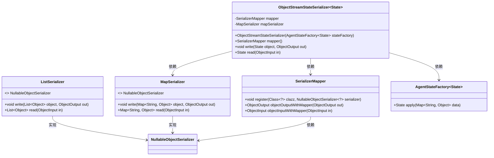
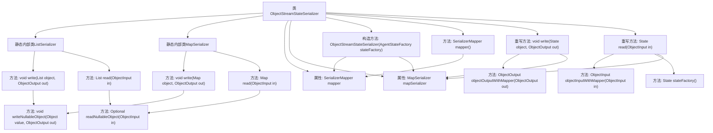

# 基础信息

|      |      |
|------|------|
| 名称 | ObjectStreamStateSerializer |
| 编码语言 | .java |
| 代码路径 | spring-ai-alibaba/spring-ai-alibaba-graph/spring-ai-alibaba-graph-core/src/main/java/com/alibaba/cloud/ai/graph/serializer/std/ObjectStreamStateSerializer.java |
| 包名 | com.alibaba.cloud.ai.graph.serializer.std |
| 依赖项 | ['java.io.IOException', 'java.io.ObjectInput', 'java.io.ObjectOutput', 'java.util.ArrayList', 'java.util.Collection', 'java.util.HashMap', 'java.util.List', 'java.util.Map', 'lombok.extern.slf4j.Slf4j', 'com.alibaba.cloud.ai.graph.serializer.StateSerializer', 'com.alibaba.cloud.ai.graph.state.AgentState', 'com.alibaba.cloud.ai.graph.state.AgentStateFactory'] |
| 概述说明 | ObjectStreamStateSerializer类负责列表和映射的序列化与反序列化，通过SerializerMapper管理序列化器。 |

# 说明

ObjectStreamStateSerializer类负责处理列表和映射的序列化与反序列化操作。该类通过SerializerMapper来管理和组织序列化器，确保数据在存储和传输过程中的准确性和一致性。其核心功能包括将复杂数据结构转换为可存储或传输的格式，并在需要时将其还原为原始数据结构。

# 类列表 Class Summary

| 名称   | 类型  | 说明 |
|-------|------|-------------|
| ObjectStreamStateSerializer | class | ObjectStreamStateSerializer类实现列表和映射的序列化与反序列化，使用SerializerMapper管理序列化器。 |

## 类 ObjectStreamStateSerializer

|      |      |
|------|------|
| 访问范围 | @Slf4j;public |
| 类型 | class |
| 名称 | ObjectStreamStateSerializer |
| 说明 | ObjectStreamStateSerializer类实现列表和映射的序列化与反序列化，使用SerializerMapper管理序列化器。 |

### UML类图

### 描述
该代码定义了一个泛型类 `ObjectStreamStateSerializer`，用于序列化和反序列化 `AgentState` 对象。它包含两个内部静态类 `ListSerializer` 和 `MapSerializer`，分别用于处理列表和映射的序列化。`ObjectStreamStateSerializer` 依赖于 `SerializerMapper` 来管理序列化器，并使用 `AgentStateFactory` 来创建 `AgentState` 实例。通过 `NullableObjectSerializer` 接口，`ListSerializer` 和 `MapSerializer` 实现了对可空对象的序列化和反序列化操作。

### 内部方法调用关系图

**描述：**  
这段代码定义了一个`ObjectStreamStateSerializer`类，用于序列化和反序列化`AgentState`对象。它包含两个静态内部类`ListSerializer`和`MapSerializer`，分别用于处理列表和映射的序列化。`ObjectStreamStateSerializer`类通过`SerializerMapper`来管理序列化器，并提供了`write`和`read`方法来执行序列化和反序列化操作。每个序列化器内部都实现了`write`和`read`方法，并处理可能的`IOException`异常。整体流程包括对象的写入、读取、以及异常处理。

### 字段列表 Field List

| 名称  | 类型  | 说明 |
|-------|-------|------|
| mapper = new SerializerMapper() | SerializerMapper | 声明并初始化一个私有的SerializerMapper对象mapper。 |
| mapSerializer = new MapSerializer() | MapSerializer | 定义并初始化了一个私有不可变的MapSerializer对象。 |

### 方法列表 Method List

| 名称  | 类型  | 说明 |
|-------|-------|------|
| mapper | SerializerMapper | 该方法返回序列化映射器实例。 |
| read | State | 重写read方法，从输入流读取并返回State对象。 |
| write | void | 重写write方法，使用mapSerializer序列化对象数据并输出。 |

