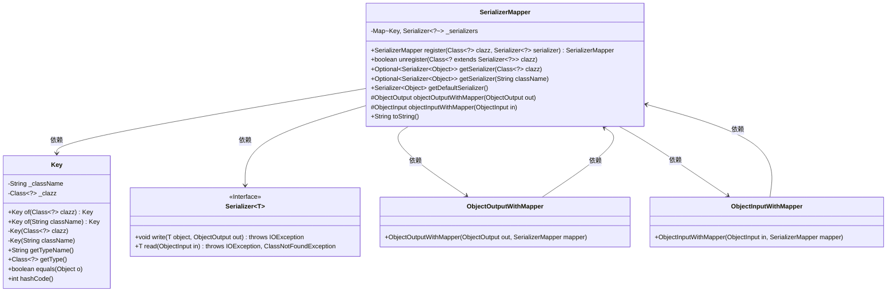

# 基础信息

|      |      |
|------|------|
| 名称 | SerializerMapper |
| 编码语言 | .java |
| 代码路径 | spring-ai-alibaba/spring-ai-alibaba-graph/spring-ai-alibaba-graph-core/src/main/java/com/alibaba/cloud/ai/graph/serializer/std/SerializerMapper.java |
| 包名 | com.alibaba.cloud.ai.graph.serializer.std |
| 依赖项 | ['java.io.IOException', 'java.io.ObjectInput', 'java.io.ObjectOutput', 'java.util.HashMap', 'java.util.List', 'java.util.Map', 'java.util.Objects', 'java.util.Optional', 'java.util.stream.Collectors', 'lombok.NonNull', 'com.alibaba.cloud.ai.graph.serializer.Serializer', 'java.lang.String.format'] |
| 概述说明 | SerializerMapper类管理序列化器，支持注册、注销和获取，提供默认序列化器。 |

# 说明

SerializerMapper类用于管理序列化器，具备注册、注销和获取序列化器的功能，同时提供默认序列化器支持。该类确保序列化器的有效管理，方便在需要时进行注册和注销操作，并能快速获取所需的序列化器。默认序列化器的存在为系统提供了基础支持，确保在没有特定序列化器时仍能正常运作。

# 类列表 Class Summary

| 名称   | 类型  | 说明 |
|-------|------|-------------|
| SerializerMapper | class | SerializerMapper类管理序列化器，支持注册、注销和获取序列化器，提供默认序列化器。 |

## 类 SerializerMapper

|      |      |
|------|------|
| 访问范围 | public |
| 类型 | class |
| 名称 | SerializerMapper |
| 说明 | SerializerMapper类管理序列化器，支持注册、注销和获取序列化器，提供默认序列化器。 |

### UML类图

这段代码定义了一个`SerializerMapper`类，用于管理和映射不同类型的序列化器。`SerializerMapper`类通过`Key`类来标识和管理不同的序列化器，`Key`类包含类名和类对象的信息。`Serializer`接口定义了序列化和反序列化的方法。`ObjectOutputWithMapper`和`ObjectInputWithMapper`类用于包装`ObjectOutput`和`ObjectInput`对象，以便在序列化和反序列化过程中使用`SerializerMapper`。整个设计使得序列化器的注册、注销和查找变得灵活且易于管理。

### 内部方法调用关系图

```mermaid
graph TD
    A["类SerializerMapper"]
    B["静态常量: Serializer<Object> DEFAULT_SERIALIZER"]
    C["内部类: Key"]
    D["方法: Key of(Class<?> clazz)"]
    E["方法: Key of(String className)"]
    F["方法: String getTypeName()"]
    G["方法: Class<?> getType()"]
    H["方法: boolean equals(Object o)"]
    I["方法: int hashCode()"]
    J["属性: Map<Key, Serializer<?>> _serializers"]
    K["方法: register(Class<?> clazz, Serializer<?> serializer)"]
    L["方法: unregister(Class<? extends Serializer<?>> clazz)"]
    M["方法: Optional<Serializer<Object>> getSerializer(Class<?> clazz)"]
    N["方法: Optional<Serializer<Object>> getSerializer(String className)"]
    O["方法: Serializer<Object> getDefaultSerializer()"]
    P["方法: ObjectOutput objectOutputWithMapper(ObjectOutput out)"]
    Q["方法: ObjectInput objectInputWithMapper(ObjectInput in)"]
    R["方法: String toString()"]

    A --> B
    A --> C
    C --> D
    C --> E
    C --> F
    C --> G
    C --> H
    C --> I
    A --> J
    A --> K
    A --> L
    A --> M
    A --> N
    A --> O
    A --> P
    A --> Q
    A --> R
```

这段代码定义了一个`SerializerMapper`类，用于管理和映射序列化器。它包含一个内部类`Key`，用于标识序列化器的类型。`SerializerMapper`提供了注册、注销和获取序列化器的方法，并支持默认序列化器。此外，它还提供了将`ObjectOutput`和`ObjectInput`与映射器结合的功能。代码通过`toString`方法展示了所有注册的序列化器类型。整体设计灵活且易于扩展，适用于复杂的序列化场景。

### 字段列表 Field List

| 名称  | 类型  | 说明 |
|-------|-------|------|
| DEFAULT_SERIALIZER = new Serializer<Object>() {		@Override		public void write(Object object, ObjectOutput out) throws IOException {			out.writeObject(object);		}		@Override		public Object read(ObjectInput in) throws IOException, ClassNotFoundException {			return in.readObject();		}	} | Serializer<Object> | 定义默认序列化器，实现对象的读写操作。 |
| _serializers = new HashMap<>() | Map<Key, Serializer<?>> | 声明一个私有不可变的Map，键为Key类型，值为Serializer泛型类型。 |

### 方法列表 Method List

| 名称  | 类型  | 说明 |
|-------|-------|------|
| getDefaultSerializer | Serializer<Object> | 获取默认序列化器的方法。 |
| getSerializer | Optional<Serializer<Object>> | 根据类名获取序列化器，返回可选值。 |
| register | SerializerMapper | 注册类与序列化器的映射关系并返回当前对象。 |
| objectInputWithMapper | ObjectInput | 保护方法，根据输入类型返回映射后的对象输入实例。 |
| unregister | boolean | 取消指定序列化器类的注册，成功返回true，否则false。 |
| toString | String | 重写toString方法，返回序列化映射器的类型名列表。 |
| objectOutputWithMapper | ObjectOutput | 方法返回带映射器的对象输出，若已存在则直接使用，否则新建。 |
| getSerializer | Optional<Serializer<Object>> | 根据类获取序列化器，优先匹配类，其次匹配可赋值的父类。 |

