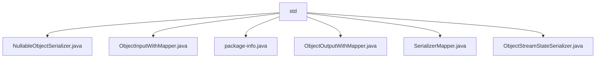

# 基础信息

|      |      |
|------|------|
| 名称 | std |
| 编码语言 | .java |
| 代码路径 | spring-ai-alibaba/spring-ai-alibaba-graph/spring-ai-alibaba-graph-core/src/main/java/com/alibaba/cloud/ai/graph/serializer/std |
| 包名 | spring-ai-alibaba.spring-ai-alibaba-graph.spring-ai-alibaba-graph-core.src.main.java.com.alibaba.cloud.ai.graph.serializer.std |
| 概述说明 | 多个类实现序列化接口，管理序列化器，支持数据流读写与映射功能。 |

# 说明

## 概述
该代码模块主要围绕序列化和反序列化功能展开，提供了多种工具类来支持从输入流中读取序列化对象、将对象序列化并写入输出流，以及管理序列化器的注册和获取。通过这些工具类，模块能够高效地处理复杂数据结构的序列化和反序列化操作，确保数据在存储和传输过程中的准确性和一致性。

## 主要业务场景
1. **序列化与反序列化**：模块中的`NullableObjectSerializer`、`ObjectOutputWithMapper`和`ObjectStreamStateSerializer`类分别负责从输入流中读取序列化对象、将对象序列化并写入输出流，以及处理列表和映射的序列化与反序列化操作。这些功能适用于需要将复杂数据结构转换为可存储或传输的格式，并在需要时还原为原始数据结构的场景。
2. **序列化器管理**：`SerializerMapper`类提供了序列化器的注册、注销和获取功能，确保序列化器的有效管理。该功能适用于需要动态管理序列化器的场景，方便在需要时进行注册和注销操作，并能快速获取所需的序列化器。
3. **默认序列化器支持**：`SerializerMapper`类还提供了默认序列化器支持，确保在没有特定序列化器时仍能正常运作。该功能为系统提供了基础支持，适用于需要处理多种数据类型但无法预先确定所有序列化器的场景。

### 包内部结构视图

该流程图展示了`std`文件夹下的文件层级关系。`std`作为根节点，包含了多个Java文件，如`NullableObjectSerializer.java`、`ObjectInputWithMapper.java`、`package-info.java`等。这些文件直接隶属于`std`文件夹，没有进一步的子文件夹层级。

# 文件列表 File List

| 名称   | 类型  | 说明 |
|-------|------|-------------|
| [ObjectStreamStateSerializer.java](ObjectStreamStateSerializer.md) | file | ObjectStreamStateSerializer类负责列表和映射的序列化与反序列化，通过SerializerMapper管理序列化器。 |
| [ObjectOutputWithMapper.java](ObjectOutputWithMapper.md) | file | ObjectOutputWithMapper类实现ObjectOutput接口，利用映射器序列化对象并写入输出流。 |
| [NullableObjectSerializer.java](NullableObjectSerializer.md) | file | 信息为空，无法生成概要描述。 |
| [SerializerMapper.java](SerializerMapper.md) | file | SerializerMapper类管理序列化器，支持注册、注销和获取，提供默认序列化器。 |
| [package-info.java](package-info.md) | file | 信息为空，无法生成概要描述。 |
| [ObjectInputWithMapper.java](ObjectInputWithMapper.md) | file | 类实现ObjectInput接口，封装输入流，支持序列化映射。 |

