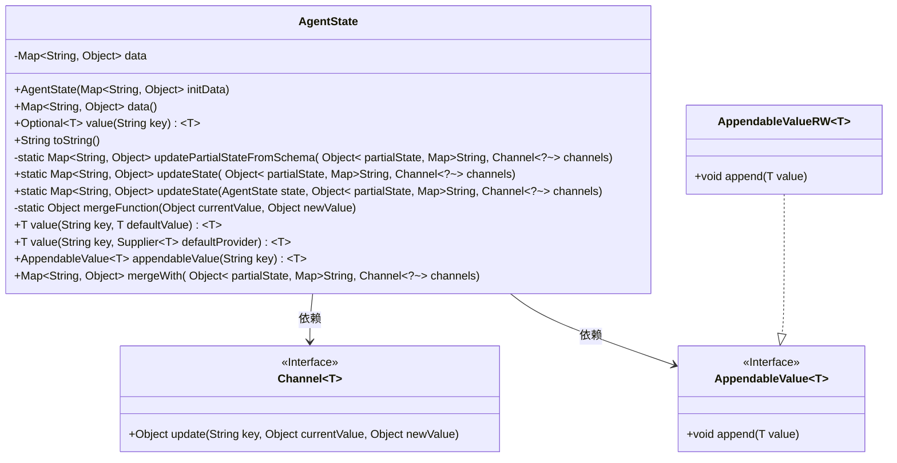

# 基础信息

|      |      |
|------|------|
| 名称 | AgentState |
| 编码语言 | .java |
| 代码路径 | spring-ai-alibaba/spring-ai-alibaba-graph/spring-ai-alibaba-graph-core/src/main/java/com/alibaba/cloud/ai/graph/state/AgentState.java |
| 包名 | com.alibaba.cloud.ai.graph.state |
| 依赖项 | ['java.util.AbstractMap', 'java.util.Collection', 'java.util.HashMap', 'java.util.Map', 'java.util.Objects', 'java.util.Optional', 'java.util.function.Supplier', 'java.util.stream.Collectors', 'java.util.stream.Stream', 'java.util.Collections.unmodifiableMap', 'java.util.Optional.ofNullable'] |
| 概述说明 | AgentState类负责代理状态的管理，支持初始化、查询、更新和合并操作。 |

# 说明

AgentState类负责管理代理的状态，提供数据初始化、查询、更新和合并等核心功能，确保代理状态的有效维护和操作。

# 类列表 Class Summary

| 名称   | 类型  | 说明 |
|-------|------|-------------|
| AgentState | class | AgentState类管理代理状态，支持数据初始化、查询、更新和合并操作。 |

## 类 AgentState

|      |      |
|------|------|
| 访问范围 | public |
| 类型 | class |
| 名称 | AgentState |
| 说明 | AgentState类管理代理状态，支持数据初始化、查询、更新和合并操作。 |

### UML类图

**描述：**
`AgentState`类用于管理代理的状态数据，提供了对状态数据的读取、更新和合并功能。它依赖于`Channel`接口来处理部分状态的更新，并通过`AppendableValue`接口支持可追加的值。`AppendableValueRW`是`AppendableValue`的实现类，用于处理值的追加操作。该类还提供了多种方法来获取和更新状态数据，支持默认值和提供者函数的使用。

### 内部方法调用关系图

```mermaid
graph TD
    A["类AgentState"]
    B["属性: Map<String, Object> data"]
    C["构造方法: AgentState(Map<String, Object> initData)"]
    D["方法: Map<String, Object> data()"]
    E["方法: <T> Optional<T> value(String key)"]
    F["重写方法: String toString()"]
    G["静态方法: Map<String, Object> updatePartialStateFromSchema(Map<String, Object> state, Map<String, Object> partialState, Map<String, Channel<?>> channels)"]
    H["静态方法: Map<String, Object> updateState(Map<String, Object> state, Map<String, Object> partialState, Map<String, Channel<?>> channels)"]
    I["静态方法: Map<String, Object> updateState(AgentState state, Map<String, Object> partialState, Map<String, Channel<?>> channels)"]
    J["静态方法: Object mergeFunction(Object currentValue, Object newValue)"]
    K["方法: <T> T value(String key, T defaultValue)"]
    L["方法: <T> T value(String key, Supplier<T> defaultProvider)"]
    M["方法: <T> AppendableValue<T> appendableValue(String key)"]
    N["方法: Map<String, Object> mergeWith(Map<String, Object> partialState, Map<String, Channel<?>> channels)"]

    A --> B
    A --> C
    A --> D
    A --> E
    A --> F
    A -.-> G
    A -.-> H
    A -.-> I
    A -.-> J
    A --> K
    A --> L
    A --> M
    A --> N
```

该流程图展示了 `AgentState` 类的结构及其内部方法调用关系。`AgentState` 类包含一个 `Map<String, Object>` 类型的 `data` 属性，用于存储代理状态数据。类中提供了多个方法，包括获取不可修改的数据视图、根据键获取值、更新状态、合并状态等功能。静态方法 `updatePartialStateFromSchema` 和 `updateState` 用于处理状态更新逻辑，而 `mergeFunction` 则用于合并新旧值。此外，类中还包含一些已弃用的方法，如 `appendableValue` 和 `mergeWith`，这些方法在未来的版本中可能会被移除。

### 字段列表 Field List

| 名称  | 类型  | 说明 |
|-------|-------|------|
| data | Map<String, Object> | 定义一个不可变的字符串到对象的映射变量data。 |

### 方法列表 Method List

| 名称  | 类型  | 说明 |
|-------|-------|------|
| toString | String | 重写toString方法，返回data的字符串表示。 |
| data | Map<String, Object> | 该方法返回一个不可修改的Map对象。 |
| updatePartialStateFromSchema | Map<String, Object> | 根据通道更新部分状态，若无通道则返回原部分状态。 |
| appendableValue | AppendableValue<T> | 废弃方法：根据键获取或创建可追加值对象。 |
| value | T | 已弃用方法，根据键获取值，默认值可选。 |
| updateState | Map<String, Object> | 更新状态方法合并原始状态与部分状态，返回新状态。 |
| mergeWith | Map<String, Object> | 已弃用方法：合并部分状态与通道并更新状态。 |
| mergeFunction | Object | 已弃用的合并函数，若当前值可追加则追加新值，否则返回新值。 |
| updateState | Map<String, Object> | 静态方法updateState更新AgentState，整合partialState和channels数据。 |
| value | T | 废弃方法：根据键获取值，若不存在则调用默认提供者。 |
| value | Optional<T> | 该方法返回指定键的Optional值，支持泛型。 |

