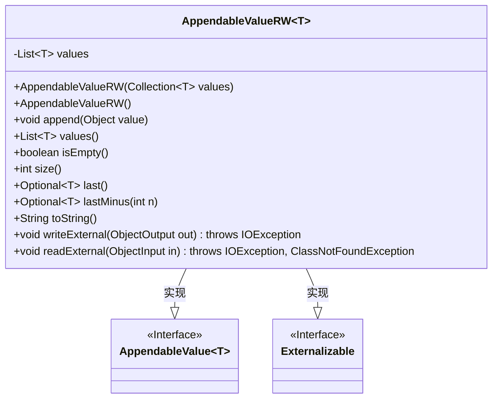
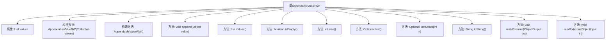

# 基础信息

|      |      |
|------|------|
| 名称 | AppendableValueRW |
| 编码语言 | .java |
| 代码路径 | spring-ai-alibaba/spring-ai-alibaba-graph/spring-ai-alibaba-graph-core/src/main/java/com/alibaba/cloud/ai/graph/state/AppendableValueRW.java |
| 包名 | com.alibaba.cloud.ai.graph.state |
| 依赖项 | ['java.io.Externalizable', 'java.io.IOException', 'java.io.ObjectInput', 'java.io.ObjectOutput', 'java.util.ArrayList', 'java.util.Collection', 'java.util.Collections', 'java.util.List', 'java.util.Optional', 'java.util.Collections.unmodifiableList'] |
| 概述说明 | 已弃用AppendableValueRW类，原支持值追加和外部化操作。 |

# 说明

已弃用的类`AppendableValueRW`，该类主要用于支持值的追加操作和外部化操作。追加操作允许在现有值的基础上添加新内容，而外部化操作则涉及将值从内部存储转换为外部格式。由于该类已被弃用，建议使用其他替代方案来实现类似功能。

# 类列表 Class Summary

| 名称   | 类型  | 说明 |
|-------|------|-------------|
| AppendableValueRW | class | 已弃用类AppendableValueRW，支持值追加和外部化操作。 |

## 类 AppendableValueRW

|      |      |
|------|------|
| 访问范围 | @Deprecated(forRemoval = true);public |
| 类型 | class |
| 名称 | AppendableValueRW |
| 说明 | 已弃用类AppendableValueRW，支持值追加和外部化操作。 |

### UML类图

**描述：**  
`AppendableValueRW` 是一个泛型类，实现了 `AppendableValue` 和 `Externalizable` 接口。它用于管理一个可追加的值的列表，提供了多种方法来操作和查询这些值，如追加值、获取不可修改的列表、检查列表是否为空、获取列表大小、获取最后一个值等。此外，它还支持序列化和反序列化操作，使得对象可以持久化存储或通过网络传输。

### 内部方法调用关系图

该流程图展示了`AppendableValueRW<T>`类的结构及其方法之间的关系。类包含一个`List<T>`类型的属性`values`，以及多个构造方法和方法，用于操作和访问该列表。方法包括`append`用于添加值，`values`返回不可修改的列表，`isEmpty`检查列表是否为空，`size`返回列表大小，`last`和`lastMinus`分别返回列表中的最后一个值和倒数第n个值，`toString`返回列表的字符串表示，`writeExternal`和`readExternal`用于序列化和反序列化列表。

### 字段列表 Field List

| 名称  | 类型  | 说明 |
|-------|-------|------|
| values | List<T> | 私有列表变量，存储类型为T的元素。 |

### 方法列表 Method List

| 名称  | 类型  | 说明 |
|-------|-------|------|
| isEmpty | boolean | isEmpty方法检查values()是否为空并返回布尔值。 |
| toString | String | toString方法返回values的字符串表示。 |
| size | int | 方法返回集合中元素的数量。 |
| values | List<T> | 该方法返回不可修改的列表，包含所有值。 |
| writeExternal | void | 重写writeExternal方法，将values对象写入输出流。 |
| lastMinus | Optional<T> | 返回列表中倒数第n个元素，若无则返回空。 |
| append | void | append方法根据传入对象类型，决定是添加单个元素还是集合。 |
| last | Optional<T> | 方法返回列表最后一个元素，若列表为空则返回空Optional。 |
| readExternal | void | 该方法从输入流读取对象并赋值给values变量。 |

