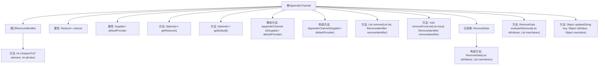

# 基础信息

|      |      |
|------|------|
| 名称 | AppenderChannel |
| 编码语言 | .java |
| 代码路径 | spring-ai-alibaba/spring-ai-alibaba-graph/spring-ai-alibaba-graph-core/src/main/java/com/alibaba/cloud/ai/graph/state/AppenderChannel.java |
| 包名 | com.alibaba.cloud.ai.graph.state |
| 依赖项 | ['java.util.ArrayList', 'java.util.Arrays', 'java.util.List', 'java.util.Optional', 'java.util.function.Supplier', 'lombok.extern.slf4j.Slf4j', 'java.util.Collections.unmodifiableList', 'java.util.Optional.ofNullable'] |
| 概述说明 | AppenderChannel类实现列表操作，支持增删改，具备默认列表和缩减器功能。 |

# 说明

AppenderChannel类是一个用于管理列表操作的类，提供了添加、删除和更新元素的功能。该类支持对列表进行基本操作，并内置了默认列表和缩减器功能，便于用户直接使用和操作列表数据。

# 类列表 Class Summary

| 名称   | 类型  | 说明 |
|-------|------|-------------|
| AppenderChannel | class | AppenderChannel类实现列表操作，支持添加、删除和更新元素，提供默认列表和缩减器功能。 |


## 类 AppenderChannel

|      |      |
|------|------|
| 访问范围 | @Slf4j;public |
| 类型 | class |
| 名称 | AppenderChannel |
| 说明 | AppenderChannel类实现列表操作，支持添加、删除和更新元素，提供默认列表和缩减器功能。 |


### UML类图

```mermaid
classDiagram
    class AppenderChannel~T~ {
        -Reducer~List~T~~ reducer
        -Supplier~List~T~~ defaultProvider
        +Optional~Reducer~List~T~~~ getReducer()
        +Optional~Supplier~List~T~~~ getDefault()
        +static AppenderChannel~T~ of(Supplier~List~T~~ defaultProvider)
        -AppenderChannel(Supplier~List~T~~ defaultProvider)
        -List~T~ remove(List~T~ list, RemoveIdentifier~T~ removeIdentifier)
        -void removeFromList(List~T~ result, RemoveIdentifier~T~ removeIdentifier)
        -RemoveData~T~ evaluateRemoval(List~T~ oldValues, List~?~ newValues)
        +Object update(String key, Object oldValue, Object newValue)
        <<interface>> RemoveIdentifier {
            +int compareTo(T element, int atIndex)
        }
        class RemoveData~T~ {
            -List~T~ oldValues
            -List~?~ newValues
            +RemoveData(List~T~ oldValues, List~?~ newValues)
        }
    }
    AppenderChannel --> RemoveIdentifier : 使用
    AppenderChannel --> RemoveData : 使用
```

### 描述
`AppenderChannel` 是一个泛型类，实现了 `Channel` 接口，用于处理列表的追加和移除操作。它包含一个 `Reducer` 用于合并列表，以及一个 `Supplier` 用于提供默认列表。`RemoveIdentifier` 是一个函数式接口，用于标识需要移除的元素。`RemoveData` 是一个记录类，用于存储移除操作后的旧值和新值。`AppenderChannel` 提供了 `update` 方法，用于更新列表中的值，并处理移除标识符。


### 内部方法调用关系图



这段代码定义了一个名为 `AppenderChannel<T>` 的泛型类，用于处理列表的追加和删除操作。类中包含了一个内部接口 `RemoveIdentifier<T>`，用于定义如何从列表中移除元素。`AppenderChannel` 类还包含了一些方法，如 `getReducer()` 和 `getDefault()`，用于获取当前的 `Reducer` 和默认的 `Supplier`。此外，类中定义了一个 `update` 方法，用于更新列表中的值，并处理可能的移除操作。整个类的设计旨在提供一种灵活的方式来管理和操作列表数据。

### 字段列表 Field List

| 名称  | 类型  | 说明 |
|-------|-------|------|
| reducer | Reducer<List<T>> | 私有最终Reducer用于处理List<T>类型数据。 |
| defaultProvider | Supplier<List<T>> | 私有供应商提供默认列表。 |

### 方法列表 Method List

| 名称  | 类型  | 说明 |
|-------|-------|------|
| removeFromList | void | 从列表中移除符合条件的元素。 |
| remove | List<T> | 该方法从列表中移除指定元素并返回不可修改的新列表。 |
| getReducer | Optional<Reducer<List<T>>> | 重写方法返回可选Reducer对象。 |
| getDefault | Optional<Supplier<List<T>>> | 方法返回默认提供者的可选列表。 |
| of | AppenderChannel<T> | 静态方法`of`创建`AppenderChannel`实例，接受`Supplier<List<T>>`参数。 |
| evaluateRemoval | RemoveData<T> | 方法评估移除操作，过滤新值并更新旧值列表。 |
| update | Object | 更新方法根据新旧值类型处理数据，支持列表、数组和单值操作，并处理异常。 |


