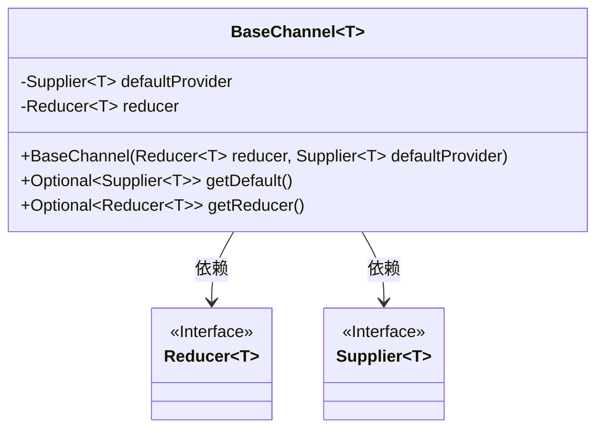
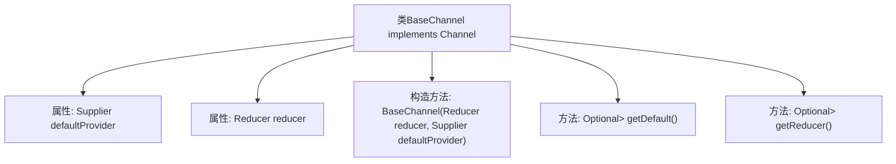

# 基础信息

|      |      |
|------|------|
| 名称 | Channel |
| 编码语言 | .java |
| 代码路径 | spring-ai-alibaba/spring-ai-alibaba-graph/spring-ai-alibaba-graph-core/src/main/java/com/alibaba/cloud/ai/graph/state/Channel.java |
| 包名 | com.alibaba.cloud.ai.graph.state |
| 依赖项 | ['java.util.Optional', 'java.util.function.Supplier', 'java.util.Optional.ofNullable'] |
| 概述说明 | BaseChannel类实现Channel接口，包含默认提供者和归约器，提供获取两者的Optional方法。 |

# 说明

BaseChannel类实现了Channel接口，并包含了默认的提供者和归约器。该类提供了获取这两个组件的Optional方法，使得用户可以根据需要获取提供者或归约器的实例。这种设计允许在不确定是否提供这些组件的情况下，通过Optional类型进行安全访问，增强了代码的灵活性和健壮性。

# 类列表 Class Summary

| 名称   | 类型  | 说明 |
|-------|------|-------------|
| BaseChannel | class | BaseChannel类实现Channel接口，包含默认提供者和归约器，提供获取两者的Optional方法。 |

## 类 BaseChannel

|      |      |
|------|------|
| 访问范围 | None |
| 类型 | class |
| 名称 | BaseChannel |
| 说明 | BaseChannel类实现Channel接口，包含默认提供者和归约器，提供获取两者的Optional方法。 |

### UML类图

这段代码定义了一个泛型类 `BaseChannel<T>`，它实现了 `Channel<T>` 接口。`BaseChannel` 类包含两个私有成员：`defaultProvider` 和 `reducer`，分别用于提供默认值和执行归约操作。类中提供了两个公有方法：`getDefault()` 和 `getReducer()`，分别返回 `defaultProvider` 和 `reducer` 的 `Optional` 包装对象。`BaseChannel` 依赖于 `Reducer` 和 `Supplier` 接口，这两个接口分别定义了归约操作和默认值提供的行为。

### 内部方法调用关系图

这段代码定义了一个泛型类 `BaseChannel<T>`，它实现了 `Channel<T>` 接口。类中包含两个属性：`defaultProvider` 和 `reducer`，分别用于提供默认值和进行归约操作。构造方法 `BaseChannel` 接受这两个参数，并确保它们不为空。类中还提供了两个方法：`getDefault` 和 `getReducer`，分别返回 `defaultProvider` 和 `reducer` 的 `Optional` 包装对象。这段代码主要用于处理通道中的默认值和归约操作。

### 字段列表 Field List

| 名称  | 类型  | 说明 |
|-------|-------|------|
| defaultProvider | Supplier<T> | 默认提供者用于生成泛型T的实例。 |
| reducer | Reducer<T> | 最终定义的Reducer<T>类型变量reducer。 |

### 方法列表 Method List

| 名称  | 类型  | 说明 |
|-------|-------|------|
| getDefault | Optional<Supplier<T>> | 方法返回可选默认供应商。 |
| getReducer | Optional<Reducer<T>> | 获取可选的Reducer对象，若存在则返回。 |

