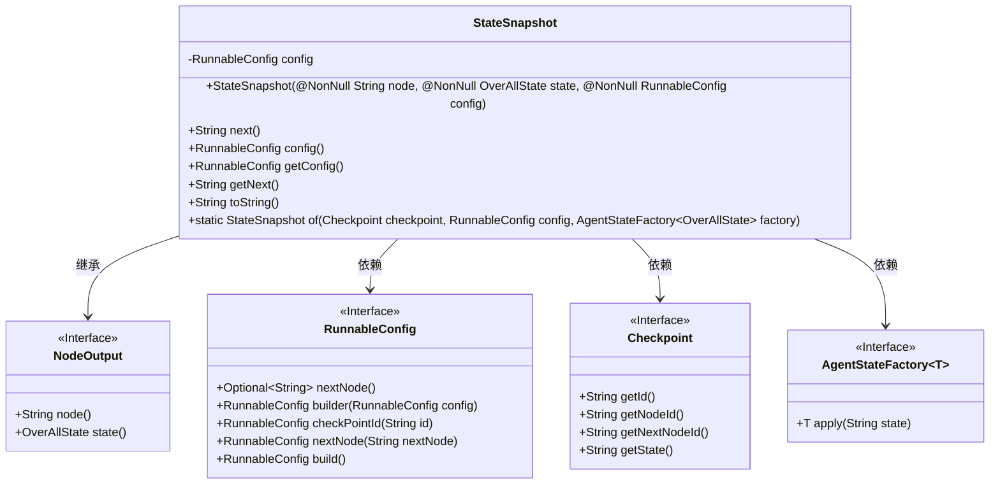
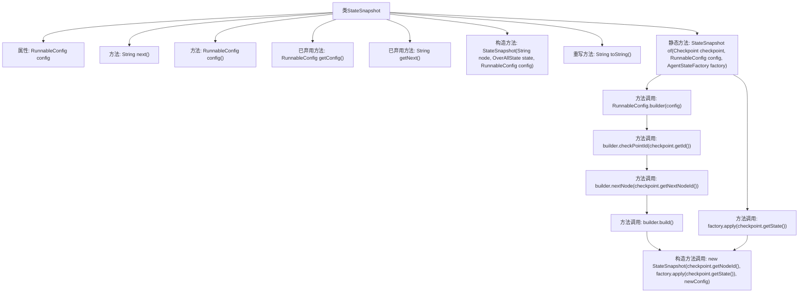

# 基础信息

|      |      |
|------|------|
| 名称 | StateSnapshot |
| 编码语言 | .java |
| 代码路径 | spring-ai-alibaba/spring-ai-alibaba-graph/spring-ai-alibaba-graph-core/src/main/java/com/alibaba/cloud/ai/graph/state/StateSnapshot.java |
| 包名 | com.alibaba.cloud.ai.graph.state |
| 依赖项 | ['com.alibaba.cloud.ai.graph.OverAllState', 'lombok.NonNull', 'com.alibaba.cloud.ai.graph.NodeOutput', 'com.alibaba.cloud.ai.graph.RunnableConfig', 'com.alibaba.cloud.ai.graph.checkpoint.Checkpoint', 'java.lang.String.format'] |
| 概述说明 | StateSnapshot类管理节点状态和配置，提供获取下一节点和配置的方法。 |

# 说明

StateSnapshot类负责管理节点状态和配置，其主要功能包括维护节点的当前状态和配置信息，并提供相应的方法来获取下一个节点及其配置。该类通过有效管理节点状态和配置，确保系统能够准确地进行状态切换和配置更新，从而支持系统的正常运行和动态调整。

# 类列表 Class Summary

| 名称   | 类型  | 说明 |
|-------|------|-------------|
| StateSnapshot | class | StateSnapshot类管理节点状态和配置，提供获取下一节点和配置的方法。 |

## 类 StateSnapshot

|      |      |
|------|------|
| 访问范围 | public final |
| 类型 | class |
| 名称 | StateSnapshot |
| 说明 | StateSnapshot类管理节点状态和配置，提供获取下一节点和配置的方法。 |

### UML类图

### 描述
`StateSnapshot`类继承自`NodeOutput`接口，并依赖于`RunnableConfig`、`Checkpoint`和`AgentStateFactory`接口。`StateSnapshot`类主要用于保存节点的状态快照，并提供获取下一个节点和配置的方法。`RunnableConfig`接口用于配置运行时的节点信息，`Checkpoint`接口用于获取检查点信息，`AgentStateFactory`接口用于创建状态对象。`StateSnapshot`类通过`of`方法从检查点和配置中创建新的状态快照实例。

### 内部方法调用关系图

这段代码定义了一个名为 `StateSnapshot` 的类，该类继承自 `NodeOutput`。`StateSnapshot` 类包含一个 `RunnableConfig` 类型的私有属性 `config`，并提供了多个方法来获取或操作该属性。代码中还包含一个静态工厂方法 `of`，用于创建 `StateSnapshot` 实例。该方法通过构建一个新的 `RunnableConfig` 对象，并将其与 `Checkpoint` 和 `AgentStateFactory` 提供的数据结合，最终生成一个新的 `StateSnapshot` 实例。此外，代码中还包含一些已弃用的方法，建议使用新的替代方法。

### 字段列表 Field List

| 名称  | 类型  | 说明 |
|-------|-------|------|
| config | RunnableConfig | 私有不可变的RunnableConfig配置对象。 |

### 方法列表 Method List

| 名称  | 类型  | 说明 |
|-------|-------|------|
| next | String | 返回配置中下一个节点，若无则返回空。 |
| getNext | String | 已弃用的getNext方法直接调用next方法。 |
| getConfig | RunnableConfig | 弃用方法getConfig，建议使用config()替代。 |
| of | StateSnapshot | 静态方法`of`创建`StateSnapshot`，基于`Checkpoint`、`RunnableConfig`和`AgentStateFactory`。 |
| config | RunnableConfig | 返回RunnableConfig类型的配置对象。 |
| toString | String | 重写toString方法，返回节点、状态和配置的格式化字符串。 |

