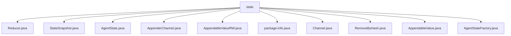

# 基础信息

|      |      |
|------|------|
| 名称 | state |
| 编码语言 | .java |
| 代码路径 | spring-ai-alibaba/spring-ai-alibaba-graph/spring-ai-alibaba-graph-core/src/main/java/com/alibaba/cloud/ai/graph/state |
| 包名 | spring-ai-alibaba.spring-ai-alibaba-graph.spring-ai-alibaba-graph-core.src.main.java.com.alibaba.cloud.ai.graph.state |
| 概述说明 | 多个类管理节点、代理状态及列表操作，部分类已弃用。 |

# 说明

## 概述
该代码模块主要涉及状态管理和数据操作的核心功能，专注于维护和操作节点、代理以及列表的状态。模块中的类设计旨在提供灵活的状态管理机制，支持动态配置更新、状态切换以及数据操作。通过使用多种设计模式（如Optional类型的安全访问）和内置功能（如默认列表和缩减器），模块增强了代码的健壮性和可维护性。

## 主要业务场景
1. **节点状态管理**：`StateSnapshot`类负责维护节点的当前状态和配置信息，确保系统能够准确地进行状态切换和配置更新。适用于需要动态调整节点状态的场景，如分布式系统中的节点管理。
  
2. **代理状态管理**：`AgentState`类提供了代理状态的初始化、查询、更新和合并功能，确保代理状态的有效维护。适用于需要管理多个代理状态的场景，如多代理系统中的状态同步。

3. **列表操作管理**：`AppenderChannel`类提供了对列表的添加、删除和更新操作，内置了默认列表和缩减器功能。适用于需要频繁操作列表数据的场景，如数据处理管道中的列表操作。

4. **通道管理**：`BaseChannel`类实现了`Channel`接口，提供了默认的提供者和归约器，支持通过Optional类型进行安全访问。适用于需要灵活管理数据通道的场景，如消息队列中的通道管理。

5. **弃用功能**：`AppendableValueRW`类已被弃用，主要用于支持值的追加和外部化操作。建议使用其他替代方案来实现类似功能。适用于需要兼容旧代码的场景，但建议逐步迁移到新的实现。

该模块的设计和功能适用于需要高效管理和操作状态的复杂系统，特别是在需要动态调整和同步状态的场景中表现出色。

### 包内部结构视图

该流程图展示了`state`文件夹下的文件结构，所有文件均直接位于`state`目录下，没有进一步的子目录层级。这些文件包括`Reducer.java`、`StateSnapshot.java`、`AgentState.java`等，涵盖了与状态管理相关的多个类文件。

# 文件列表 File List

| 名称   | 类型  | 说明 |
|-------|------|-------------|
| [AgentStateFactory.java](AgentStateFactory.md) | file | 信息为空，无法生成概要描述。 |
| [RemoveByHash.java](RemoveByHash.md) | file | 无内容，无法生成概要描述。 |
| [package-info.java](package-info.md) | file | 信息为空，无法生成概要描述。 |
| [AppenderChannel.java](AppenderChannel.md) | file | AppenderChannel类实现列表操作，支持增删改，具备默认列表和缩减器功能。 |
| [Reducer.java](Reducer.md) | file | 信息为空，无法生成概要描述。 |
| [AppendableValue.java](AppendableValue.md) | file | 信息为空，无法生成概要描述。 |
| [Channel.java](Channel.md) | file | BaseChannel类实现Channel接口，包含默认提供者和归约器，提供获取两者的Optional方法。 |
| [AppendableValueRW.java](AppendableValueRW.md) | file | 已弃用AppendableValueRW类，原支持值追加和外部化操作。 |
| [AgentState.java](AgentState.md) | file | AgentState类负责代理状态的管理，支持初始化、查询、更新和合并操作。 |
| [StateSnapshot.java](StateSnapshot.md) | file | StateSnapshot类管理节点状态和配置，提供获取下一节点和配置的方法。 |

