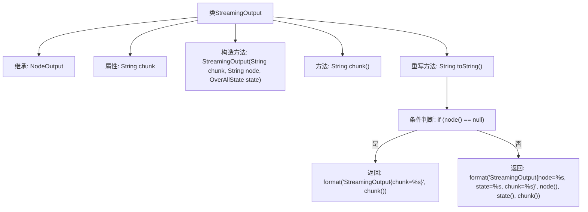

# 基础信息

|      |      |
|------|------|
| 名称 | StreamingOutput |
| 编码语言 | .java |
| 代码路径 | spring-ai-alibaba/spring-ai-alibaba-graph/spring-ai-alibaba-graph-core/src/main/java/com/alibaba/cloud/ai/graph/streaming/StreamingOutput.java |
| 包名 | com.alibaba.cloud.ai.graph.streaming |
| 依赖项 | ['com.alibaba.cloud.ai.graph.NodeOutput', 'com.alibaba.cloud.ai.graph.OverAllState', 'com.alibaba.cloud.ai.graph.state.AgentState', 'java.lang.String.format'] |
| 概述说明 | StreamingOutput继承NodeOutput，含chunk字段，提供chunk和toString方法。 |

# 说明

StreamingOutput类继承自NodeOutput类，包含一个名为chunk的字段。该类提供了两个主要方法：chunk方法和toString方法。chunk方法用于处理数据块，而toString方法用于将对象转换为字符串表示。这些功能使得StreamingOutput类能够有效地处理流式输出数据，并提供了方便的字符串转换能力。

# 类列表 Class Summary

| 名称   | 类型  | 说明 |
|-------|------|-------------|
| StreamingOutput | class | StreamingOutput类继承NodeOutput，包含chunk字段，提供chunk方法和toString方法。 |


## 类 StreamingOutput

|      |      |
|------|------|
| 访问范围 | public |
| 类型 | class |
| 名称 | StreamingOutput |
| 说明 | StreamingOutput类继承NodeOutput，包含chunk字段，提供chunk方法和toString方法。 |


### UML类图

```mermaid
classDiagram
    class NodeOutput {
        -String node
        -OverAllState state
        +NodeOutput(String node, OverAllState state)
        +String node()
        +OverAllState state()
        +String toString()
    }

    class StreamingOutput {
        -String chunk
        +StreamingOutput(String chunk, String node, OverAllState state)
        +String chunk()
        +String toString()
    }

    NodeOutput <|-- StreamingOutput // 继承
```

**描述**：`StreamingOutput` 类继承自 `NodeOutput` 类，包含一个私有成员 `chunk` 和相应的构造函数、getter 方法以及重写的 `toString` 方法。`NodeOutput` 类包含 `node` 和 `state` 两个私有成员，并提供了相应的构造函数和 getter 方法。`StreamingOutput` 类通过继承 `NodeOutput` 类，扩展了其功能，增加了对 `chunk` 的处理。


### 内部方法调用关系图



这段代码定义了一个名为`StreamingOutput`的类，它继承自`NodeOutput`类。`StreamingOutput`类包含一个私有属性`chunk`，并通过构造方法初始化该属性。类中还定义了一个方法`chunk()`用于返回`chunk`的值，并重写了`toString()`方法，根据`node()`的值返回不同的格式化字符串。如果`node()`为`null`，则返回仅包含`chunk`的字符串，否则返回包含`node`、`state`和`chunk`的字符串。

### 字段列表 Field List

| 名称  | 类型  | 说明 |
|-------|-------|------|
| chunk | String | 定义私有不可变字符串变量chunk。 |

### 方法列表 Method List

| 名称  | 类型  | 说明 |
|-------|-------|------|
| chunk | String | 获取chunk字符串的方法。 |
| toString | String | 重写toString方法，根据node是否为空返回不同格式的字符串。 |


