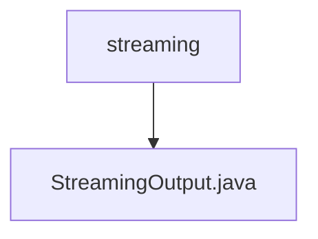

# 基础信息

|      |      |
|------|------|
| 名称 | streaming |
| 编码语言 | .java |
| 代码路径 | spring-ai-alibaba/spring-ai-alibaba-graph/spring-ai-alibaba-graph-core/src/main/java/com/alibaba/cloud/ai/graph/streaming |
| 包名 | spring-ai-alibaba.spring-ai-alibaba-graph.spring-ai-alibaba-graph-core.src.main.java.com.alibaba.cloud.ai.graph.streaming |
| 概述说明 | StreamingOutput继承NodeOutput，含chunk字段，提供chunk和toString方法。 |

# 说明

StreamingOutput类继承自NodeOutput类，包含一个名为chunk的字段。该类提供了两个主要方法：chunk方法和toString方法。chunk方法用于处理数据块，而toString方法用于将对象转换为字符串表示。这些功能使得StreamingOutput类能够有效地处理流式输出数据，并提供了方便的字符串转换能力。

### 包内部结构视图

流程图展示了路径的层级关系，`streaming` 是父节点，`StreamingOutput.java` 是其子节点。该结构表示 `StreamingOutput.java` 文件位于 `streaming` 目录下，清晰地反映了文件的组织方式。

# 文件列表 File List

| 名称   | 类型  | 说明 |
|-------|------|-------------|
| [StreamingOutput.java](StreamingOutput.md) | file | StreamingOutput继承NodeOutput，含chunk字段，提供chunk和toString方法。 |

