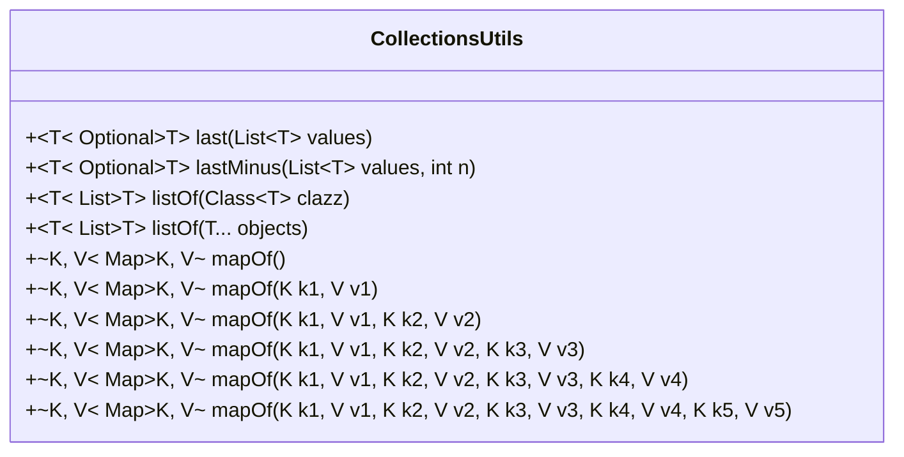
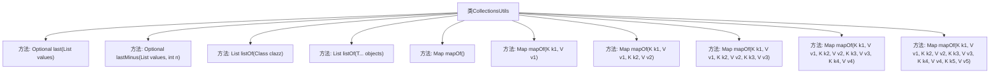

# 基础信息

|      |      |
|------|------|
| 名称 | CollectionsUtils |
| 编码语言 | .java |
| 代码路径 | spring-ai-alibaba/spring-ai-alibaba-graph/spring-ai-alibaba-graph-core/src/main/java/com/alibaba/cloud/ai/graph/utils/CollectionsUtils.java |
| 包名 | com.alibaba.cloud.ai.graph.utils |
| 依赖项 | ['java.util.Arrays', 'java.util.Collections', 'java.util.HashMap', 'java.util.List', 'java.util.Map', 'java.util.Optional', 'java.util.Collections.emptyMap', 'java.util.Collections.unmodifiableMap'] |
| 概述说明 | CollectionsUtils类提供列表和映射操作，含获取末尾元素、创建不可修改集合方法，部分已弃用。 |

# 说明

CollectionsUtils类是一个用于处理列表和映射的工具类，提供了多种实用方法。其中包括获取列表末尾元素的功能，以及创建不可修改的列表和映射的方法。值得注意的是，该类中的部分方法已被标记为弃用，建议使用替代方案。这些方法旨在简化对集合数据的操作，提高代码的可读性和维护性。

# 类列表 Class Summary

| 名称   | 类型  | 说明 |
|-------|------|-------------|
| CollectionsUtils | class | CollectionsUtils类提供列表和映射操作，包含获取列表末尾元素、创建不可修改列表和映射的方法，部分方法已弃用。 |

## 类 CollectionsUtils

|      |      |
|------|------|
| 访问范围 | public final |
| 类型 | class |
| 名称 | CollectionsUtils |
| 说明 | CollectionsUtils类提供列表和映射操作，包含获取列表末尾元素、创建不可修改列表和映射的方法，部分方法已弃用。 |

### UML类图

**描述：**
`CollectionsUtils` 类提供了多个静态方法，用于处理集合操作。这些方法包括获取列表的最后一个元素、从列表末尾获取指定位置的元素、创建包含特定元素的列表以及创建包含不同数量键值对的不可修改的映射。大多数方法已被标记为 `@Deprecated`，建议使用 Java 的 Convenience Factory Methods for Collections 替代。

### 内部方法调用关系图

这段代码定义了一个名为`CollectionsUtils`的工具类，提供了多个静态方法来处理集合操作。主要包括获取列表的最后一个元素、从列表末尾获取指定位置的元素、创建不同类型的列表和映射等。这些方法大多被标记为`@Deprecated`，建议使用Java的新集合工厂方法。

### 字段列表 Field List

| 名称  | 类型  | 说明 |
|-------|-------|------|

### 方法列表 Method List

| 名称  | 类型  | 说明 |
|-------|-------|------|
| mapOf | Map<K, V> | 废弃方法mapOf返回空Map。 |
| mapOf | Map<K, V> | 已弃用方法，用于创建不可修改的四元素Map。 |
| last | Optional<T> | 静态方法返回列表最后一个元素，若列表为空或null则返回空Optional。 |
| mapOf | Map<K, V> | 废弃方法：创建包含两对键值对的不可修改Map。 |
| mapOf | Map<K, V> | 已弃用的静态方法，用于创建不可修改的三元素Map。 |
| mapOf | Map<K, V> | 该方法已弃用，用于创建单键值对的不可变映射。 |
| mapOf | Map<K, V> | 废弃的静态方法，用于创建不可修改的五元素映射。 |
| listOf | List<T> | 废弃方法，返回不可修改的列表，处理空值和单元素情况。 |
| lastMinus | Optional<T> | 返回列表中倒数第n个元素，若无效则返回空。 |
| listOf | List<T> | 已弃用的静态方法，返回指定类型的空列表。 |

