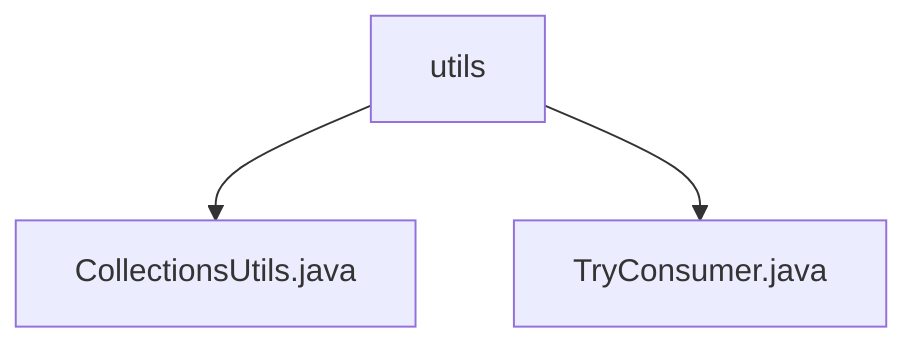

# 基础信息

|      |      |
|------|------|
| 名称 | utils |
| 编码语言 | .java |
| 代码路径 | spring-ai-alibaba/spring-ai-alibaba-graph/spring-ai-alibaba-graph-core/src/main/java/com/alibaba/cloud/ai/graph/utils |
| 包名 | spring-ai-alibaba.spring-ai-alibaba-graph.spring-ai-alibaba-graph-core.src.main.java.com.alibaba.cloud.ai.graph.utils |
| 概述说明 | CollectionsUtils类提供处理列表和映射的实用方法，部分方法已弃用。 |

# 说明

## 概述
该代码模块主要包含用于处理集合数据的工具类和方法，旨在简化对列表和映射的操作，提高代码的可读性和维护性。模块中的工具类提供了多种实用方法，包括获取列表末尾元素、创建不可修改的列表和映射等功能。部分方法已被标记为弃用，建议使用替代方案。

## 主要业务场景
1. **集合数据处理**：该模块的工具类主要用于处理列表和映射数据，提供了一系列实用方法来简化常见操作，如获取列表末尾元素、创建不可修改的集合等。
2. **代码优化与维护**：通过提供简化的方法，减少重复代码，提高代码的可读性和维护性。
3. **弃用方法迁移**：模块中部分方法已被标记为弃用，建议开发者使用替代方案，以确保代码的长期可维护性和兼容性。

### 包内部结构视图

该流程图展示了路径的层级关系，其中`utils`文件夹包含两个文件：`CollectionsUtils.java`和`TryConsumer.java`。这种结构清晰地反映了文件在项目中的组织方式，便于开发者快速定位和理解代码的分布。

# 文件列表 File List

| 名称   | 类型  | 说明 |
|-------|------|-------------|
| [TryConsumer.java](TryConsumer.md) | file | 内容为空，无法生成概要描述。 |
| [CollectionsUtils.java](CollectionsUtils.md) | file | CollectionsUtils类提供列表和映射操作，含获取末尾元素、创建不可修改集合方法，部分已弃用。 |

