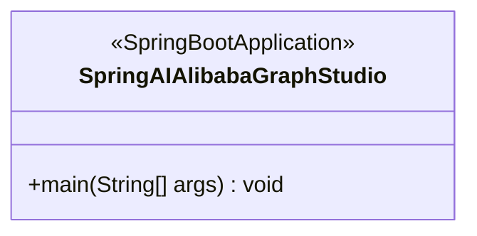
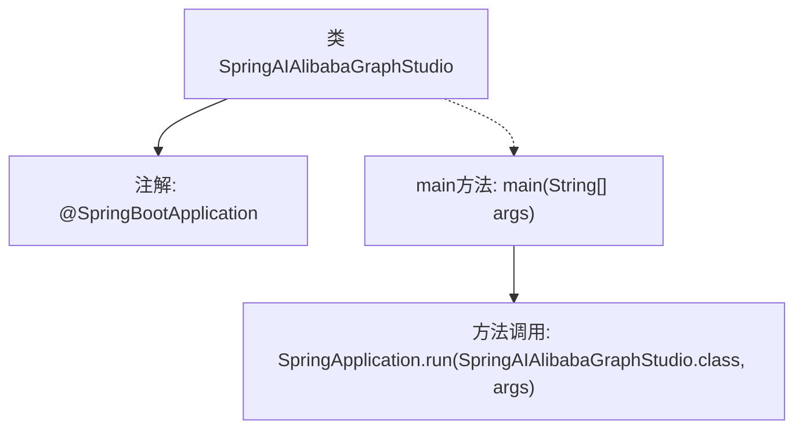

# 基础信息

|      |      |
|------|------|
| 名称 | SpringAIAlibabaGraphStudio |
| 编码语言 | .java |
| 代码路径 | spring-ai-alibaba/spring-ai-alibaba-graph/spring-ai-alibaba-graph-studio/src/main/java/com/alibaba/cloud/ai/SpringAIAlibabaGraphStudio.java |
| 包名 | com.alibaba.cloud.ai |
| 依赖项 | ['org.springframework.boot.SpringApplication', 'org.springframework.boot.autoconfigure.SpringBootApplication'] |
| 概述说明 | SpringBoot应用启动类包含主方法以运行应用。 |

# 说明

SpringBoot应用启动类是SpringBoot项目的入口点，包含主方法用于启动和运行整个应用。该启动类通常使用@SpringBootApplication注解标注，以启用自动配置和组件扫描。主方法通过调用SpringApplication.run()方法来启动Spring应用上下文，并初始化所有配置的Bean和依赖。启动类的位置决定了SpringBoot自动扫描的包范围，确保应用能够正确加载所有必要的组件和配置。

# 类列表 Class Summary

| 名称   | 类型  | 说明 |
|-------|------|-------------|
| SpringAIAlibabaGraphStudio | class | SpringBoot应用启动类，包含主方法运行应用。 |

## 类 SpringAIAlibabaGraphStudio

|      |      |
|------|------|
| 访问范围 | @SpringBootApplication;public |
| 类型 | class |
| 名称 | SpringAIAlibabaGraphStudio |
| 说明 | SpringBoot应用启动类，包含主方法运行应用。 |

### UML类图

**描述：**  
`SpringAIAlibabaGraphStudio` 类是一个 Spring Boot 应用程序的入口类，使用 `@SpringBootApplication` 注解标记。该类包含一个 `main` 方法，用于启动 Spring Boot 应用程序。通过 `SpringApplication.run` 方法，该类将自身作为参数传递，以启动整个应用程序。

### 内部方法调用关系图

这段代码定义了一个名为`SpringAIAlibabaGraphStudio`的Spring Boot应用类，使用了`@SpringBootApplication`注解来标识这是一个Spring Boot应用的入口类。`main`方法中调用了`SpringApplication.run`方法，启动Spring Boot应用并加载当前类作为配置类。流程图展示了类的结构及其方法调用关系，清晰地描述了Spring Boot应用的启动流程。

### 字段列表 Field List

| 名称  | 类型  | 说明 |
|-------|-------|------|

### 方法列表 Method List

| 名称  | 类型  | 说明 |
|-------|-------|------|
| main | void | SpringBoot启动类，运行SpringAIAlibabaGraphStudio应用。 |

