# 基础信息

|      |      |
|------|------|
| 名称 | ai |
| 编码语言 | .java |
| 代码路径 | spring-ai-alibaba/spring-ai-alibaba-graph/spring-ai-alibaba-graph-studio/src/main/java/com/alibaba/cloud/ai |
| 包名 | spring-ai-alibaba.spring-ai-alibaba-graph.spring-ai-alibaba-graph-studio.src.main.java.com.alibaba.cloud.ai |
| 概述说明 | 代码模块涉及参数类定义、AI工作流管理、图形化开发平台、返回结果封装、DSL数据处理、API接口定义、内存管理、异常处理、模板转换和SpringBoot启动。 |

# 说明

## 概述
该代码模块是一个基于Spring框架的AI工作流管理系统，主要用于管理和处理不同类型节点的数据。模块的核心功能包括DSL数据处理与转换、应用程序生命周期管理、代码生成、项目生成、应用程序创建等。模块通过定义和封装多个参数类、控制器类、服务类以及异常处理类，确保了在不同业务场景下数据的准确传递和处理。模块还提供了灵活的节点设计和丰富的功能支持，能够高效地处理复杂的工作流任务，适用于多种AI应用场景。

## 主要业务场景
1. **DSL管理**：通过 `DSLParam` 类和其他DSL相关类，模块能够存储和处理不同类型的DSL内容，确保在处理和解析DSL时能够准确识别其方言类型。
2. **代码生成**：`CodeGenerateParam` 类和其他生成器相关类用于定义生成代码所需的节点类型和节点数据，确保代码生成的准确性和完整性。
3. **项目生成**：`ProjectGenerateParam` 类用于定义生成项目所需的关键配置信息，包括DSL内容、方言、Spring Boot版本等，确保项目能够按照预期生成并运行。
4. **应用程序创建**：`CreateAppParam` 类用于定义创建应用程序所需的基本信息，包括应用程序名称、运行模式和描述，确保应用程序能够正确创建和配置。
5. **应用管理与元数据处理**：通过 `App` 类和 `AppMetadata` 类，模块能够管理和操作应用的元数据和规格信息，确保在运行模型时具备必要的属性和方法支持。
6. **变量管理**：`Variable` 类和 `VariableSelector` 类用于标识和存储具体数据，支持通过构造函数初始化变量实例，并在复杂的命名空间中准确地定位和区分不同的变量。
7. **事件处理**：`RunEvent` 类用于存储事件类型信息，支持在运行过程中处理和记录不同类型的事件。
8. **聊天机器人功能**：`ChatBot` 类用于定义应用程序的核心功能或服务，以便在不同的上下文中复用。
9. **工作流管理**：通过 `NodeData`、`Workflow`、`Graph`、`Node`、`Edge` 和 `Case` 等类，模块支持工作流的定义、执行和管理，确保工作流能够按照预定的逻辑和条件顺利执行。
10. **异常处理**：通过 `RestExceptionHandler` 类和多种自定义异常类，模块能够在不同场景下捕获并处理特定的错误，确保系统在遇到问题时能够提供清晰、准确的反馈。
11. **内存管理**：`AppMemorySaver` 类负责将应用数据存储在内存中，确保数据的高效访问和操作，并支持应用状态的保存和恢复功能。
12. **API管理**：通过 `AppAPI`、`RunnerAPI`、`DSLAPI` 和 `GeneratorAPI` 等接口，模块提供了对AI应用程序的创建、配置、管理和执行功能，支持从模型定义到执行的全流程操作。
13. **Swagger配置**：通过Swagger配置类，模块能够对API进行分组管理，确保与特定路径相关的API能够被正确分类和展示，提升API的可维护性和可读性。
14. **模板转换**：`StringTemplateUtil` 类实现Dify与Spring-AI模板之间的相互转换，确保两种不同模板格式能够无缝对接，提升系统的兼容性和灵活性。
15. **应用启动**：SpringBoot应用启动类是SpringBoot项目的入口点，负责启动和运行整个应用，确保应用能够正确加载所有必要的组件和配置。

这些业务场景共同构成了一个完整的AI开发和管理平台，支持从模型定义到执行的全流程操作，适用于多种AI应用场景。

### 包内部结构视图

```mermaid
graph TD
    ai --> param
    ai --> model
    ai --> controller
    ai --> common
    ai --> service
    ai --> api
    ai --> config
    ai --> saver
    ai --> exception
    ai --> autoconfigure
    ai --> utils
    ai --> SpringAIAlibabaGraphStudio.java
    param --> DSLParam.java
    param --> CodeGenerateParam.java
    param --> ProjectGenerateParam.java
    param --> CreateAppParam.java
    model --> App.java
    model --> Variable.java
    model --> RunEvent.java
    model --> chatbot
    model --> VariableType.java
    model --> AppMetadata.java
    model --> VariableSelector.java
    model --> workflow
    chatbot --> ChatBot.java
    workflow --> NodeData.java
    workflow --> Workflow.java
    workflow --> EdgeType.java
    workflow --> NodeType.java
    workflow --> nodedata
    workflow --> Graph.java
    workflow --> Node.java
    workflow --> Case.java
    workflow --> Edge.java
    nodedata --> LLMNodeData.java
    nodedata --> StartNodeData.java
    nodedata --> RetrieverNodeData.java
    nodedata --> CodeNodeData.java
    nodedata --> VariableAggregatorNodeData.java
    nodedata --> BranchNodeData.java
    nodedata --> EndNodeData.java
    nodedata --> AnswerNodeData.java
    controller --> GeneratorController.java
    controller --> DSLController.java
    controller --> AppController.java
    controller --> RunnerController.java
    common --> R.java
    common --> ReturnCode.java
    service --> dsl
    service --> runner
    service --> app
    service --> generator
    dsl --> DSLAdapter.java
    dsl --> adapters
    dsl --> AbstractDSLAdapter.java
    dsl --> serialize
    dsl --> nodes
    dsl --> DSLDialectType.java
    dsl --> Serializer.java
    dsl --> NodeDataConverter.java
    adapters --> DifyDSLAdapter.java
    adapters --> CustomDSLAdapter.java
    serialize --> YamlSerializer.java
    serialize --> JsonSerializer.java
    nodes --> EndNodeDataConverter.java
    nodes --> StartNodeDataConverter.java
    nodes --> VariableAggregatorNodeDataConverter.java
    nodes --> CodeNodeDataConverter.java
    nodes --> LLMNodeDataConverter.java
    nodes --> RetrieverNodeDataConverter.java
    nodes --> BranchNodeDataConverter.java
    nodes --> AnswerNodeDataConverter.java
    nodes --> AbstractNodeDataConverter.java
    runner --> RunnableModel.java
    runner --> Runner.java
    app --> AppDelegate.java
    app --> AppDelegateImpl.java
    generator --> CodeGenerator.java
    generator --> ProjectGenerator.java
    api --> AppAPI.java
    api --> RunnerAPI.java
    api --> DSLAPI.java
    api --> GeneratorAPI.java
    config --> SwaggerConfiguration.java
    saver --> AppSaver.java
    saver --> AppMemorySaver.java
    exception --> RestExceptionHandler.java
    exception --> SerializationException.java
    exception --> NotFoundException.java
    exception --> NotImplementedException.java
    autoconfigure --> AppSaverConfiguration.java
    utils --> StringTemplateUtil.java
```

该流程图展示了`spring-ai-alibaba-graph-studio`项目的目录结构，从根目录`ai`开始，逐级展开到各个子目录和文件。每个节点代表一个文件夹或文件，清晰地展示了项目中的层级关系和文件分布。

# 文件列表 File List

| 名称   | 类型  | 说明 |
|-------|------|-------------|
| [SpringAIAlibabaGraphStudio.java](SpringAIAlibabaGraphStudio.md) | file | SpringBoot应用启动类包含主方法以运行应用。 |
| [utils](utils/_module.md) | package | StringTemplateUtil类实现Dify与Spring-AI模板互转。 |
| [autoconfigure](autoconfigure/_module.md) | package | AppSaverConfiguration类定义条件内存保存器Bean。 |
| [exception](exception/_module.md) | package | RestExceptionHandler处理异常，SerializationException、NotFoundException、NotImplementedException继承RuntimeException，含code和msg属性。 |
| [saver](saver/_module.md) | package | AppMemorySaver类实现AppSaver接口，管理内存应用列表，支持数据存储与访问。 |
| [config](config/_module.md) | package | Swagger配置类管理API分组，路径为/graph-studio。 |
| [api](api/_module.md) | package | 输入内容为空，无法生成总结描述。 |
| [service](service/_module.md) | package | 模块支持DSL数据处理、节点转换、序列化及元数据映射，适用于复杂业务场景。 |
| [common](common/_module.md) | package | R类封装返回结果，含状态码、消息、数据和时间戳，统一处理成功和错误情况。 |
| [controller](controller/_module.md) | package | GeneratorController管理生成器与适配器，DSLController协调适配器与保存器，AppController与AppDelegate交互，RunnerController管理Runner与AppSaver。 |
| [model](model/_module.md) | package | Spring框架AI工作流管理系统，支持节点数据、工作流执行、图结构管理及复杂任务处理。 |
| [param](param/_module.md) | package | DSLParam存储DSL内容及方言，CodeGenerateParam定义节点类型及数据，ProjectGenerateParam配置项目生成参数，CreateAppParam包含应用名称、模式及描述。 |

