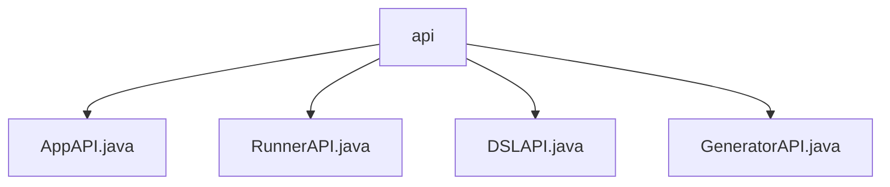

# 基础信息

|      |      |
|------|------|
| 名称 | api |
| 编码语言 | .java |
| 代码路径 | spring-ai-alibaba/spring-ai-alibaba-graph/spring-ai-alibaba-graph-studio/src/main/java/com/alibaba/cloud/ai/api |
| 包名 | spring-ai-alibaba.spring-ai-alibaba-graph.spring-ai-alibaba-graph-studio.src.main.java.com.alibaba.cloud.ai.api |
| 概述说明 | 输入内容为空，无法生成总结描述。 |

# 说明

## 概述
该代码模块属于 `spring-ai-alibaba` 项目中的一个子模块，具体路径为 `spring-ai-alibaba-graph/spring-ai-alibaba-graph-studio`。模块主要包含与 AI 相关的 API 接口定义，涉及应用程序、运行器、DSL（领域特定语言）以及生成器等功能。这些 API 接口可能用于支持 AI 模型的开发、管理和执行，以及与 AI 相关的数据流处理。

## 主要业务场景
1. **应用程序管理**：通过 `AppAPI` 接口，可能提供了对 AI 应用程序的创建、配置和管理功能，支持开发者对 AI 应用的生命周期进行控制。
2. **运行器管理**：`RunnerAPI` 接口可能用于管理和执行 AI 模型的运行任务，包括任务的启动、停止、监控等操作。
3. **DSL 支持**：`DSLAPI` 接口可能提供了对领域特定语言的支持，允许开发者通过 DSL 定义 AI 模型的行为和数据流处理逻辑。
4. **生成器功能**：`GeneratorAPI` 接口可能用于生成 AI 模型或相关代码，支持自动化生成和部署 AI 模型的功能。

这些 API 接口共同构成了一个完整的 AI 开发和管理平台，支持从模型定义到执行的全流程操作。

### 包内部结构视图

该流程图展示了在`api`文件夹下的四个Java文件：`AppAPI.java`、`RunnerAPI.java`、`DSLAPI.java`和`GeneratorAPI.java`。这些文件都位于`com/alibaba/cloud/ai/api`路径下，且它们都直接隶属于`api`文件夹。流程图清晰地反映了这些文件的层级关系，所有文件都从属于同一个父目录`api`。

# 文件列表 File List

| 名称   | 类型  | 说明 |
|-------|------|-------------|
| [GeneratorAPI.java](GeneratorAPI.md) | file | 信息为空，无法生成概要描述。 |
| [DSLAPI.java](DSLAPI.md) | file | 信息为空，无法生成概要描述。 |
| [AppAPI.java](AppAPI.md) | file | 信息为空，无法生成概要描述。 |
| [RunnerAPI.java](RunnerAPI.md) | file | 无内容可总结。 |

