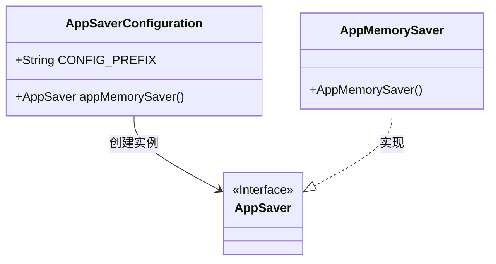
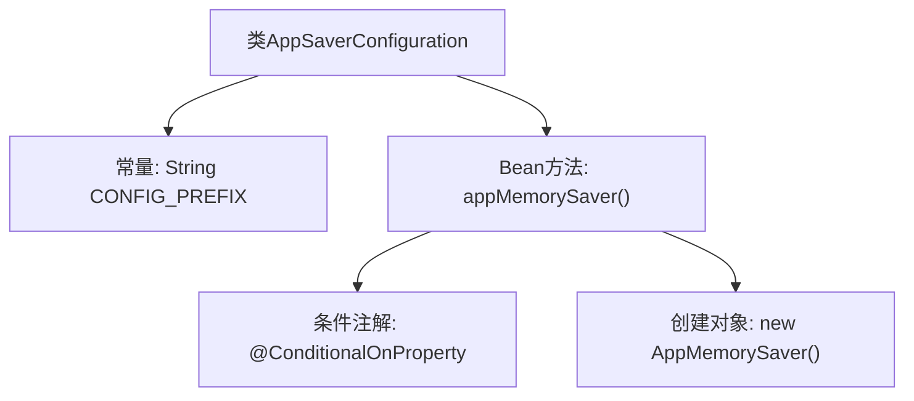

# 基础信息

|      |      |
|------|------|
| 名称 | AppSaverConfiguration |
| 编码语言 | .java |
| 代码路径 | spring-ai-alibaba/spring-ai-alibaba-graph/spring-ai-alibaba-graph-studio/src/main/java/com/alibaba/cloud/ai/autoconfigure/AppSaverConfiguration.java |
| 包名 | com.alibaba.cloud.ai.autoconfigure |
| 依赖项 | ['com.alibaba.cloud.ai.saver.AppMemorySaver', 'com.alibaba.cloud.ai.saver.AppSaver', 'org.springframework.boot.autoconfigure.condition.ConditionalOnProperty', 'org.springframework.context.annotation.Bean', 'org.springframework.context.annotation.Configuration'] |
| 概述说明 | AppSaverConfiguration类定义条件内存保存器Bean。 |

# 说明

AppSaverConfiguration类是一个用于定义基于条件的内存保存器的Bean。该类的主要功能是配置和管理内存保存机制，确保在特定条件下数据能够被有效地保存和恢复。通过该类的配置，可以灵活地控制内存保存的行为，从而优化系统性能和资源利用率。该类通常用于需要高效内存管理的应用场景，确保数据的持久性和系统的稳定性。

# 类列表 Class Summary

| 名称   | 类型  | 说明 |
|-------|------|-------------|
| AppSaverConfiguration | class | AppSaverConfiguration类定义了一个基于条件的内存保存器Bean。 |

## 类 AppSaverConfiguration

|      |      |
|------|------|
| 访问范围 | @Configuration;public |
| 类型 | class |
| 名称 | AppSaverConfiguration |
| 说明 | AppSaverConfiguration类定义了一个基于条件的内存保存器Bean。 |

### UML类图

### 描述
`AppSaverConfiguration` 是一个配置类，用于根据条件创建 `AppSaver` 的实例。它包含一个常量 `CONFIG_PREFIX` 和一个方法 `appMemorySaver()`，该方法在满足特定条件时返回 `AppMemorySaver` 的实例。`AppMemorySaver` 实现了 `AppSaver` 接口，表示一种内存存储的实现。整个类图展示了配置类如何依赖接口并创建具体的实现类。

### 内部方法调用关系图

这段代码定义了一个Spring配置类`AppSaverConfiguration`，其中包含一个常量`CONFIG_PREFIX`和一个带有条件注解的Bean方法`appMemorySaver()`。当配置属性`spring.ai.alibaba.studio.saver`的值为`memory`或缺失时，该方法会返回一个`AppMemorySaver`对象。流程图展示了类的结构、常量、Bean方法及其条件注解和对象创建的关系。

### 字段列表 Field List

| 名称  | 类型  | 说明 |
|-------|-------|------|
| CONFIG_PREFIX = "spring.ai.alibaba.studio" | String | Spring AI Alibaba Studio配置前缀为"spring.ai.alibaba.studio"。 |

### 方法列表 Method List

| 名称  | 类型  | 说明 |
|-------|-------|------|
| appMemorySaver | AppSaver | 基于配置条件创建内存存储的AppSaver实例。 |

