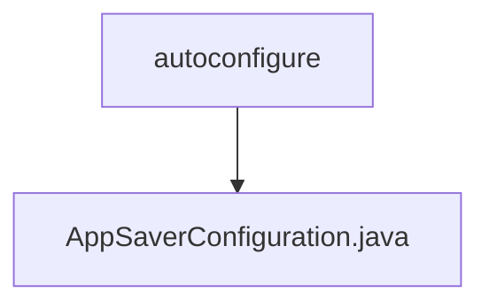

# 基础信息

|      |      |
|------|------|
| 名称 | autoconfigure |
| 编码语言 | .java |
| 代码路径 | spring-ai-alibaba/spring-ai-alibaba-graph/spring-ai-alibaba-graph-studio/src/main/java/com/alibaba/cloud/ai/autoconfigure |
| 包名 | spring-ai-alibaba.spring-ai-alibaba-graph.spring-ai-alibaba-graph-studio.src.main.java.com.alibaba.cloud.ai.autoconfigure |
| 概述说明 | AppSaverConfiguration类定义条件内存保存器Bean。 |

# 说明

AppSaverConfiguration类是一个用于定义基于条件的内存保存器的Bean。该类的主要功能是配置和管理内存保存机制，确保在特定条件下数据能够被有效地保存和恢复。通过该类的配置，可以灵活地控制内存保存的行为，从而优化系统性能和资源利用率。该类通常用于需要高效内存管理的应用场景，确保数据的持久性和系统的稳定性。

### 包内部结构视图

流程图描述：该流程图展示了路径的层级关系，其中`autoconfigure`文件夹包含一个文件`AppSaverConfiguration.java`。路径结构简洁明了，仅包含一个文件夹和一个文件，层级关系清晰。

# 文件列表 File List

| 名称   | 类型  | 说明 |
|-------|------|-------------|
| [AppSaverConfiguration.java](AppSaverConfiguration.md) | file | AppSaverConfiguration类定义条件内存保存器Bean。 |

