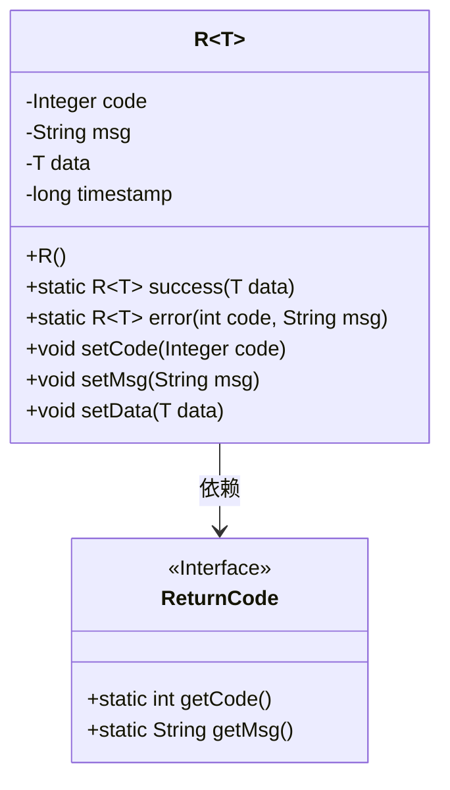
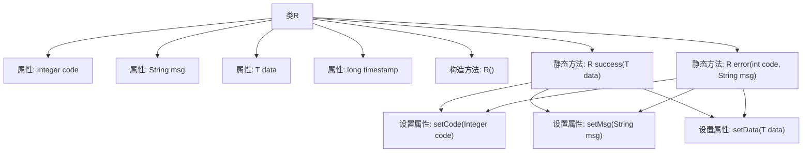

# 基础信息

|      |      |
|------|------|
| 名称 | R |
| 编码语言 | .java |
| 代码路径 | spring-ai-alibaba/spring-ai-alibaba-graph/spring-ai-alibaba-graph-studio/src/main/java/com/alibaba/cloud/ai/common/R.java |
| 包名 | com.alibaba.cloud.ai.common |
| 依赖项 | ['lombok.Data'] |
| 概述说明 | R类封装返回结果，含状态码、消息、数据、时间戳，支持成功和错误构造。 |

# 说明

R类是一个用于封装返回结果的类，包含了状态码、消息、数据和时间戳四个主要属性。该类提供了两种构造方法，分别用于处理成功和错误的情况。成功构造方法用于返回正常操作的结果，而错误构造方法则用于返回操作失败时的错误信息。通过这种设计，R类能够统一处理各种返回结果，确保返回信息的完整性和一致性。

# 类列表 Class Summary

| 名称   | 类型  | 说明 |
|-------|------|-------------|
| R | class | R类封装了返回结果，包含状态码、消息、数据和时间戳，提供成功和错误两种构造方法。 |

## 类 R

|      |      |
|------|------|
| 访问范围 | @Data;public |
| 类型 | class |
| 名称 | R |
| 说明 | R类封装了返回结果，包含状态码、消息、数据和时间戳，提供成功和错误两种构造方法。 |

### UML类图

这段代码定义了一个泛型类 `R<T>`，用于封装返回结果。类中包含四个私有字段：`code`、`msg`、`data` 和 `timestamp`，分别表示状态码、消息、数据和时间戳。类提供了两个静态方法：`success` 和 `error`，分别用于生成成功和错误的返回结果。`success` 方法使用 `ReturnCode` 接口中的常量来设置状态码和消息，而 `error` 方法则允许自定义状态码和消息。类图展示了 `R<T>` 类与 `ReturnCode` 接口之间的依赖关系。

### 内部方法调用关系图

该流程图展示了类`R<T>`的结构及其方法调用关系。类`R<T>`包含四个属性：`code`、`msg`、`data`和`timestamp`，并提供了无参构造方法`R()`。类中还定义了两个静态方法：`success(T data)`和`error(int code, String msg)`，分别用于创建成功和错误的响应对象。这两个方法通过调用`setCode`、`setMsg`和`setData`方法来设置对象的属性值。

### 字段列表 Field List

| 名称  | 类型  | 说明 |
|-------|-------|------|
| code | Integer | 私有整型变量code。 |
| timestamp | long | 定义一个长整型私有变量timestamp。 |
| msg | String | 定义了一个私有字符串变量msg。 |
| data | T | 私有变量data，类型为T。 |

### 方法列表 Method List

| 名称  | 类型  | 说明 |
|-------|-------|------|
| success | R<T> | 静态方法返回成功响应，包含数据、状态码和消息。 |
| error | R<T> | 静态方法error返回R对象，设置code、msg，data为null。 |

