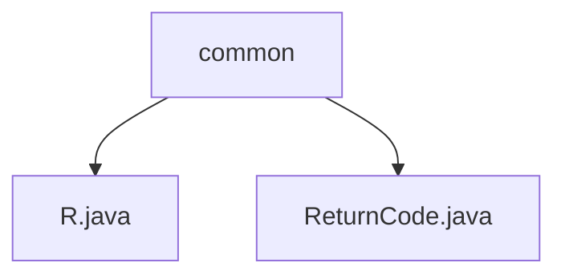

# 基础信息

|      |      |
|------|------|
| 名称 | common |
| 编码语言 | .java |
| 代码路径 | spring-ai-alibaba/spring-ai-alibaba-graph/spring-ai-alibaba-graph-studio/src/main/java/com/alibaba/cloud/ai/common |
| 包名 | spring-ai-alibaba.spring-ai-alibaba-graph.spring-ai-alibaba-graph-studio.src.main.java.com.alibaba.cloud.ai.common |
| 概述说明 | R类封装返回结果，含状态码、消息、数据和时间戳，统一处理成功和错误情况。 |

# 说明

## 概述

该代码模块主要用于封装和处理返回结果，确保在不同业务场景下返回信息的完整性和一致性。模块的核心类包括 `R` 类和 `ReturnCode` 类。`R` 类是一个通用的返回结果封装类，包含了状态码、消息、数据和时间戳等属性，并提供了处理成功和错误情况的构造方法。`ReturnCode` 类则可能用于定义和管理返回的状态码，以便在系统中统一使用。

## 主要业务场景

1. **成功操作的结果返回**：在业务操作成功时，使用 `R` 类的成功构造方法返回操作结果。该方法会自动填充状态码、消息、数据和时间戳，确保返回信息的完整性和一致性。

2. **错误操作的结果返回**：在业务操作失败时，使用 `R` 类的错误构造方法返回错误信息。该方法会包含错误的状态码和描述信息，帮助调用方快速定位问题。

3. **状态码管理**：通过 `ReturnCode` 类定义和管理系统中使用的状态码，确保在不同模块和业务场景中状态码的统一性和可维护性。

通过这种设计，该模块能够有效地处理各种返回结果，简化了返回信息的封装和处理流程，提高了代码的可读性和可维护性。

### 包内部结构视图

该流程图展示了`spring-ai-alibaba-graph-studio`项目中的`common`文件夹与其内部文件`R.java`和`ReturnCode.java`之间的层级关系。`common`文件夹作为根节点，包含了两个具体的Java文件，分别用于定义项目中的常量和返回码。

# 文件列表 File List

| 名称   | 类型  | 说明 |
|-------|------|-------------|
| [ReturnCode.java](ReturnCode.md) | file | 信息为空，无法生成概要描述。 |
| [R.java](R.md) | file | R类封装返回结果，含状态码、消息、数据、时间戳，支持成功和错误构造。 |

