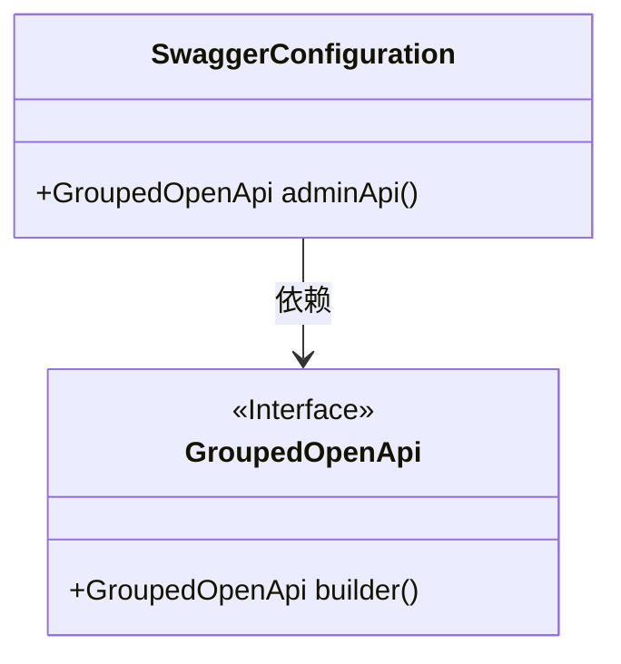
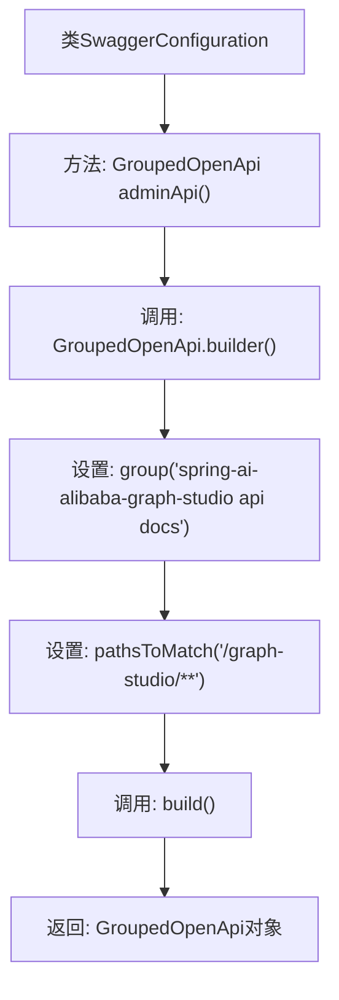

# 基础信息

|      |      |
|------|------|
| 名称 | SwaggerConfiguration |
| 编码语言 | .java |
| 代码路径 | spring-ai-alibaba/spring-ai-alibaba-graph/spring-ai-alibaba-graph-studio/src/main/java/com/alibaba/cloud/ai/config/SwaggerConfiguration.java |
| 包名 | com.alibaba.cloud.ai.config |
| 依赖项 | ['org.springdoc.core.models.GroupedOpenApi', 'org.springframework.context.annotation.Bean', 'org.springframework.context.annotation.Configuration'] |
| 概述说明 | Swagger配置类管理API分组，路径为/graph-studio。 |

# 说明

Swagger配置类用于管理API分组，并指定该分组匹配路径为/graph-studio。该配置类的主要功能是通过Swagger工具对API进行分组管理，确保与/graph-studio路径相关的API能够被正确分类和展示。通过这种方式，开发者可以更方便地管理和查看与该路径相关的API文档，提升API的可维护性和可读性。

# 类列表 Class Summary

| 名称   | 类型  | 说明 |
|-------|------|-------------|
| SwaggerConfiguration | class | Swagger配置类定义了一个管理API分组，匹配/graph-studio路径。 |

## 类 SwaggerConfiguration

|      |      |
|------|------|
| 访问范围 | @Configuration;public |
| 类型 | class |
| 名称 | SwaggerConfiguration |
| 说明 | Swagger配置类定义了一个管理API分组，匹配/graph-studio路径。 |

### UML类图

**描述：**  
`SwaggerConfiguration` 类是一个配置类，用于定义 Swagger 文档的生成规则。该类包含一个公共方法 `adminApi()`，该方法返回一个 `GroupedOpenApi` 对象，用于配置 API 文档的分组和路径匹配规则。`GroupedOpenApi` 是一个接口，提供了构建 API 文档分组的方法。`SwaggerConfiguration` 类依赖于 `GroupedOpenApi` 接口来实现 API 文档的配置。

### 内部方法调用关系图

这段代码定义了一个Spring配置类`SwaggerConfiguration`，其中包含一个`@Bean`注解的方法`adminApi()`。该方法使用`GroupedOpenApi.builder()`创建一个API文档分组，设置分组名称为`'spring-ai-alibaba-graph-studio api docs'`，并匹配路径`'/graph-studio/**'`，最后通过`build()`方法返回一个`GroupedOpenApi`对象。该配置类用于在Spring应用中集成Swagger API文档生成功能。

### 字段列表 Field List

| 名称  | 类型  | 说明 |
|-------|-------|------|

### 方法列表 Method List

| 名称  | 类型  | 说明 |
|-------|-------|------|
| adminApi | GroupedOpenApi | 定义名为adminApi的Bean，用于生成spring-ai-alibaba-graph-studio API文档，匹配路径为/graph-studio/**。 |

